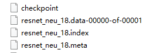

`[TOC]`

###  tf.Variable() shortcoming

运行图时，会有两组变量被创建。。看图：


### Global step

```python
global_step = tf.Variable(0, dtype=tf.int32, trainable=False, name='global_step')
```

Very common in TensorFlow program.

### tf.train.Saver()

#### 保存特定参数


### tf.summary

#### 步骤

Visualize our summary statistics during our training

+ tf.summary.scalar
+ tf.summary.histogram
+ tf.summary.image

三步走：1、creat summarie and op 2、run it 3、write summaries to file


### Tensorboard

#### 曲线对比

If you save your summaries into different sub-folder in your graph folder, you can compare your progresses. For example, the first time we run our model with learning rate 1.0, we save it in ‘improved_graph/lr1.0’ and the second time we run our model, we save it in ‘improved_graph/lr0.5：


### TensorFlow Padding Options？

#### Valid：

可以想象，先不考虑第一个F×F的卷积（+1），（也可以倒着考虑，但由于可能要删除最后及列，故还是正方向考虑）或者说以卷积核右边为对象，它会走直到N×N的右边，走过的长度为N-F，步长是S，所以卷积出来的尺寸为(N - F) / stride，取下整。可能会droped右面，下面的像素。

或者new_height = new_width = (N– F + 1) / S，结果向上取整，从几何意义上理解不了这个公式。

#### Same(with zero padding)


Same的意思可以理解为，~~卷积出来的尺寸与原图像尺寸大小相等~~。原来不是，上面一句话仅仅适用于步长为1的情况。实际情况看上图。“SAME”尝试向左和向右均匀填充，但如果要添加的列数为奇数，则会向右添加额外的列，如本示例中的情况（只展示水平方向）。

+ stride=1，核大小F是奇数：

  积核尺寸是奇数，那么只需让卷积核的中间与图像左上角对齐，卷积直到中间与图像的右上角对齐，那么卷积核相对于图像多出来的行数即为padding的像素值。卷积后大小：（F-1）/2。

+ stride=S：

  stride=1卷积出来的尺寸与原图大小一致。

  当stride=S时，卷积（无论卷积核多大）出来的尺寸为**N / S （结果向上取整）**，这个可以从卷积核的**左边**考虑，卷积直到无法移动。这里Padding的数量要从结果往回推导。

  参考上图，现在已知卷积核大小F×F（为了简化问题，这里选长宽一样的），步长为S，卷积后的尺寸大小为N / S （结果向上取整）。补0后的问题就是Valid卷积方式而且是能整除的方式哦。

  考虑宽度：Valid的公式为(N - F) / stride + 1= N/S=new_weight，所以补0后的宽度为**(new_weight – 1) × S + F**。这里可以沿着valid公式的几何思路反过来考虑。

  左边：Pddding_left = padding_need/2  右边：Pddding = padding_need-padding_left。

### Visualizing convnet features

不知道。


### tf.transpose()

```python
 net = tf.transpose(inputs, perm=(0, 2, 3, 1))  # 转换维度，(0,1,2,3)=>(0,2,1,3))
```

### list相加

```python
import numpy as np
a = [5,10,10,3]   # shape(4,)
b =[6,4]  # shape(2,)

print(a+b)  # [5, 10, 10, 3, 6, 4]
print(np.add(a, b)) # ValueError: operands could not be broadcast together with shapes (4,) (2,) 
```

### tf.concat()

```python
t1 = [[1, 2, 3], [4, 5, 6]]
t2 = [[7, 8, 9], [10, 11, 12]]
tf.concat([t1, t2], axis=0)  # [[1, 2, 3], [4, 5, 6], [7, 8, 9], [10, 11, 12]]
tf.concat([t1, t2], axis=1)  # [[1, 2, 3, 7, 8, 9], [4, 5, 6, 10, 11, 12]]

# tensor t3 with shape [2, 3]
# tensor t4 with shape [2, 3]
tf.shape(tf.concat([t3, t4], 0))  # [4, 3]
tf.shape(tf.concat([t3, t4], 1))  # [2, 6]
```

就是在某一维度上连接起来。。

怎么想象两个矩阵在某一维度上的连接呢？

多维度矩阵，可以想象成：从0维展开，又会得到len(Numpy[0])个多维矩阵。

```python
import numpy as np
t1 = [[1, 2, 3], [4, 5, 6]]
t2 = [[7, 8, 9], [10, 11, 12]]
print(t1[0])  # [1, 2, 3]
print(t1[1])  # [4, 5, 6]
```

axis=0的链接即：t1[0]，t1[1]...，+  t2[0]，t2[1]...也就是：t1+t2

axis=1的连接即：a\[0]+b\[0]，a[1]+b[1]

下面看一下：

```python
t1 = [[[1, 2], [2, 3]], [[4, 4], [5, 3]]]  # shape:(2,2,2)
t2 = [[[7, 4], [8, 4]], [[2, 10], [15, 11]]] # shape:(2,2,2)
tf.concat([t1, t2], -1)  # 倒数第一维，-1+rank = -1+3 = 2
>>>
[[[ 1,  2,  7,  4],
  [ 2,  3,  8,  4]],

 [[ 4,  4,  2, 10],
  [ 5,  3, 15, 11]]]
```

axis=2的连接即：a\[0]\[0]+b\[0]\[0]，a\[0]\[1]+b\[0]\[1]，a\[1]\[0]+b\[1]\[0]，a\[1]\[1]+b\[1]\[1]

尝试想象上面，令axis=1的连接。a\[0]+b\[0]，a[1]+b[1]

连接操作，形状维度不变，只是在某一维度膨胀了。

### tf.stack() and tf.unstack()

> **Note:** If you are concatenating along a new axis consider using stack. E.g. 

与concat不同，这是堆叠。

```python
import numpy as np
a = [[[1, 2], [2, 3]], [[4, 4], [5, 3]]]  # shape:(2,2,2)
b = [[[7, 4], [8, 4]], [[2, 10], [15, 11]]]
c = np.stack([a,b],-1)
print(c)
print(c.shape)
>>>
[[[[ 1  7]
   [ 2  4]]

  [[ 2  8]
   [ 3  4]]]


 [[[ 4  2]
   [ 4 10]]

  [[ 5 15]
   [ 3 11]]]]

(2, 2, 2, 2)
```

### tf.gfile.FastGFile

```
image_data = tf.gfile.FastGFile('img/a.jpg', 'rb').read()
>>>
b'\x89PNG\r\n\x1a\n\x00\x00\x00\rIHDR\x00\x00\x00O\x00\x00\x00\x17\x08\x06\x00\x00\x00J\xe9\x12\x1c\x00\x00\x00\x01sRGB\x00\xae\xce\x1c\xe9\x00……
```

返回什么呢？image_data: string, JPEG encoding of RGB image

### TensorFlow-Slim Data

[TensorFlow-Slim Data](https://github.com/tensorflow/tensorflow/tree/master/tensorflow/contrib/slim/python/slim/data)

# 常用函数

## 创建变量

参考：[TensorFlow变量管理](https://ilewseu.github.io/2018/03/11/Tensorflow%E5%8F%98%E9%87%8F%E7%AE%A1%E7%90%86/) 。

创建变量是最最常用的，权重与偏差，都需要创建。tensorflow中常用的两个函数是：`tf.Variable `和`tf.get_variable` ，那么他们有什么不同呢啊？

### Variable类

创建变量，想象一下，是要有初始值的（那就包括形状shape和类型dtype，以及以何种方式初始化这些值），说白了就是要用 tf中提供的一些 initializer functions来初始化。

> Just like any Tensor, variables created with Variable() can be used as inputs for other Ops in the graph.
>
> 在run Ops之前，变量要被确切的初始化，由于tensorflow是先构建图后执行操作，变量不会自己初始化哦，所以：
>
>  You can initialize a variable by 
>
> + running  its initializer op：sess.run(w.initializer)
> + restoring the variable from a save file, 
> + simply running an assign Op that assigns a value to the variable. 
>
> 事实上，variable initializer op 就是一个 assign Op，通过他将初始值赋给变量。
>
> ============================
>
> 最常用的手段是使用常规函数`global_variables_initializer() `添加 an Op 给这个 graph来初始化所有变量，在启动graph后，使用变量前运行这个Op。
>
> 两个与变量有关的 graph collection：
>
> + **GraphKeys.GLOBAL_VARIABLES**：新变量默认添加到此集合，可通过`global_variables()` returns the contents of that collection.
> +  **GraphKeys.TRAINABLE_VARIABLES**：可训练变量集合，用于区别**可训练的模型参数**和其他变量，例如我们常常用` global_step`记录 training steps，由参数 trainable 控制。可通过`trainable_variables() `返回内容，各种各样的`Optimizer` classes使用此集合作为默认变量list去优化

You add a variable to the graph by constructing an instance of the `class Variable`：

```python
# This constructor creates both a variable Op and an assign Op 
# to set the variable to its initial value
def __init__(self,
             initial_value=None,
             trainable=True,
             collections=None,   # 一般用不到
             validate_shape=True,
             caching_device=None,  # ？？
             name=None,
             variable_def=None,    # ？？？
             dtype=None,
             expected_shape=None,# If set, initial_value is expected to have this shape.
             import_scope=None,  # ？？
             constraint=None):   # 优化器更新后的可选投影函数
```

+ **initial_value**--A Tensor，这个Tensor常常用  initializer functions 来构造， (Note that initializer functions from `init_ops.py` must first be bound(绑定) to a shape before being used here.) 

  ```python
  def weight_variable(shape):
      initial = tf.truncated_normal(shape, stddev=0.01) # 形状必须指定
      return tf.Variable(initial)
  ```

+ **trainable**--上面说了

+ **collections**--List of graph collections keys. The new variable is added to these collections. Defaults to [GraphKeys.GLOBAL_VARIABLES].

+ **validate_shape**--False，允许以未知的shape初始化；True，不可以，必须指定**initial_value**的shape。

+ **name**--可选参数字符串，默认为'Variable' ，并且自动区分。

+ **dtype**--If set, initial_value will be converted to the given type. If None, either the datatype will be kept (if initial_value is a Tensor), or convert_to_tensor will decide.

###  get_variable函数

创建或者获取变量，名字是必须填的参数。

```python
def get_variable(name,       # 这不同于Variable类，是必须给出的哦
                 shape=None,
                 dtype=None,
                 initializer=None, # 前三个变量相当于Variable的initial_value一个参数
                 regularizer=None,
                 trainable=True,
                 collections=None,
                 # 后面不知道干啥的..
                 caching_device=None,
                 partitioner=None,
                 validate_shape=True,
                 use_resource=None,
                 custom_getter=None,
                 constraint=None)
```

**对于tf.get_variable函数，变量名称是一个必填的参数。** tf.get_variable会根据这个名字去创建或者获取变量。 

1. 变量共享机制

**如果需要通过tf.get_variable获取一个已经创建的变量，需要通过tf.variable_scope函数来生成一个上下文管理器，并明确指定在这个上下文管理器中，tf.get_variable将直接获取已经生成的变量。** 

```python
# 在名字为foo的命名空间内创建名字为v的变量
with tf.variable_scope("foo"):
    v = tf.get_variable("v", [1], initializer=tf.constant_initializer(1.0))
# 因为在命名空间foo中已经存在名为v的变量，所以下面的代码将会报错
with tf.variable_scope("foo"):
    v = tf.get_variable("v",[1])
# 在生成上下文管理器时，将参数reuse设置为True。这样tf.get_vaiable函数将直接获取
# 已经声明的变量。
with tf.variable_scope("foo",reuse=True):
    v1 = tf.get_variable("v",[1])
    print v==v1 #输出为True
# 将参数reuse设置为True时，tf.variable_scope将只能获取已经创建过的变量。因为在命名
# 空间bar中还没有创建变量v，所以下面的代码将会报错
with tf.variable_scope("bar",reuse=True):
    v = tf.get_variable("v",[1])
```

2. 命名空间管理

**tf.variable_scope函数生成的上下文管理器也会创建一个TensorFlow中的命名空间：**

```python
v1 = tf.get_variable("v",[1])
print v1.name    # 输出v:0,"v"为变量名称，“：0”表示这个变量时生成变量这个运算的第一个结果
with tf.variable_scope("foo"):
    v2 = tf.get_variable("v",[1])
    print v2.name  # 输出为foo/v:0。在tf.variable_scope中创建的变量，名称前面会
                   # 加入命名空间的名称，通过/来分隔命名空间的名称和变量的名称。
with tf.variable_scope("foo"):
    with tf.variable_scope("bar"):
        v3 = tf.get_variable("v",[1])
        print v3.name # 输出为foo/bar/v:0。命名空间可以嵌套，同时变量的名称也会
                      # 加入所有命名空间的名称作为前缀。
    v4 = tf.get_variable("v1",[1])
    print v4.name  # 输出foo/v1:0。当命名空间退出之后，变量名称也就不会再被加入其前缀了。
    
# 创建一个名称为空的命名空间，并设置为reuse=True
with tf.variable_scope("", reuse=True):
    v5 = tf.get_variable("foo/bar/v",[1]) # 可以直接通过带命名空间名称的变量名来
                                          # 获取其他命名空间下的变量
    print v5 == v3 # 输出为True
    v6 = tf.get_variable("foo/v1",[1])
    print v6 == v4 # 输出为True
```


### 初始化函数(initializer)

| 初始化函数                          | 功能                                                         | 主要参数                        |
| ----------------------------------- | :----------------------------------------------------------- | ------------------------------- |
| tf.constant_initializer             | 将变量初始化为给定常量                                       | 常量的取值                      |
| tf.random_normal_initializer        | 将变量初始化为满足正态分布的随机值                           | 正态分布的均值和标准差          |
| tf.truncated_normal_initializer     | 将变量初始化为满足正态分布的随机值，但如果随机出来的值 偏离平均值超过2个标准差，那么这个数将会被重新随机 | 正态分布的均值和标准差          |
| tf.random_uniform_initializer       | 将变量初始化为满足均匀分布的随机值                           | 最大值、最小值                  |
| tf.uniform_unit_scaling_initializer | 将变量初始化为满足均匀分布但不影响输出数量级的随机值         | factor(产生随机数时 乘以的系数) |
| tf.zeros_initializer                | 将被变量设置为0                                              | 变量维度                        |
| tf.ones_initializer                 | 将变量设置为1                                                | 变量的维度                      |

### 两者区别：

参考：

https://zhuanlan.zhihu.com/p/26996077

[TensorFlow 变量共享](https://www.cnblogs.com/Charles-Wan/p/6200446.html)

tensorflow中用tf.Variable()，tf.get_variable()，tf.Variable_scope()，tf.name_scope()几个函数来维护变量。

+ tf.Variable()会自动检测命名冲突并自行处理，
+ tf.get_variable()则遇到重名的变量创建且变量名没有设置为共享变量时，则会报错。  

```python
def weight_variable(shape):
    initial = tf.truncated_normal(shape, stddev=0.01)
    return tf.Variable(initial, name = 'weights')

def bias_variable(shape):
    initial = tf.constant(0.01, shape=shape)
    return tf.Variable(initial, name = 'biases')

def conv2d(input, in_features, out_features, kernel_size):
    W = weight_variable([ kernel_size, kernel_size, in_features, out_features ])
    conv = tf.nn.conv2d(input, W, [ 1, 1, 1, 1 ], padding='SAME')
    return conv + bias_variable([ out_features ])
```

然后有：

```python
# 下面会生成两套变量
result1 = conv2d(image1, 3, 16, 3)
result2 = conv2d(image2, 3, 16, 3)
```

如果是用的是 tf.get_variable ，那么就会报错，

```python
# Raises ValueError(... weights already exists ...)
```

为了解决这个问题，TensorFlow 又提出了 tf.variable_scope 函数。

+ tf.Variable()用于创建一个新变量，在同一个name_scope下面，可以创建相同名字的变量，底层实现会自动引入别名机制，两次调用产生了其实是两个不同的变量。 
+ tf.get_variable(<variable_name>)用于获取或创建一个变量，并且不受name_scope的约束。当这个变量已经存在时，则自动获取；如果不存在，则自动创建一个变量。 

```python
with tf.variable_scope("foo"):
    with tf.name_scope("bar"):
        v = tf.get_variable("v", [1])  # 不受约束
        x = 1.0 + v
        a = tf.Variable(tf.constant(1.0,shape=[2,2]))  #  受约束
        
print(v.name)     # "foo/v:0"
print(x.op.name)  # "foo/bar/add"
print(a.name)     # "foo/bar/Variable:0"
```

+ tf.name_scope(<scope_name>):主要用于管理一个图里面的**各种op的名字**，返回的是一个以scope_name命名的context manager。一个graph会维护一个name_space的堆，每一个namespace下面可以定义各种op或者子namespace，实现一种层次化有条理的管理，避免各个op之间命名冲突。 
+ tf.variable_scope(<scope_name>)：一般与tf.name_scope()配合使用，用于管理一个**graph中变量的名字**，避免变量之间的命名冲突，tf.variable_scope(<scope_name>)允许在一个variable_scope下面共享变量。 


## 卷积

TensorFlow中，卷积都有哪些函数？

### tf.nn.conv2d

```python
# tf.nn.conv2d
def conv2d(input,   # 4D Tensor,shape [batch, height, width, in_channels]
           filter,  # A Tensor, [height, width, in_channels, out_channels],类型一致和输入
           strides, # 一般来说，[1, stride, stride, 1].在高和宽之间以步长stride滑动
           padding, #SAME" or "VALID".
           use_cudnn_on_gpu=True, 
           data_format="NHWC", dilations=[1, 1, 1, 1], name=None):
```

 对于2D卷积来说，卷积核 filter的可以理解为 [height，width，卷积核通道数，卷积核个数]

那么有，1）输入的通道数 in_channels = = 卷积核通道数 in_channels。2）大多数情况，卷积核的第0 和第3 维度大小为 1 。但是这个函数要重复指定。

而且，卷积操作前，要定义权重参数W；卷积操作后，1）还要加bias项，2）后面可能还要接激活函数，3）还要考虑其是否正则化参数。

所以使用这个函数使有一点点麻烦。看下一个函数：

### tf.layers.conv2d

函数中用到了Class `Conv2D`：tf.layers.Conv2D

```python
def conv2d(inputs,
           filters,         # 卷积核个数，输出通道数
           kernel_size,     # An integer or tuple/list of 2 integers，用于指定卷积核高宽
           strides=(1, 1),  # An integer or tuple/list of 2 integers，指定步长
           padding='valid',
           data_format='channels_last',
           dilation_rate=(1, 1),
           
           activation=None,
           use_bias=True,
           
           kernel_initializer=None,
           bias_initializer=init_ops.zeros_initializer(),
           
           kernel_regularizer=None, # 这几个正则怎么用不太清楚
           bias_regularizer=None,   # 如何添加到损失中作为正则项呢？
           activity_regularizer=None, # Optional regularizer function for the output？
           
           kernel_constraint=None,
           bias_constraint=None,
           trainable=True,
           name=None,
           reuse=None) # Boolean, 是否使用通过相同的名字使用先前的wights
```

参数：

+ data_format：string

  channels_last ：(batch, height, width, channels)

  channels_first ： (batch, channels, height, width)

+ dilation_rate：空洞卷积？不等于1的时候与stride不等于1不兼容

这个函数，就结合各种操作为一体了。

## 激活函数

## Pooling

## 损失函数

### api

```python
tf.nn.softmax_cross_entropy_with_logits(labels=y_,logits=y)
# 操作施加在未经过Softmax处理的logits上
# logits与labels的shape和类型相同：比如[bantch_size,num_classes]
```

**注意！！！**这个函数的返回值并不是一个数，而是一个向量，如果要求交叉熵，我们要再做一步tf.reduce_sum操作,就是对向量里面所有元素求和，最后才得到交叉熵，如果求loss，则要做一步tf.reduce_mean操作，对向量求均值！ 

```python
tf.nn.sparse_softmax_cross_entropy_with_logits()
# labels的形状要求是[batch_size]，即只有一个正确类别
# 而值必须是从0开始编码的int32或int64，而且值范围是[0, num_class)
```

```python
 tf.nn.sigmoid_cross_entropy_with_logits()
 # 多目标分类，labels的shape和logits相同
```

```python
tf.nn.weighted_cross_entropy_with_logits()
# 是sigmoid_cross_entropy_with_logits的拓展版，多支持一个pos_weight参数，
# 在传统基于sigmoid的交叉熵算法上，正样本算出的值乘以某个系数。
```


### 正则

例子：

```python
cross_entropy = tf.nn.softmax_cross_entropy_with_logits(labels=ys,
                                                        logits=output)
loss = tf.reduce_mean(cross_entropy, name='loss')

# 这样的话除了权重，也把偏置bias加进去了。
l2 = tf.add_n([tf.nn.l2_loss(var) for var in tf.trainable_variables()])

train_op = tf.train.MomentumOptimizer(
    learning_rate=0.01,momentum=0.9,
    use_nesterov=True).minimize(loss=loss + l2 * 1e-4)
```


```python
 # 会自己添加到REGULARIZATION_LOSSES集合中
 S = tf.get_variable(name='S',regularizer=tf.contrib.layers.l2_regularizer )
 reg_losses = tf.get_collection(tf.GraphKeys.REGULARIZATION_LOSSES)
 reg_constant = 0.01  # Choose an appropriate one.
 loss = my_normal_loss + reg_constant * sum(reg_losses)

```


或者在定义变量的时候：

```python
def create_variable(name, shape, weight_decay=None, loss=tf.nn.l2_loss):
    with tf.device("/cpu:0"):
        var = tf.get_variable(name, dtype=tf.float32, shape=shape,
                              initializer=tf.truncated_normal_initializer(stddev=0.05))
 
    if weight_decay:
        wd = loss(var) * weight_decay
        tf.add_to_collection("weight_decay", wd)
 
    return var
```

> “create_variable” has a weight_decay parameter that defines whether the variable should be affected by regularization or not. Why do we choose to avoid regularization on any variables? The function is used for weights and bias creation. Bias shouldn’t be influenced by regularization as reported in https://www.cs.toronto.edu/~hinton/absps/guideTR.pdf 

## 保存模型

+ 怎么用保存的模型 做预测呢，不用搭建网络了？

  看import_meta_graph函数

+ 怎么restore一部分参数呢？

  在初始化Saver类的时候指定参数列表

+ 怎么训练一部分参数

  在优化器minimize()参数中指定var_list

+ 怎么检查ckpt文件呢？一个函数

+ 怎么知道模型里存的变量的名字呢？不知道的话，不就不能指定参数列表了吗？？

  所以你得知道。。


**参数模型文件列表**：



+ checkpoint：a protocol buffer
+ data-00000-of-00001：数据文件，保存的是网络的权值，偏置，操作等等。
+ index：是一个不可变得字符串表，每一个键都是张量的名称，它的值是一个序列化的BundleEntryProto。 每个BundleEntryProto描述张量的元数据：“数据”文件中的哪个文件包含张量的内容，该文件的偏移量，校验和，一些辅助数据等等。
+ meta：`MetaGraphDef` file，图结构。

checkpoint的内容，可以看到最新的是20：

```
model_checkpoint_path: "resnet_neu_20"
all_model_checkpoint_paths: "resnet_neu_18"
all_model_checkpoint_paths: "resnet_neu_19"
all_model_checkpoint_paths: "resnet_neu_20"
```

> savers keep a protocol buffer on disk with the list of recent checkpoints. This is used to manage numbered checkpoint files and by `latest_checkpoint()`, which makes it easy to discover the path
> to the most recent checkpoint.

### class Saver

初始化`class Saver`，**The constructor adds ops to save and restore variables**

```python
saver = tf.train.Saver()
```

构造函数：

```python
def __init__(self,
            var_list=None,
            reshape=False,
            sharded=False,
            max_to_keep=5,                           # 保持几个
            keep_checkpoint_every_n_hours=10000.0,   # 几小时
            name=None,  # Optional name to use as a prefix when adding operations.
            # ==========后面不知道都是什么鬼东西了==============
            restore_sequentially=False,
            saver_def=None,
            builder=None,
            defer_build=False,
            allow_empty=False,
            write_version=saver_pb2.SaverDef.V2,
            pad_step_number=False,
            save_relative_paths=False,
            filename=None):
```

var_list：`var_list` specifies the variables that will be saved and restored. It canbe passed as a `dict` or a `list`。

**注意！！！这里的功能包括保存和恢复，一旦初始化此类，就添加了save和restore的OP**。

* A `dict` of names to variables: The keys are the names that will **be used to save or restore the variables in the checkpoint files.**
* A list of variables: The variables will be keyed with their op name in the checkpoint files.

dict中，key是op的name，应该是参数列表name属性的值吧。

例如：

```python
v1 = tf.Variable(..., name='v1')
v2 = tf.Variable(..., name='v2')

# Pass the variables as a dict:
saver = tf.train.Saver({'v1': v1, 'v2': v2})

# Or pass them as a list.
saver = tf.train.Saver([v1, v2])
# Passing a list is equivalent to passing a dict with the variable op names
# as keys:
saver = tf.train.Saver({v.op.name: v for v in [v1, v2]})
```

### saver.save()

> This method **runs the ops** added by the constructor for saving variables.
> It requires a **session** in which the graph was launched.
> The variables to save must also have been **initialized**.

```python
def save(self,
         sess,
         save_path,  #  Prefix of filenames,注意是前缀
         global_step=None,  # 可以被append到save_path上作为前缀名
         latest_filename=None, # Optional name for the protocol buffer file
         meta_graph_suffix="meta", # Suffix for `MetaGraphDef` file
         write_meta_graph=True,    # whether or not to write the meta graph file.
         write_state=True, # whether or not to write the CheckpointStateProto.
         strip_default_attrs=False)
```

### saver.restore()

> This method runs the ops added by the constructor for restoring variables.
>
> The variables to restore do not have to have been initialized, as restoring is itself a way to initialize variables.

```python
def restore(self, sess, save_path)
```

没啥可说的啊。

### train.import_meta_graph

```python
@tf_export("train.import_meta_graph")
def import_meta_graph(meta_graph_or_file, clear_devices=False,
                      import_scope=None, **kwargs):
```

meta_graph_or_file：`MetaGraphDef` protocol buffer **or** filename (including the path) containing a `MetaGraphDef`.

结合 `export_meta_graph()`（在调用save()函数时，就会调用此函数，保存到文件），这个函数可以被用来：

  * Serialize a graph along with other Python objects such as `QueueRunner`, `Variable` into a `MetaGraphDef`.

  * Restart training from a saved graph and checkpoints.

    ```Python
    # Create a saver.
    saver = tf.train.Saver(...variables...)
    # Remember the training_op we want to run by adding it to a collection.
    tf.add_to_collection('train_op', train_op)
    sess = tf.Session()
    for step in xrange(1000000):
        sess.run(train_op)
        if step % 1000 == 0:
            # Saves checkpoint, which by default also exports a meta_graph
            # named 'my-model-global_step.meta'.
            saver.save(sess, 'my-model', global_step=step)
    ```

      Later we can continue training from this saved `meta_graph` without building
      the model from scratch.

      ```Python
      with tf.Session() as sess:
        new_saver = tf.train.import_meta_graph('my-save-dir/my-model-10000.meta')
        new_saver.restore(sess, 'my-save-dir/my-model-10000')
        # tf.get_collection() returns a list. In this example we only want the
        # first one.
        train_op = tf.get_collection('train_op')[0]
        for step in xrange(1000000):
          sess.run(train_op)
      ```

  * Run inference from a saved graph and checkpoints.

### train.latest_checkpoint

可以看到，还用到了`get_checkpoint_state`函数获取 ckpt 的 CheckpointState。

**用这些函数，就可以指定文件夹来获得restore中的文件路径了，而不用每次都去修改模型路径了。嘿嘿**

```python
@tf_export("train.latest_checkpoint")
def latest_checkpoint(checkpoint_dir, latest_filename=None):
      # Pick the latest checkpoint based on checkpoint state.
      ckpt = get_checkpoint_state(checkpoint_dir, latest_filename)
      if ckpt and ckpt.model_checkpoint_path:
            # Look for either a V2 path or a V1 path, with priority for V2.
            v2_path = _prefix_to_checkpoint_path(ckpt.model_checkpoint_path,
                                                 saver_pb2.SaverDef.V2)
            v1_path = _prefix_to_checkpoint_path(ckpt.model_checkpoint_path,
                                                 saver_pb2.SaverDef.V1)
            if file_io.get_matching_files(v2_path) or file_io.get_matching_files(
                v1_path):
              return ckpt.model_checkpoint_path
            else:
              logging.error("Couldn't match files for checkpoint %s",
                            ckpt.model_checkpoint_path)
      return None
```

### train.checkpoint_exists

```python
@tf_export("train.checkpoint_exists")
def checkpoint_exists(checkpoint_prefix)
# checkpoint_prefix:
# Typically the result of `Saver.save()` or that of `tf.train.latest_checkpoint()`,
```

## 图形

tensorboard的使用

TensorFlow 包含可帮助您理解图中的代码的工具。**图可视化工具**是 TensorBoard 的一个组件，可在浏览器中可视化图的结构。要创建可视化图表，最简单的方法是传递 [`tf.Graph`](https://tensorflow.google.cn/api_docs/python/tf/Graph)（在创建 [`tf.summary.FileWriter`](https://tensorflow.google.cn/api_docs/python/tf/summary/FileWriter) 时） 


## 数据输入相关

### 常用方法

参考：https://blog.csdn.net/zzk1995/article/details/54292859

1. string_input_producer

   ```python
   @tf_export("train.string_input_producer")
   def string_input_producer(string_tensor,  # 1-D ，就是sting list
                             num_epochs=None,  # 不指定的话，可以无限循环生成string
                             shuffle=True, 
                             seed=None,
                             capacity=32,
                             shared_name=None,
                             name=None,
                             cancel_op=None)
   '''
   Returns:
       A queue with the output strings.  
       A `QueueRunner` for the Queue 
       is added to the current `Graph`'s `QUEUE_RUNNER` collection.
   '''
   ```

   这构造了一个默认容量为32的队列，同时将此队列的将QueueRunner加入集合，比如：

   ```python
   # xxx_list可以是图像路劲list，或tfrecord路径，或其他字符串list，看你怎么用
   name_queue = tf.train.string_input_producer(xxx_list)
   # 比如：
   xxx_list = tf.constant(['auglib_test.tfrecord', 'auglib_test.tfrecord'],dtype = tf.string)
   xxx_list = ['auglib_test.tfrecord', 'auglib_test.tfrecord']
   ```

   定义OP

   ```
   size = name_queue.size()
   a = name_queue.dequeue()
   ```

   **必须要有 tf.train.start_queue_runners(sess=sess)，来初始化queue里边的内容，使其运作 起来**

   ```python
   with tf.Session() as sess:
       tf.train.start_queue_runners(sess=sess)
       print(sess.run(size))
       print(sess.run(a))
       print(sess.run(size))
       print(sess.run(a))
       print(sess.run(size))
       print(sess.run(a))
       print(sess.run(size))
   ```

   可以看到每run一次出列操作，就会取出一个值：

   ```
   >>>
   11
   b'F:\\data\\augLib\\train\\Mold'
   32
   b'F:\\data\\augLib\\train\\Hole'
   32
   b'F:\\data\\augLib\\train\\Flat flower'
   32
   ```

   

2. reader

   在得到`name_queue`后，搞一个reader，不同reader对应不同的文件结构。

   + 比如TFrecord文件

     ```python
     reader = tf.TFRecordReader()
     _, serialized_example = reader.read(name_queue)  # 每次返回一个文件名和对应数据
     '''
     解析serialized_example操作，可得到img_tensor,label_tensor
     '''
     ```

   + 或者dequeue()之后自己写读取图片的过程（ps：得用tf自带的函数，毕竟都是Tensor类型）

3. tf.train.batch或者tf.train.shuffle_batch

   第2步得到的使一个一个数据，但是训练网络每次要放入一批。

   其内部原理似乎是创建了一个queue，然后不断调用你的单样本tensor获得样本，直到queue里边有足够的样本，然后一次返回一堆样本，组成样本batch 。

   ```python
   img_batch, label_batch = tf.train.shuffle_batch([img_tensor, label_tensor],
                                                   batch_size=batch_size, 
                                                   capacity=3000,
                                                   min_after_dequeue=10)
   ```

   

4. 事实上一直到上一步的image_batch和label_batch的tensor，都还没有真实的数据在里边，我们必须用Session run一下这个4D的tensor，才会真的有数据出来。这个原理就和我们定义好的神经网络run一下出结果一样，你一run这个4D tensor，他就会顺着自己的operator找自己依赖的其他tensor，一路最后找到最开始reader那里。

   所以，image_batch和label_batch就是tensor了，不能喂到placeholder里了。

### tf.data api

???

```python
from tensorflow.python.data import Dataset  # 好像是基类
from tensorflow.python.data import FixedLengthRecordDataset
from tensorflow.python.data import Iterator
from tensorflow.python.data import TFRecordDataset
from tensorflow.python.data import TextLineDataset
```

参考：https://tensorflow.google.cn/guide/datasets

两个抽象类：

+ [`tf.data.Dataset`](https://tensorflow.google.cn/api_docs/python/tf/data/Dataset)  
+ [`tf.data.Iterator`](https://tensorflow.google.cn/api_docs/python/tf/data/Iterator) 

#### 数据集结构

一个数据集包含多个元素，每个元素的结构都相同。一个元素包含一个或多个 [`tf.Tensor`](https://tensorflow.google.cn/api_docs/python/tf/Tensor) 对象，**这些对象称为组件**。 

#### 创建迭代器

**单次迭代器**

```python
iterator = dataset.make_one_shot_iterator()
```

**可初始化迭代器**需要先运行显式 `iterator.initializer` 操作。虽然有些不便，**但它允许您使用一个或多个`tf.placeholder()`张量（可在初始化迭代器时馈送）参数化数据集的定义**。 

```python
max_value = tf.placeholder(tf.int64, shape=[])
dataset = tf.data.Dataset.range(max_value)
iterator = dataset.make_initializable_iterator()

# Initialize an iterator over a dataset with 10 elements.
sess.run(iterator.initializer, feed_dict={max_value: 10})
```

**可重新初始化**迭代器可以通过多个不同的 `Dataset` 对象进行初始化。 

```python
iterator = tf.data.Iterator.from_structure(training_dataset.output_types,
                                           training_dataset.output_shapes)
                                           
training_init_op = iterator.make_initializer(training_dataset)
validation_init_op = iterator.make_initializer(validation_dataset)

Initialize an iterator over 某一个 dataset.
sess.run(training_init_op)
sess.run(validation_init_op)
```

**可馈送**迭代器可以与 [`tf.placeholder`](https://tensorflow.google.cn/api_docs/python/tf/placeholder) 一起使用，以选择所使用的 `Iterator`（在每次调用 [`tf.Session.run`](https://tensorflow.google.cn/api_docs/python/tf/Session#run) 时）（通过熟悉的 `feed_dict` 机制）。 它提供的功能与可重新初始化迭代器的相同，但在迭代器之间切换时不需要从数据集的开头初始化迭代器。 

```python
handle = tf.placeholder(tf.string, shape=[])
iterator = tf.data.Iterator.from_string_handle(
    handle, training_dataset.output_types, training_dataset.output_shapes)
next_element = iterator.get_next()

# 可以定义不同的迭代器 
training_iterator = training_dataset.make_one_shot_iterator()
validation_iterator = validation_dataset.make_initializable_iterator()

# The `Iterator.string_handle()` method returns a tensor that can be evaluated
# and used to feed the `handle` placeholder.
training_handle = sess.run(training_iterator.string_handle())
validation_handle = sess.run(validation_iterator.string_handle())

for _ in range(200):
    # 根据handle的传入值，初始化迭代器
    sess.run(next_element, feed_dict={handle: training_handle})
    
    sess.run(validation_iterator.initializer)
    sess.run(next_element, feed_dict={handle: validation_handle})
```


#### 读取输入数据

##### 消耗Numpy数组

其实这种方法就与我们将numpy数据全部放入内存中一样，每次根据训练的step和batchsize去切片取出数据（只不过在`tf.data`这里可以用迭代器啦）。

```python
with np.load("/var/data/training_data.npy") as data:
  features = data["features"]
  labels = data["labels"]

# Assume that each row of `features` corresponds to the same row as `labels`.
assert features.shape[0] == labels.shape[0]

dataset = tf.data.Dataset.from_tensor_slices((features, labels))
```

请注意，上面的代码段会将 `features` 和 `labels` 数组作为 `tf.constant()` 指令嵌入在 TensorFlow 图中。这样非常适合小型数据集，但会浪费内存，因为会多次复制数组的内容，并可能会达到 [`tf.GraphDef`](https://tensorflow.google.cn/api_docs/python/tf/GraphDef) 协议缓冲区的 2GB 上限 。可以用placeholder解决：

```python
features_placeholder = tf.placeholder(features.dtype, features.shape)
labels_placeholder = tf.placeholder(labels.dtype, labels.shape)

dataset = tf.data.Dataset.from_tensor_slices((features_placeholder, labels_placeholder))
# [Other transformations on `dataset`...]
dataset = ...
iterator = dataset.make_initializable_iterator()

sess.run(iterator.initializer, feed_dict={features_placeholder: features,
                                          labels_placeholder: labels})
```

##### 消耗TFrecord数据

TFRecord 文件格式是一种面向记录的简单二进制格式，很多 TensorFlow 应用采用此格式来训练数据。通过 [`tf.data.TFRecordDataset`](https://tensorflow.google.cn/api_docs/python/tf/data/TFRecordDataset) 类，您可以将一个或多个 TFRecord 文件的内容作为输入管道的一部分进行流式传输。 

```python
filenames = ["/var/data/file1.tfrecord", "/var/data/file2.tfrecord"]
dataset = tf.data.TFRecordDataset(filenames)
```

`TFRecordDataset` 初始化程序的 `filenames` 参数可以是**字符串、字符串列表，也可以是字符串 [`tf.Tensor`](https://tensorflow.google.cn/api_docs/python/tf/Tensor)**。因此，如果您有两组分别用于训练和验证的文件，则可以使用 `tf.placeholder(tf.string)` 来表示文件名，并使用适当的文件名初始化迭代器： 

```python
filenames = tf.placeholder(tf.string, shape=[None])
dataset = tf.data.TFRecordDataset(filenames)

dataset = dataset.map(...)  # Parse the record into tensors.
dataset = dataset.repeat()  # Repeat the input indefinitely.
dataset = dataset.batch(32)
iterator = dataset.make_initializable_iterator()

# 根据实际情况，可以用训练集或验证集初始化迭代器
training_filenames = ["/var/data/file1.tfrecord", "/var/data/file2.tfrecord"]
sess.run(iterator.initializer, feed_dict={filenames: training_filenames})
```


消耗文本数据

消耗CSV数据

### 使用 `Dataset.map()` 预处理数据

`Dataset.map(f)` 转换通过将指定函数 `f` 应用于输入数据集的每个元素来生成新数据集。此转换基于 [`map()` 函数](https://en.wikipedia.org/wiki/Map_(higher-order_function))（通常应用于函数式编程语言中的列表和其他结构）。函数 `f` 会接受表示输入中单个元素的 [`tf.Tensor`](https://tensorflow.google.cn/api_docs/python/tf/Tensor) 对象，并返回表示新数据集中单个元素的 [`tf.Tensor`](https://tensorflow.google.cn/api_docs/python/tf/Tensor) 对象。此函数的实现使用标准的 TensorFlow 指令将一个元素转换为另一个元素。 

#### 解析 `tf.Example` 协议缓冲区消息

```python
# Transforms a scalar string `example_proto` into a pair of a scalar string and
# a scalar integer, representing an image and its label, respectively.
def _parse_function(example_proto):
  features = {"image": tf.FixedLenFeature((), tf.string, default_value=""),
              "label": tf.FixedLenFeature((), tf.int64, default_value=0)}
  parsed_features = tf.parse_single_example(example_proto, features)
  return parsed_features["image"], parsed_features["label"]

# Creates a dataset that reads all of the examples from two files, and extracts
# the image and label features.
filenames = ["/var/data/file1.tfrecord", "/var/data/file2.tfrecord"]
dataset = tf.data.TFRecordDataset(filenames)
dataset = dataset.map(_parse_function)
```

#### 解码图片数据

```python
# Reads an image from a file, decodes it into a dense tensor, and resizes it
# to a fixed shape.
def _parse_function(filename, label):
  image_string = tf.read_file(filename)
  image_decoded = tf.image.decode_jpeg(image_string)
  image_resized = tf.image.resize_images(image_decoded, [28, 28])
  return image_resized, label

# A vector of filenames.
filenames = tf.constant(["/var/data/image1.jpg", "/var/data/image2.jpg", ...])
# `labels[i]` is the label for the image in `filenames[i].
labels = tf.constant([0, 37, ...])

dataset = tf.data.Dataset.from_tensor_slices((filenames, labels))
dataset = dataset.map(_parse_function)
```

