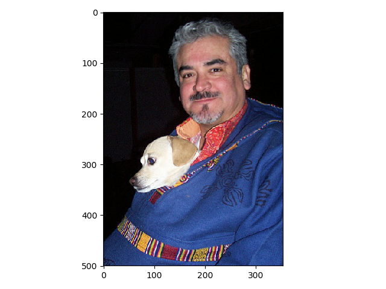
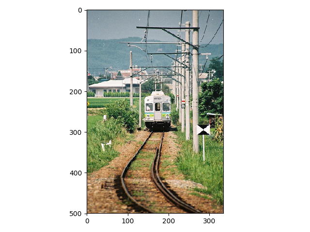
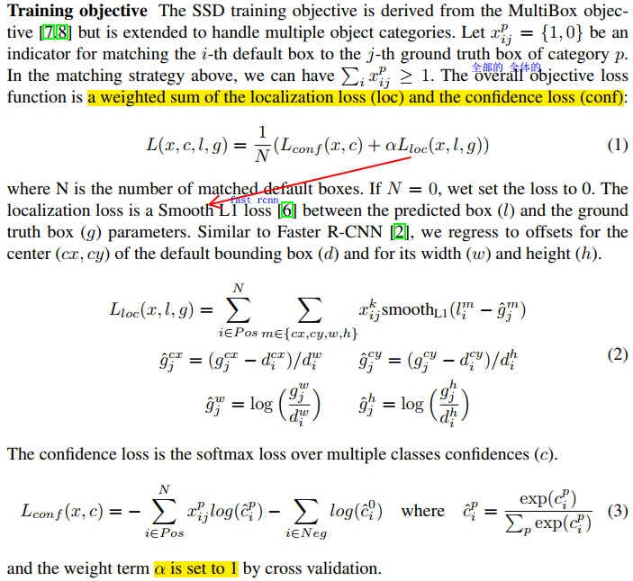

## 数据集

### 1.1数据集TFrecoeds制作

PASCALVOC 2007，用于物体检测的注释在Annotations文件夹中，每张图片对应信息保存为xml文件。

```xml
<annotation>
	<folder>VOC2007</folder>
	<filename>000001.jpg</filename>
	<source>  # 没啥用
		<database>The VOC2007 Database</database>
		<annotation>PASCAL VOC2007</annotation>
		<image>flickr</image>
		<flickrid>341012865</flickrid>
	</source>
	<owner>  # 没啥用
		<flickrid>Fried Camels</flickrid>
		<name>Jinky the Fruit Bat</name>
	</owner>
	<size>  # 图像尺寸及通道数
		<width>353</width>
		<height>500</height>
		<depth>3</depth>
	</size>
	<segmented>0</segmented>
	<object>
		<name>dog</name>
		<pose>Left</pose>  # 好像是从哪个角度拍的？
		<truncated>1</truncated>  # 这个目标是否因为各种原因没有被框完整（被截断了）
		<difficult>0</difficult>  # 待检测目标是否很难识别，为1的目标在测评估中一般会被忽略
		<bndbox>  # 轴对其矩形，框住的是目标在照片中的可见部分
			<xmin>48</xmin>
			<ymin>240</ymin>
			<xmax>195</xmax>
			<ymax>371</ymax>
		</bndbox>
	</object>
	<object>
		……
	</object>
</annotation>

```

20类别+1背景信息如下，以字典类型存储

```python
VOC_LABELS = {
    'none': (0, 'Background'),
    'aeroplane': (1, 'Vehicle'),
    'bicycle': (2, 'Vehicle'),
    'bird': (3, 'Animal'),
    'boat': (4, 'Vehicle'),
    'bottle': (5, 'Indoor'),
    'bus': (6, 'Vehicle'),
    'car': (7, 'Vehicle'),
    'cat': (8, 'Animal'),
    'chair': (9, 'Indoor'),
    'cow': (10, 'Animal'),
    'diningtable': (11, 'Indoor'),
    'dog': (12, 'Animal'),
    'horse': (13, 'Animal'),
    'motorbike': (14, 'Vehicle'),
    'person': (15, 'Person'),
    'pottedplant': (16, 'Indoor'),
    'sheep': (17, 'Animal'),
    'sofa': (18, 'Indoor'),
    'train': (19, 'Vehicle'),
    'tvmonitor': (20, 'Indoor'),
}
```

#### run

```python
DIRECTORY_ANNOTATIONS = 'Annotations/'
DIRECTORY_IMAGES = 'JPEGImages/'
# TFRecords convertion parameters.
RANDOM_SEED = 4242
SAMPLES_PER_FILES = 200  # 每个tfrecor存储的sample数量

def run(dataset_dir, output_dir, name='voc_train', shuffling=False):
    """Runs the conversion operation.
    Args:
      dataset_dir: The dataset directory. mine:F:/data/VOCdevkit/VOC2007
      output_dir: Output directory.比如：./tfrecords
      name：默认为voc_train,对应VOC2007为voc_2007_train
    """
    # True if the path exists, whether its a file or a directory
    if not tf.gfile.Exists(dataset_dir): 
        tf.gfile.MakeDirs(dataset_dir)
    # Dataset filenames, and shuffling.对于检测任务，洗不洗牌感觉没那么重要
    path = os.path.join(dataset_dir, DIRECTORY_ANNOTATIONS)
    filenames = sorted(os.listdir(path))  # 必须排序，因为系统都出来的可能不按照顺序
    if shuffling:
        random.seed(RANDOM_SEED)  # 保证下一句（洗牌）每次输出一样的结果
        random.shuffle(filenames)
    # Process dataset files.
    i = 0
    fidx = 0  # file_index,tfrecords的名字中的 %03d，9663=200*48+63，会生成49个tfrecords
    while i < len(filenames):  # 9963个图片
        # Open new TFRecord file.
        tf_filename = _get_output_filename(output_dir, name, fidx)  # 就获得个路径名字。。。
        with tf.python_io.TFRecordWriter(tf_filename) as tfrecord_writer:
            j = 0
            while i < len(filenames) and j < SAMPLES_PER_FILES:
                sys.stdout.write('\r>> Converting image %d/%d' % (i+1, len(filenames)))
                sys.stdout.flush()
                
                filename = filenames[i]
                img_name = filename[:-4]  # 去掉.jpg
                _add_to_tfrecord(dataset_dir, img_name, tfrecord_writer)
                i += 1
                j += 1
            fidx += 1
    print('\nFinished converting the Pascal VOC dataset!')
```

其中：

```python
def _get_output_filename(output_dir, name, idx):
    return '%s/%s_%03d.tfrecord' % (output_dir, name, idx)
```

#####  _add_to_tfrecord()

1. 处理一张图片及其xml文件，读取信息
2. 将信息转换为example
3. 运用*tf.python_io.TFRecordWriter*写入一张图片信息（example）到文件中：

> 真不明白为什么单独写一个函数。。

```python
def _add_to_tfrecord(dataset_dir, name, tfrecord_writer):
    """Loads data from image and annotations files and add them to a TFRecord.

    Args:
      dataset_dir: Dataset directory;
      name: Image name to add to the TFRecord;
      tfrecord_writer: The TFRecord writer to use for writing.
    """
    image_data, shape, bboxes, labels, labels_text, difficult, truncated = \
        _process_image(dataset_dir, name)
    example = _convert_to_example(image_data, labels, labels_text,
                                  bboxes, shape, difficult, truncated)
    tfrecord_writer.write(example.SerializeToString())
```

###### _process_image

```python
def _process_image(directory, name):
    """Process a image and annotation file.
      dataset_dir: Dataset directory;
      name: Image name to add to the TFRecord;
    """
    # 原来是：filename = directory + DIRECTORY_IMAGES + name + '.jpg'
    # 很奇怪，directory后面没有'/'啊，怎么不用join
    # 为什么不直接传入带后缀.jpg的文件名
    # 卧槽，懂了还有xml文件呢
    filename = directory +'/'+ DIRECTORY_IMAGES + name + '.jpg'
    # Read the image file.
    # 原来是：image_data = tf.gfile.FastGFile(filename, 'r').read()，有bug
    # rb表示按字节读，r默认是rt模式：字节文本。不太懂
    image_data = tf.gfile.FastGFile(filename, 'rb').read()

    # Read the XML annotation file.这又用join。。。。。。
    filename = os.path.join(directory, DIRECTORY_ANNOTATIONS, name + '.xml')
    tree = ET.parse(filename)  # 解析
    root = tree.getroot()

    # Image shape.
    size = root.find('size')
    shape = [int(size.find('height').text),
             int(size.find('width').text),
             int(size.find('depth').text)]  # 比如1.jpg, [500,353,3]
    # Find annotations.每个object有以下信息
    bboxes = []  # 归一化哦，元素：tuple(ymin,xmin,ymax,xmax)
    labels = []
    labels_text = []
    difficult = []
    truncated = []
    for obj in root.findall('object'):
        label = obj.find('name').text
        labels.append(int(VOC_LABELS[label][0]))
        labels_text.append(label.encode('ascii'))

        if obj.find('difficult'):
            difficult.append(int(obj.find('difficult').text))
        else:
            difficult.append(0)
        if obj.find('truncated'):
            truncated.append(int(obj.find('truncated').text))
        else:
            truncated.append(0)

        bbox = obj.find('bndbox')
        bboxes.append((float(bbox.find('ymin').text) / shape[0],  # 归一化了啊
                       float(bbox.find('xmin').text) / shape[1],
                       float(bbox.find('ymax').text) / shape[0],
                       float(bbox.find('xmax').text) / shape[1]
                       ))
    return image_data, shape, bboxes, labels, labels_text, difficult, truncated
```

得到的主要的有用的图片信息：

```python
img_data:image_data = tf.gfile.FastGFile(filename, 'rb').read(),一大串\x进制的
shape:[H,W,3]，形状为(3,)
下面对应多个object：
bboxes:[(ymin,xmin,ymax,xmax),(),()],形状为(num_object,)，记住这里已经归一化，并且将坐标放在了一起。
labels:[c1,c2,c3……],形状为(num_object,)
labels_text, difficult, truncated好像没啥用。
```

######  _convert_to_example

返回tf.train.Example(features=tf.train.Features(feature={……}))实例。

```python
def _convert_to_example(image_data, labels, labels_text, bboxes, shape,
                        difficult, truncated):
    """Build an Example proto for an image example.

    Args:
      image_data: string, JPEG encoding of RGB image;
      labels: list of integers, identifier for the ground truth;
      labels_text: list of strings, human-readable labels;
      bboxes: list of bounding boxes; each box is a list of integers; # tuple吧？？
          specifying [xmin, ymin, xmax, ymax]. [ymin,xmin,ymax,xmax]吧？？？？
          All boxes are assumed to belong to the same label as the image label.
      shape: 3 integers, image shapes in pixels.
    Returns:
      Example proto
    """
    xmin = []
    ymin = []
    xmax = []
    ymax = []
    for b in bboxes:
        assert len(b) == 4
        [l.append(point) for l, point in zip([ymin, xmin, ymax, xmax], b)]
        
    image_format = b'JPEG'
    example = tf.train.Example(features=tf.train.Features(feature={
            'image/height': int64_feature(shape[0]),
            'image/width': int64_feature(shape[1]),
            'image/channels': int64_feature(shape[2]),
            'image/shape': int64_feature(shape),
            'image/object/bbox/xmin': float_feature(xmin),
            'image/object/bbox/xmax': float_feature(xmax),
            'image/object/bbox/ymin': float_feature(ymin),
            'image/object/bbox/ymax': float_feature(ymax),
            'image/object/bbox/label': int64_feature(labels),
            'image/object/bbox/label_text': bytes_feature(labels_text),
            'image/object/bbox/difficult': int64_feature(difficult),
            'image/object/bbox/truncated': int64_feature(truncated),
            'image/format': bytes_feature(image_format),
            'image/encoded': bytes_feature(image_data)}))
    return example

def int64_feature(value):
    """Wrapper for inserting int64 features into Example proto.
    """
    if not isinstance(value, list):
        value = [value]
    return tf.train.Feature(int64_list=tf.train.Int64List(value=value))

def float_feature(value):
    """Wrapper for inserting float features into Example proto.
    """
    if not isinstance(value, list):
        value = [value]
    return tf.train.Feature(float_list=tf.train.FloatList(value=value))

def bytes_feature(value):
    """Wrapper for inserting bytes features into Example proto.
    """
    if not isinstance(value, list):
        value = [value]
    return tf.train.Feature(bytes_list=tf.train.BytesList(value=value))
```

其中：

```python
"""zip([iterable, ...])
参数说明：
	iterabl -- 一个或多个迭代器;返回zip对象，需要用list转换展示，打包为tuple
"""
z = zip([ymin, xmin, ymax, xmax], (1,2,3,4))
print (list(z))  # [([], 1), ([], 2), ([], 3), ([], 4)]
```

#### 关键步骤

```python
while i < len(filenames):
    tf_filename = ''
	with tf.python_io.TFRecordWriter(tf_filename) as tfrecord_writer:
    	image_data, shape, bboxes, labels = process(info(i)) # 自己去处理数据第i个数据，最好list
         example = tf.train.Example(features=tf.train.Features(feature={
            'image/format': bytes_feature(image_format),
            'image/encoded': bytes_feature(image_data),
            'image/height': int64_feature(shape[0]),
            'image/width': int64_feature(shape[1]),
            'image/channels': int64_feature(shape[2]),
            'image/shape': int64_feature(shape),
            'image/object/bbox/xmin': float_feature(xmin),
            'image/object/bbox/xmax': float_feature(xmax),
            'image/object/bbox/ymin': float_feature(ymin),
            'image/object/bbox/ymax': float_feature(ymax),
            'image/object/bbox/label': int64_feature(labels)}))
    	tfrecord_writer.write(example.SerializeToString())
        i+=1
```

1. 生成TFRecord Writer：

   ```python
   writer = tf.python_io.TFRecordWriter(path, options=None)
   ```

2. tf.train.Features生成协议信息，内层feature是字典，字典key用于读取时索引。列表类型一般有BytesList, FloatList, Int64List， 例如：

   ```python
   feature = {
   "width":tf.train.Feature(int64_list=tf.train.Int64List(value=[width])),
   "weights":tf.train.Feature(float_list=tf.train.FloatList(value=[weights])),
   "image_raw":tf.train.Feature(bytes_list=tf.train.BytesList(value=[image_raw]))
   }
   ```
   其中

   ```python
   tf.train.BytesList(value=[value]) # value转化为字符串（二进制）列表
   tf.train.FloatList(value=[value]) # value转化为浮点型列表
   tf.train.Int64List(value=[value]) # value转化为整型列表
   ```

   外层features再将内层字典编码： 

   ```python
   features = tf.train.Features(feature)
   ```

3. 使用tf.train.Example将features编码数据封装成特定的PB协议格式

   ```python
   example = tf.train.Example(features)
   ```
   print的效果：

   ```
   features {
     feature {
       key: "image/data"
       value {
         bytes_list {
           value: "\224\224..."
         }
       }
     }
     feature {
       key: "image/label"
       value {
         int64_list {
           value: 0
         }
       }
     }
   }        
   ```

   

4. 将example数据系列化为字符串

   ```python
   example_str = example.SerializeToString()
   ```

5. 将系列化为字符串的example数据写入协议缓冲区

   ```python
   writer.write(example_str)
   writer.close()
   ```


### 1.2数据集读取

#### tf.TFRecordReader

```python
    fliename = r'./voc_2007_train_000.tfrecord'
    # 一、根据文件名生成文件名队列
    filename_queue = tf.train.string_input_producer([filename])  # tfrecord文件名list
    reader = tf.TFRecordReader()  # 二、生成TFRecordReader
    tf_name, serialized_example = reader.read(filename_queue)  # 返回文件名和读取的内容
    # 三、解析器解析序列化example
    features = tf.parse_single_example(serialized_example,
                features={
                # 对于单个元素的变量，我们使用FixlenFeature来读取，需要指明变量存储的数据类型
                'image/encoded': tf.FixedLenFeature([], tf.string,default_value=''),
                'image/format': tf.FixedLenFeature([], tf.string,default_value='jpeg'),
                'image/height': tf.FixedLenFeature([1], tf.int64),
                'image/width': tf.FixedLenFeature([1], tf.int64),
                'image/channels': tf.FixedLenFeature([1], tf.int64),
                'image/shape': tf.FixedLenFeature([3], tf.int64),
                # 对于list类型的变量，我们使用VarLenFeature来读取，同样需要指明读取变量的类型
                # bbox
                'image/object/bbox/xmin':tf.VarLenFeature(dtype=tf.float32),
                'image/object/bbox/ymin':tf.VarLenFeature(dtype=tf.float32),
                'image/object/bbox/xmax':tf.VarLenFeature(dtype=tf.float32),
                'image/object/bbox/ymax':tf.VarLenFeature(dtype=tf.float32),
                # label
                'image/object/bbox/label':tf.VarLenFeature(dtype=tf.int64),
                })
    
    # features字典，接下来用key索引得到数据，为我所用。
```

例如，显示000001.jpg图片：

```python
print(features) # 1标注
import matplotlib.pyplot as plt
with tf.Session() as sess:
    coord = tf.train.Coordinator()
    threads = tf.train.start_queue_runners(sess=sess, coord=coord)
    shape,ymin,img = \
sess.run([features['image/shape'],features['image/object/bbox/ymin'],features['image/encoded']])
    print(shape)  # [500 353   3]
    print(ymin)  # 2标注

    image = tf.image.decode_jpeg(img, channels=3) #Tensor("DecodeJpeg:0", shape=(?, ?, 3), dtype=uint8) 最好不要在session里面写Op的操作。。。。。。。。。
    image = sess.run(image)  # type：numpy.ndarray
    print(image.dtype)  # uint8

    plt.imshow(image)
    plt.show()

    coord.request_stop()
    coord.join(threads)
```

注意：#1标注，#2标注的打印结果：

```python
#1 features:是字典
{'image/object/bbox/label': 
<tensorflow.python.framework.sparse_tensor.SparseTensor object at 0x000001DBA49CDD68>,
'image/object/bbox/ymax':
<tensorflow.python.framework.sparse_tensor.SparseTensor object at 0x000001DBA4A06D68>,
 'image/encoded': 
 <tf.Tensor 'ParseSingleExample/ParseSingleExample:16' shape=() dtype=string>,
 'image/height': 
 <tf.Tensor 'ParseSingleExample/ParseSingleExample:18' shape=(1,) dtype=int64>,
 }
```

+ 以list存储的label和ymax等坐标值取出来的类型是**SparseTensor**；
+ 而image是**string**类型，应该是字节型字符串，像这样：

```
b'\xff\xd8\xff\xe0\x00\x10JFIF\x00\x01\x01\x00\x00………………………………………………………………'
```

+ 高、宽、通道数、和形状都是int64类型的，情理之中。

```python
#2 而ymin的类型是：tf.VarLenFeature(dtype=tf.float32),取出来是稀疏Tensor..........
SparseTensorValue(indices=array([[0],[1]], dtype=int64), 
                  values=array([0.48 , 0.024], dtype=float32), 
                  dense_shape=array([2], dtype=int64))
# 怎么就是稀疏矩阵了呢？？？如何转换成可以正常的array([0.48 , 0.024], dtype=float32)呢？？靠
```

#### 读取多张

在构建好图之后，run，image节点多次就可以依次取出图像数据。

```python
filename_queue = tf.train.string_input_producer([tfrecord_path])
reader = tf.TFRecordReader()
# 用reader去read数据集队列
tf_name, serialized_example = reader.read(filename_queue,name='reading')
features = tf.parse_single_example(serialized_example,
    features={
              'image/encoded': tf.FixedLenFeature([], tf.string, default_value=''),
    })
img = features['image/encoded']
image = tf.image.decode_jpeg(img, channels=3)
=======================构建图完成=========================
with tf.Session() as sess:
writer = tf.summary.FileWriter('./graphs',sess.graph)
coord = tf.train.Coordinator()
threads = tf.train.start_queue_runners(sess=sess, coord=coord)

print(image)
img1 = sess.run(image)
img2 = sess.run(image)  # run了两次image结点就可以依次取出图像
plt.imshow(img1)
plt.show()
plt.imshow(img2)
plt.show()
coord.request_stop()
coord.join(threads)
```





#### tf.python_io.tf_record_iterator 

```python
with tf.Session() as sess:
    for serialized_example in tf.python_io.tf_record_iterator(tfrecord_path):
        # An iterator that read the records from a TFRecords file
        features = tf.parse_single_example(serialized_example,
            features={
            'image/encoded': tf.FixedLenFeature([], tf.string, default_value=''),
            'image/height': tf.FixedLenFeature([1], tf.int64),
            'image/object/bbox/ymin': tf.VarLenFeature(dtype=tf.float32),
            'image/object/bbox/label': tf.VarLenFeature(dtype=tf.int64),
            })
        height = features['image/height']
        print(sess.run(height))
```

### 1.3slim库的数据集读取

#### slim.dataset.Dataset

说白了，这个类就是个类似于`nametuple`的类，他自己是没什么卵用。

> More concretely, TF-Slim's [dataset](https://tensorflow.google.cn/code/tensorflow/contrib/slim/python/slim/data/dataset.py) 
> is **a tuple** that encapsulates the following elements of a dataset specification:
>
> + `data_sources`: A list of file paths that together make up the dataset
> + `reader`: A TensorFlow [Reader](https://tensorflow.google.cn/api_docs/python/io_ops.html#ReaderBase) appropriate for the file type in `data_sources`.
> + `decoder`: A TF-Slim [data_decoder](https://tensorflow.google.cn/code/tensorflow/contrib/slim/python/slim/data/data_decoder.py) class which is used to decode the content of the read dataset files.
> + `num_samples`: The number of samples in the dataset.
> + `items_to_descriptions`: A map from the items provided by the dataset to descriptions of each.
>
> In a nutshell, a dataset is read by (a) opening the files specified by `data_sources` using the given `reader` class (b) decoding the files using the given `decoder` and (c) allowing the user to request a list of `items` to be returned as `Tensors`.

```python
class Dataset(object):
  """Represents a Dataset specification."""

  def __init__(self, data_sources, reader, decoder, num_samples,
               items_to_descriptions, **kwargs):
        
    print(kwargs)
    kwargs['data_sources'] = data_sources # ./tfrecords/voc2007_train_*.tfrecord
    kwargs['reader'] = reader
    kwargs['decoder'] = decoder
    kwargs['num_samples'] = num_samples
    kwargs['items_to_descriptions'] = items_to_descriptions
    print(kwargs)
    self.__dict__.update(kwargs)
    print(self.__dict__)
```

上面三行`print`是手动加的，看一下实例化一个对象的打印输出：

```python
dataset = Dataset(
            data_sources='./tfrecords/voc2007_train_*.tfrecord',
            reader=tf.TFRecordReader,  # reader = tf.TFRecordReader
            decoder='decoder',
            num_samples= 200,
            items_to_descriptions='hahahhaha',
            num_classes=21,
            others='i dont know')
# 仅为了演示，参数都传入字符串了,这里关键字参数有2个。
>>>
{'num_classes': 21, 'others': 'i dont know'}
{'num_classes': 21, 'others': 'i dont know', 
 'data_sources': './tfrecords/voc2007_train_*.tfrecord', 
 'reader': <class 'tensorflow.python.ops.io_ops.TFRecordReader'>, 'decoder': 'decoder', 
 'num_samples': 200, 'items_to_descriptions': 'haha'}
# 最后的kwargs与__dict__的值一样，都是属性及值的字典。
```

关键字参数，\*\*kwargs在传入时会打包成字典dict，可以看到这里允许用户传入一些其他与数据集相关的参数，这里主要理解：`__dict__`是一个字典，it contains all the attributes which describe the object 。猜测字典的`updata`方法可以更新属性值，如果没有则新增。

##### Data Decoders：TFExampleDecoder

构造slim.dataset.Dataset最重要的底下这两行了。

```python
reader=tf.TFRecordReader,
decoder=？,
```

reader和数据集格式有关，decoder与read出来的数据格式有关。下面的代码是TFExampleDecoder的生成代码，可以看到参数`keys_to_features`格式与用[tf.TFRecordReader](#tf.tfrecordreader)读取数据时所用的时相同的字典格式：

> A `TFExample` protocol buffer is a map from keys (strings) to either a  `tf.FixedLenFeature`  or `tf.VarLenFeature`.  
>
> Consequently, to decode a`TFExample`, one must provide a mapping from one or more `TFExample` fields to each of the `items` that the `tfexample_decoder` can provide. 
>

`TFExample`字段应该指的是`features`字典里的各个键值吧。通过下面的代码及上面的引用可以看到，`TFExampleDecoder`可以提供的items并不是与features的一一对应，**而是一对一，或者多对一**。

```python
keys_to_features = {
    # 对于单个元素的变量，我们使用FixlenFeature来读取，需要指明变量存储的数据类型
    'image/encoded': tf.FixedLenFeature((), tf.string, default_value=''),
    'image/format': tf.FixedLenFeature((), tf.string, default_value='jpeg'),
    # shape
    'image/height': tf.FixedLenFeature([1], tf.int64),
    'image/width': tf.FixedLenFeature([1], tf.int64),
    'image/channels': tf.FixedLenFeature([1], tf.int64),
    'image/shape': tf.FixedLenFeature([3], tf.int64),
    # 对于list类型的变量，我们使用VarLenFeature来读取，同样需要指明读取变量的类型
    # bbox
    'image/object/bbox/xmin': tf.VarLenFeature(dtype=tf.float32),
    'image/object/bbox/ymin': tf.VarLenFeature(dtype=tf.float32),
    'image/object/bbox/xmax': tf.VarLenFeature(dtype=tf.float32),
    'image/object/bbox/ymax': tf.VarLenFeature(dtype=tf.float32),
    # label
    'image/object/bbox/label': tf.VarLenFeature(dtype=tf.int64),
    'image/object/bbox/difficult': tf.VarLenFeature(dtype=tf.int64),
    'image/object/bbox/truncated': tf.VarLenFeature(dtype=tf.int64),
}
items_to_handlers = {
    'image': slim.tfexample_decoder.Image('image/encoded', 'image/format'),
    'shape': slim.tfexample_decoder.Tensor('image/shape'),
    'object/bbox': slim.tfexample_decoder.BoundingBox(
            ['ymin', 'xmin', 'ymax', 'xmax'], 'image/object/bbox/'),
    'object/label': slim.tfexample_decoder.Tensor('image/object/bbox/label'),
    'object/difficult': slim.tfexample_decoder.Tensor('image/object/bbox/difficult'),
    'object/truncated': slim.tfexample_decoder.Tensor('image/object/bbox/truncated'),
}
decoder = slim.tfexample_decoder.TFExampleDecoder(
    keys_to_features, items_to_handlers)
```

上述所用到的实例都在`slim.tfexample_decoder.py`文件中定义，我们去看一看[tfexample_decoder.py](https://github.com/tensorflow/tensorflow/blob/master/tensorflow/contrib/slim/python/slim/data/tfexample_decoder.py)：

+ `keys_to_features`[这个](#Data Decoders：TFExampleDecoder)上面解释了，TFExample key：`tf.VarLenFeature` or `tf.FixedLenFeature`instances
+ `items_to_handlers`也是字典，a dictionary from items (strings) to `ItemHandler`  instances，自己起的字符串与ItemHandler实例的映射。

上面两个参数构成了`slim.tfexample_decoder.TFExampleDecoder`。

而那些 `ItemHandler` 实例都是继承自 `Class ItemHandler` ：

```python
class ItemHandler(object):
  """Specifies the item-to-Features mapping for tf.parse_example.
  既指定用于解析Example proto的部分Features的列表，即用于多对一的多。
  也指定用于对Example解析的结果进行后处理的函数，即返回多对一的一。
  """
  __metaclass__ = abc.ABCMeta

  def __init__(self, keys):
    """Constructs the handler with the name of the tf.Feature keys to use.
    Args:
      keys: the name of the TensorFlow Example Feature.
    """
    if not isinstance(keys, (tuple, list)):
      keys = [keys]
    self._keys = keys  # 保存所有用到的Feature name

  @property
  def keys(self):
    return self._keys

  @abc.abstractmethod
  def tensors_to_item(self, keys_to_tensors):
    """Maps the given dictionary of tensors to the requested item.

    Args:
      keys_to_tensors: a mapping of TF-Example keys to parsed tensors.

    Returns:
      the final tensor representing the item being handled.
    """
    pass
```

那Image、Tensor、BoundingBox这些子类 `ItemHandler` 都干了什么呢？有许多子类，目前我们只看这三个：

+ `class Tensor(ItemHandler)`

```python
class Tensor(ItemHandler):
  """An ItemHandler that returns a parsed Tensor."""

  def __init__(self, tensor_key, shape_keys=None, shape=None, default_value=0):
    """Initializes the Tensor handler.

    tensor_key：the name of the `TFExample` feature to read the tensor from.
    返回no reshaping的Tensor，但仍然可以指定形状，来源有两个：shape_key，这个也是TFExample feature的名字或名字列表，shape则是人为提供。
    """
    if shape_keys and shape is not None:
      raise ValueError('Cannot specify both shape_keys and shape parameters.')
    if shape_keys and not isinstance(shape_keys, list):
      shape_keys = [shape_keys]
    self._tensor_key = tensor_key
    self._shape_keys = shape_keys
    self._shape = shape
    self._default_value = default_value
    keys = [tensor_key]
    if shape_keys:
      keys.extend(shape_keys)  # 把所有keys用来初始化_key
    super(Tensor, self).__init__(keys)

  def tensors_to_item(self, keys_to_tensors): 
     # keys_to_tensors不知道是啥。。。应该就是tfexample解析出来的字典
     # keys_to_tensors: a mapping of TF-Example keys to parsed tensors.
    tensor = keys_to_tensors[self._tensor_key]
    shape = self._shape
    if self._shape_keys:
      shape_dims = []
      for k in self._shape_keys:
        shape_dim = keys_to_tensors[k]
        if isinstance(shape_dim, sparse_tensor.SparseTensor):
          shape_dim = sparse_ops.sparse_tensor_to_dense(shape_dim)
        shape_dims.append(shape_dim)
      shape = array_ops.reshape(array_ops.stack(shape_dims), [-1])
    if isinstance(tensor, sparse_tensor.SparseTensor):
      if shape is not None:
        tensor = sparse_ops.sparse_reshape(tensor, shape)
      tensor = sparse_ops.sparse_tensor_to_dense(tensor, self._default_value)
    else:
      if shape is not None:
        tensor = array_ops.reshape(tensor, shape)
    return tensor
```

+ `class Image(ItemHandler)`

```python
class Image(ItemHandler):
  """An ItemHandler that decodes a parsed Tensor as an image."""

  def __init__(self,
               image_key=None,
               format_key=None,
               shape=None,
               channels=3,
               dtype=dtypes.uint8,
               repeated=False,
               dct_method=''):
    """Initializes the image.

    Args:
      dtype: images will be decoded at this bit depth. Different formats
        support different bit depths.
          See tf.image.decode_image,
              tf.decode_raw,
      repeated: if False, decodes a single image. If True, decodes a
        variable number of image strings from a 1D tensor of strings.
      dct_method: An optional string. Defaults to empty string. It only takes
        effect when image format is jpeg, used to specify a hint about the
        algorithm used for jpeg decompression. Currently valid values
        are ['INTEGER_FAST', 'INTEGER_ACCURATE']. The hint may be ignored, for
        example, the jpeg library does not have that specific option.
    """
    if not image_key:
      image_key = 'image/encoded'
    if not format_key:
      format_key = 'image/format'
    # 把给出的不管几个features key付给继承父类的_key
    super(Image, self).__init__([image_key, format_key])  
    self._image_key = image_key
    self._format_key = format_key
    self._shape = shape
    self._channels = channels
    self._dtype = dtype
    self._repeated = repeated
    self._dct_method = dct_method

  def tensors_to_item(self, keys_to_tensors):
    """See base class."""
    image_buffer = keys_to_tensors[self._image_key]
    image_format = keys_to_tensors[self._format_key]

    if self._repeated:
      return functional_ops.map_fn(lambda x: self._decode(x, image_format),
                                   image_buffer, dtype=self._dtype)
    else:
      return self._decode(image_buffer, image_format)

  def _decode(self, image_buffer, image_format):
        # 函数就不展示了
        return image
```

+ `class BoundingBox(ItemHandler)`：在检测任务中经常会用到哦。

  参数一般为keys = ['ymin', 'xmin', 'ymax', 'xmax']，其中都是一张图像上多个bbox的坐标list。

```python
class BoundingBox(ItemHandler):
  """An ItemHandler that concatenates a set of parsed Tensors to Bounding Boxes.
  """

  def __init__(self, keys=None, prefix=None):
    """Initialize the bounding box handler.

    Args:
      keys: A list of four key names representing the ymin, xmin, ymax, mmax
      prefix: An optional prefix for each of the bounding box keys.
        If provided, `prefix` is appended to each key in `keys`.

    Raises:
      ValueError: if keys is not `None` and also not a list of exactly 4 keys
    """
    if keys is None:
      keys = ['ymin', 'xmin', 'ymax', 'xmax']
    elif len(keys) != 4:
      raise ValueError('BoundingBox expects 4 keys but got {}'.format(
          len(keys)))
    self._prefix = prefix
    self._keys = keys
    self._full_keys = [prefix + k for k in keys]
    super(BoundingBox, self).__init__(self._full_keys)

  def tensors_to_item(self, keys_to_tensors):
    """Maps the given dictionary of tensors to a concatenated list of bboxes.

    Args:
      keys_to_tensors: a mapping of TF-Example keys to parsed tensors.

    Returns:
      [num_boxes, 4] tensor of bounding box coordinates,
        i.e. 1 bounding box per row, in order [y_min, x_min, y_max, x_max].
    """
    sides = []
    for key in self._full_keys:
      side = keys_to_tensors[key]
      if isinstance(side, sparse_tensor.SparseTensor):
        side = side.values
      side = array_ops.expand_dims(side, 0)  # 例如[4,5] -> [[4,5]] (2)->(1,2)
      sides.append(side)

    bounding_box = array_ops.concat(sides, 0)  # (4,2)
    # 上面两步操作是先扩维，然后连接；也可以直接stack吧
    return array_ops.transpose(bounding_box)  # shape = (2,4)
```

+ `class TFExampleDecoder(data_decoder.DataDecoder)`

```python
class TFExampleDecoder(data_decoder.DataDecoder):
  """A decoder for TensorFlow Examples.
解码Example proto buffers分两步，(1)解析Example，得到a set of tensors，(2)处理第一步得到的tensors得到用户需要的'item' tensors，也就是多对一的过程。
所以，对于第一步解析需要keys_to_features，第二步需要a list of ItemHandlers，来告诉Decoder如何post_processing 第一部得到的tensors.
  """

  def __init__(self, keys_to_features, items_to_handlers):
    """Constructs the decoder."""
    self._keys_to_features = keys_to_features
    self._items_to_handlers = items_to_handlers

  def list_items(self):
    """See base class."""
    return list(self._items_to_handlers.keys())

  def decode(self, serialized_example, items=None):
    """Decodes the given serialized TF-example.

    Args:
      serialized_example: a serialized TF-example tensor.
      items: the list of items to decode. These must be a subset of the item
        keys in self._items_to_handlers. If `items` is left as None, then all
        of the items in self._items_to_handlers are decoded.

    Returns:
      the decoded items, a list of tensor.
    """
    example = parsing_ops.parse_single_example(serialized_example,
                                               self._keys_to_features)

    # Reshape non-sparse elements just once, adding the reshape ops in
    # deterministic order.
    for k in sorted(self._keys_to_features):
      v = self._keys_to_features[k]
      if isinstance(v, parsing_ops.FixedLenFeature):
        example[k] = array_ops.reshape(example[k], v.shape)

    if not items:
      items = self._items_to_handlers.keys()

    outputs = []
    for item in items:
      handler = self._items_to_handlers[item]
      keys_to_tensors = {key: example[key] for key in handler.keys}
      # 我就想知道keys_to_tensors这个到底咋来的？答案↑👆：其实就是解析后example的子集
      outputs.append(handler.tensors_to_item(keys_to_tensors))
    return outputs
```

继承`DataDecoder`抽象类：

```python
import abc  # 这提莫的什么鬼？？？
class DataDecoder(object):
  """An abstract class which is used to decode data for a provider."""

  __metaclass__ = abc.ABCMeta

  @abc.abstractmethod
  def decode(self, data, items):
    """
    Args:
      data: A possibly encoded data format.
      items: A list of strings, each of which indicate a particular data type.
    Returns:
      A list of `Tensors`, whose length matches the length of `items`, where
      each `Tensor` corresponds to each item.
    """
    pass

  @abc.abstractmethod
  def list_items(self):
    """Lists the names of the items that the decoder can decode.
    Returns:
      A list of string names.
    """
    pass
```

#### DatasetDataProvider

定义在[`slim.dataset_data_provider.py`](https://github.com/tensorflow/tensorflow/blob/master/tensorflow/contrib/slim/python/slim/data/dataset_data_provider.py)，不解释源码了，会用就得了。

使用例子：

```python
provider = slim.dataset_data_provider.DatasetDataProvider(
    dataset,
    num_readers=FLAGS.num_readers,
    common_queue_capacity=20 * FLAGS.batch_size,
    common_queue_min=10 * FLAGS.batch_size,
    shuffle=True)
```

```python
class DatasetDataProvider(data_provider.DataProvider):

  def __init__(self,
               dataset,
               num_readers=1,
               reader_kwargs=None,
               shuffle=True,
               num_epochs=None,
               common_queue_capacity=256,
               common_queue_min=128,
               record_key='record_key',
               seed=None,
               scope=None):
    """Creates a DatasetDataProvider.
    Note: if `num_epochs` is not `None`,  local counter `epochs` will be created
    by relevant function. Use `local_variables_initializer()` to initialize
    local variables.
    Args:
      dataset: An instance of the Dataset class.
      num_readers: The number of parallel readers to use.
      reader_kwargs: An optional dict of kwargs for the reader.
      shuffle: Whether to shuffle the data sources and common queue when
        reading.
      num_epochs: The number of times each data source is read. If left as None,
        the data will be cycled through indefinitely.
      common_queue_capacity: The capacity of the common queue.
      common_queue_min: The minimum number of elements in the common queue after
        a dequeue.
      record_key: The item name to use for the dataset record keys in the
        provided tensors.
      seed: The seed to use if shuffling.
      scope: Optional name scope for the ops.
    Raises:
      ValueError: If `record_key` matches one of the items in the dataset.
    """
    key, data = parallel_reader.parallel_read(
        # ./tfrecords/voc2007_train_*.tfrecord，匹配*应该是在这个函数完成，有时间再看吧。
        dataset.data_sources,
        reader_class=dataset.reader,
        num_epochs=num_epochs,
        num_readers=num_readers,
        reader_kwargs=reader_kwargs,
        shuffle=shuffle,
        capacity=common_queue_capacity,
        min_after_dequeue=common_queue_min,
        seed=seed,
        scope=scope)

    items = dataset.decoder.list_items()
    tensors = dataset.decoder.decode(data, items)

    items_to_tensors = dict(zip(items, tensors))
    if record_key in items_to_tensors:
      raise ValueError('The item name used for `record_key` cannot also be '
                       'used for a dataset item: %s', record_key)
    items_to_tensors[record_key] = key

    super(DatasetDataProvider, self).__init__(
        items_to_tensors=items_to_tensors,
        num_samples=dataset.num_samples)
```

继承：最主要的方法就是`get(items)`了

```python
class DataProvider(object):
  """Maps a list of requested data items to tensors from a data source.

  All data providers must inherit from DataProvider and implement the Get
  method which returns arbitrary types of data. No assumption is made about the
  source of the data nor the mechanism for providing it.
  """
  __metaclass__ = abc.ABCMeta

  def __init__(self, items_to_tensors, num_samples):
    """Constructs the Data Provider.

    Args:
      items_to_tensors: a dictionary of names to tensors.
      num_samples: the number of samples in the dataset being provided.
    """
    self._items_to_tensors = items_to_tensors
    self._num_samples = num_samples

  def get(self, items):
    """Returns a list of tensors specified by the given list of items.

    The list of items is arbitrary different data providers satisfy different
    lists of items. For example the Pascal VOC might accept items 'image' and
    'semantics', whereas the NYUDepthV2 data provider might accept items
    'image', 'depths' and 'normals'.

    Args:
      items: a list of strings, each of which indicate a particular data type.

    Returns:
      a list of tensors, whose length matches the length of `items`, where each
      tensor corresponds to each item.

    Raises:
      ValueError: if any of the items cannot be satisfied.
    """
    self._validate_items(items)
    return [self._items_to_tensors[item] for item in items]

  def list_items(self):
    """Returns the list of item names that can be provided by the data provider.

    Returns:
      a list of item names that can be passed to Get([items]).
    """
    return self._items_to_tensors.keys()

  def num_samples(self):
    """Returns the number of data samples in the dataset.

    Returns:
      a positive whole number.
    """
    return self._num_samples
```

### 1.4总结流程

至此我们通过`provider.get()`得到了我们想要的数据，由于之前对代码的不熟悉，自底向上梳理了一遍代码，现在我们通过get()入口，自顶向下观察函数之间的调用

```python
provider =  slim.dataset_data_provider.DatasetDataProvider(
                    dataset,
                    num_readers=FLAGS.num_readers,
                    common_queue_capacity=20 * FLAGS.batch_size,
                    common_queue_min=10 * FLAGS.batch_size,
                    shuffle=True)
===========================================================
|[image,labels] = provider.get(['image','label'])  # 啊真费事。
|--key, data = parallel_reader.parallel_read(....)
|--items = dataset.decoder.list_items()
|--tensors = dataset.decoder.decode(data, items)
|--|--decode(self, serialized_example, items=None)
|--|--|--example = parsing_ops.parse_single_example(serialized_example,
                                                    self._keys_to_features)
|--|--|--|--outputs.append(handler.tensors_to_item(keys_to_tensors))
|--|--|--|--return outputs # 用handler处理解析后tensor的结果
|
|--items_to_tensors = dict(zip(items, tensors))
|--return [self._items_to_tensors[item] for item in items]
===========================================================
dataset.decoder
===========================================================
|dataset= slim.dataset.Dataset(
            data_sources=file_pattern,  # ./tfrecords/voc2007_train_*.tfrecord
            reader=reader,  # reader = tf.TFRecordReader
            decoder=decoder,  # ?
            num_samples=split_to_sizes[split_name],
            items_to_descriptions=items_to_descriptions,
            num_classes=num_classes,
            labels_to_names=labels_to_names)
|--decoder = slim.tfexample_decoder.TFExampleDecoder(keys_to_features, items_to_handlers)
|----keys_to_features
|----items_to_handlers
```


## 训练前细节

### 2.1Anchors的生成

为所有特征图生成anchors：layers_anchors: [(y,x,h,w),(y,x,h,w),(y,x,h,w),(y,x,h,w),(y,x,h,w),(y,x,h,w)]。元素为tuple类型。

```python
def ssd_anchors_all_layers(img_shape,
                           layers_shape,
                           anchor_sizes,
                           anchor_ratios,
                           anchor_steps,
                           offset=0.5,
                           dtype=np.float32):
    """Compute anchor boxes for all feature layers.
    """
    layers_anchors = []
    for i, s in enumerate(layers_shape):  # 例如第一层
        anchor_bboxes = ssd_anchor_one_layer(img_shape, s,  # (38,38)
                                             anchor_sizes[i],  # (21,45)
                                             anchor_ratios[i],  # [2,.5]
                                             anchor_steps[i],  # 8
                                             offset=offset, dtype=dtype)
        layers_anchors.append(anchor_bboxes)
    return layers_anchors
```

下面函数返回：

y，x：形状：(H, W, 1)

h，w : 形状：(num_anchors, ) 比如：4个或6个，也要归一化


```python
def ssd_anchor_one_layer(img_shape,
                         feat_shape,
                         sizes,
                         ratios,
                         step,
                         offset=0.5,
                         dtype=np.float32):
    """Computer SSD default anchor boxes for one feature layer.
    Determine the relative position grid of the centers, and the relative
    width and height.
    以sdd300的第一个特征图为例:
    Arguments:
      feat_shape: Feature shape, used for computing relative position grids;  (38,38)
      size: Absolute reference sizes;  (21.,45.)
      ratios: Ratios to use on these features;  [2,.5]
      img_shape: Image shape, used for computing height, width relatively to the
        former;  (300,300)
      offset: Grid offset.  0.5
    Return:
      y, x, h, w: Relative x and y grids of the centers, and relative height and width.
    """
    # Weird SSD-Caffe computation using steps values...
    y, x = np.mgrid[0:feat_shape[0], 0:feat_shape[1]]
    y = (y.astype(dtype) + offset) * step / img_shape[0] 
    # y.astype(dtype):Copy of the array, cast to a specified type.
    x = (x.astype(dtype) + offset) * step / img_shape[1] # 除以300/8≈38，即归一化
    
    # Expand dims to support easy broadcasting.
    y = np.expand_dims(y, axis=-1)
    x = np.expand_dims(x, axis=-1)

    # Compute relative height and width.
    # Tries to follow the original implementation of SSD for the order.
    num_anchors = len(sizes) + len(ratios)
    h = np.zeros((num_anchors, ), dtype=dtype)  
    w = np.zeros((num_anchors, ), dtype=dtype) 
    # Add first anchor boxes with ratio=1.
    h[0] = sizes[0] / img_shape[0] # 21/300 默认ratio=1的一个框
    w[0] = sizes[0] / img_shape[1] # 21/300
    di = 1
    if len(sizes) > 1:
        h[1] = math.sqrt(sizes[0] * sizes[1]) / img_shape[0]  # 默认ratio=更号下s0*s1的框
        w[1] = math.sqrt(sizes[0] * sizes[1]) / img_shape[1]
        di += 1
    for i, r in enumerate(ratios):  #  其他2或者4个框
        h[i+di] = sizes[0] / img_shape[0] / math.sqrt(r)
        w[i+di] = sizes[0] / img_shape[1] * math.sqrt(r)
    return y, x, h, w
```

其中：

#### np.mgrid

相当于生成了一个坐标(x,y)网格，分别存储横坐标和纵坐标，而且正好与图像的对应，原点在左上角。

```python
import numpy as np
a = np.mgrid[0:5, 0:5]  # np.mgrid[0:a,0:b] 生成(2,a,b)形状的数组，数字排列规则见例子。先|后——
y, x = a
print(a)
print(a.shape) # (2, 5, 5)
print(y)
>>>
[
y [[0 0 0 0 0]
  [1 1 1 1 1]
  [2 2 2 2 2]
  [3 3 3 3 3]
  [4 4 4 4 4]]

x [[0 1 2 3 4]
  [0 1 2 3 4]
  [0 1 2 3 4]
  [0 1 2 3 4]
  [0 1 2 3 4]]
]
```

#### np.expand_dims

正如作者所说：Expand dims to support easy broadcasting.

```python
y = np.expand_dims(y, axis=-1) # 增加一个axis维度 (5,5)->(5,5,1)
print(y)
>>>
[[[0][0][0][0][0]]
[[1][1][1][1][1]]
[[2][2][2][2][2]]
[[3][3][3][3][3]]
[[4][4][4][4][4]]]
```

####  parallel_reader

```python
from tensorflow.contrib.slim.python.slim.data import parallel_reader
data_files = parallel_reader.get_data_files(data_sources)
```


### 2.2预处理图像增强

来自provider的数据，名称和形状：

+ image：(H，W，3)
+ glables：（num_objects，）
+ gbboxes：(N，4)

```python
def preprocess_for_train(image, labels, bboxes,
                         out_shape, data_format='NHWC',
                         scope='ssd_preprocessing_train'):
    """Preprocesses the given image for training.

    Note that the actual resizing scale is sampled from
        [`resize_size_min`, `resize_size_max`].

    Args:
        image: A `Tensor` representing an image of arbitrary size.
        output_height: The height of the image after preprocessing.
        output_width: The width of the image after preprocessing.
        resize_side_min: The lower bound for the smallest side of the image for
            aspect-preserving resizing.
        resize_side_max: The upper bound for the smallest side of the image for
            aspect-preserving resizing.

    Returns:
        A preprocessed image.
    """
    fast_mode = False
    with tf.name_scope(scope, 'ssd_preprocessing_train', [image, labels, bboxes]):
        if image.get_shape().ndims != 3:
            raise ValueError('Input must be of size [height, width, C>0]')
        # Convert to float scaled [0, 1].
        if image.dtype != tf.float32:
            image = tf.image.convert_image_dtype(image, dtype=tf.float32)
        tf_summary_image(image, bboxes, 'image_with_bboxes')

        # Distort image and bounding boxes.
        dst_image = image
        dst_image, labels, bboxes, distort_bbox = \
            distorted_bounding_box_crop(image, labels, bboxes,
                                        min_object_covered=MIN_OBJECT_COVERED,
                                        aspect_ratio_range=CROP_RATIO_RANGE)
        # Resize image to output size.
        dst_image = tf_image.resize_image(dst_image, out_shape,
                                          method=tf.image.ResizeMethod.BILINEAR,
                                          align_corners=False)
        tf_summary_image(dst_image, bboxes, 'image_shape_distorted')

        # Randomly flip the image horizontally.
        dst_image, bboxes = tf_image.random_flip_left_right(dst_image, bboxes)

        # Randomly distort the colors. There are 4 ways to do it.
        dst_image = apply_with_random_selector(
                dst_image,
                lambda x, ordering: distort_color(x, ordering, fast_mode),
                num_cases=4)
        tf_summary_image(dst_image, bboxes, 'image_color_distorted')

        # Rescale to VGG input scale.
        image = dst_image * 255.
        image = tf_image_whitened(image, [_R_MEAN, _G_MEAN, _B_MEAN])
        # Image data format.
        if data_format == 'NCHW':
            image = tf.transpose(image, perm=(2, 0, 1))
        return image, labels, bboxes
```

### 2.3 encode bbox：真正输入

最开始provider提供的标签只是每个object的标签，而我们要做的是给所有anchors都安排上。

`class SSDNet`中的方法。

对于原始图像和预处理后的图像，我么都需要为**每一个特张图的每一个anchor打正负标签**，并且把原始的bbox坐标[ymin,xmin,ymax,xmin]编码为可以用于回归的偏移量哦[cx，cy，h，w]。负样本的类别是0，偏移量也是默认的0。

```python
def bboxes_encode(self, labels, bboxes, anchors,
                  scope=None):
    """Encode labels and bounding boxes.
    """
    return ssd_common.tf_ssd_bboxes_encode(
        labels, bboxes, anchors,
        self.params.num_classes,
        self.params.no_annotation_label,
        ignore_threshold=0.5,
        prior_scaling=self.params.prior_scaling,
        scope=scope)
```

`tf_ssd_bboxes_encode`定义在`nets/ssd_common.py`:

输入为：

预处理后的(1)图像数据和(2)生成的anchor

+ ~~image：(W，H，3)~~

+ glables: Tensor（num_objects，）
+ gbboxes：Tensor (num_objects，4)
+ ssd_anchors：List [(y，x，w，h) × 6……]，六个特征图。
  + y，x：ndarray，形状：(H, W, 1)，框中心归一化坐标。
  + h，w : ndarray，形状：(num_anchors, ) 比如：4个或6个，也要归一化

返回：都是List，长度都为6，对应6个不同的特征图，size_features不同。

+ gclasses：List，元素为：
  + target_labels：Tensor（size_features，size_features，4/6）

+ glocalisations：List
  +  target_localizations：Tensor（size_features，size_features，4/6，4）
+ gscores ：List
  + target_scores：Tensor（size_features，size_features，4/6）

```python
# Encoding boxes for all feature layers.
def tf_ssd_bboxes_encode(labels,
                         bboxes,
                         anchors,
                         num_classes,
                         no_annotation_label,
                         ignore_threshold=0.5,
                         prior_scaling=[0.1, 0.1, 0.2, 0.2],
                         dtype=tf.float32,
                         scope='ssd_bboxes_encode'):
    """Encode groundtruth labels and bounding boxes using SSD net anchors.
    Encoding boxes for all feature layers.

    Arguments:
      labels: 1D Tensor(int64) containing groundtruth labels;
      bboxes: Nx4 Tensor(float) with bboxes relative coordinates;
      anchors: List of Numpy array with layer anchors;
      matching_threshold: Threshold for positive match with groundtruth bboxes;
      prior_scaling: Scaling of encoded coordinates.

    Return:
      (target_labels, target_localizations, target_scores):
        Each element is a list of target Tensors.
    """
    with tf.name_scope(scope):
        target_labels = []
        target_localizations = []
        target_scores = []
        for i, anchors_layer in enumerate(anchors):
            with tf.name_scope('bboxes_encode_block_%i' % i):
                t_labels, t_loc, t_scores = \
                    tf_ssd_bboxes_encode_layer(labels, bboxes, anchors_layer,
                                               num_classes, no_annotation_label,
                                               ignore_threshold,
                                               prior_scaling, dtype)
                target_labels.append(t_labels)
                target_localizations.append(t_loc)
                target_scores.append(t_scores)
        return target_labels, target_localizations, target_scores
```


```python
# Encoding boxes for one layers.
def tf_ssd_bboxes_encode_layer(labels,
                               bboxes,
                               anchors_layer,
                               num_classes,
                               no_annotation_label,
                               ignore_threshold=0.5,
                               prior_scaling=[0.1, 0.1, 0.2, 0.2],
                               dtype=tf.float32):
    """Encode groundtruth labels and bounding boxes using SSD anchors from
    one layer.

    Arguments:
      labels: 1D Tensor(int64) containing groundtruth labels;
      bboxes: Nx4 Tensor(float) with bboxes relative coordinates;
      anchors_layer: Numpy array with one layer's anchors;
      matching_threshold: Threshold for positive match with groundtruth bboxes;
      prior_scaling: Scaling of encoded coordinates.

    Return:
      (target_labels, target_localizations, target_scores): Target Tensors.
    """
    # Anchors coordinates and volume.
    yref, xref, href, wref = anchors_layer  # 这些值都经过了归一化。
    # yref和xref的shape为（38,38,1）；href和wref的shape为（4，），可以运算吗？
    # 可以，实验证明形状由（38,38,1）=>（38,38,4）
    ymin = yref - href / 2.  # 由中心点找左上、右下坐标
    xmin = xref - wref / 2.
    ymax = yref + href / 2.
    xmax = xref + wref / 2.
    # 由左上角和右下角坐标确定anchor面积，用于之后算IoU
    vol_anchors = (xmax - xmin) * (ymax - ymin)

    # Initialize tensors...
    shape = (yref.shape[0], yref.shape[1], href.size)  # 比如，第一层(38,38,4)
    # 初始化特征图上的点对应的各个anchor所属  标签类别和分数（打标签）
    feat_labels = tf.zeros(shape, dtype=tf.int64)  # 初始值0
    feat_scores = tf.zeros(shape, dtype=dtype)
    # 初始化box对应的ground truth的坐标（打标签）
    feat_ymin = tf.zeros(shape, dtype=dtype)    #（38，38，4）
    feat_xmin = tf.zeros(shape, dtype=dtype)
    feat_ymax = tf.ones(shape, dtype=dtype)
    feat_xmax = tf.ones(shape, dtype=dtype)

    def jaccard_with_anchors(bbox):
        """Compute jaccard score between a box and the anchors.
        传入的是ground truth的bbox
        """
        int_ymin = tf.maximum(ymin, bbox[0])   # 左上角选大值
        int_xmin = tf.maximum(xmin, bbox[1])
        int_ymax = tf.minimum(ymax, bbox[2])   # 右下角选小值
        int_xmax = tf.minimum(xmax, bbox[3])
        h = tf.maximum(int_ymax - int_ymin, 0.)  # 可能不重叠，会为负值
        w = tf.maximum(int_xmax - int_xmin, 0.)
        # Volumes.
        inter_vol = h * w
        union_vol = vol_anchors - inter_vol \
            + (bbox[2] - bbox[0]) * (bbox[3] - bbox[1])  # 并 面积
        jaccard = tf.div(inter_vol, union_vol)
        return jaccard

    # 这个不是IoU(并集)，是Io anchors，这里没用
    def intersection_with_anchors(bbox):
        """Compute intersection between score a box and the anchors.
        """
        int_ymin = tf.maximum(ymin, bbox[0])
        int_xmin = tf.maximum(xmin, bbox[1])
        int_ymax = tf.minimum(ymax, bbox[2])
        int_xmax = tf.minimum(xmax, bbox[3])
        h = tf.maximum(int_ymax - int_ymin, 0.)
        w = tf.maximum(int_xmax - int_xmin, 0.)
        inter_vol = h * w
        scores = tf.div(inter_vol, vol_anchors)
        return scores

    def condition(i, feat_labels, feat_scores,
                  feat_ymin, feat_xmin, feat_ymax, feat_xmax):
        """Condition: check label index.
        """
        # groundtruth labels
        # 遍历所有ground truth的框
        # 即i与labels的第一维对比（实际上labels就是1D Tesnor），即有几个框，遍历几个框
        # if i < tf.shape(labels)[0]
        r = tf.less(i, tf.shape(labels))
        return r[0]

    # 该函数大致意思是选择与gt box IOU最大的锚点框负责该gtbox的回归任务，
    # 所以要循环找出匹配框
    def body(i, feat_labels, feat_scores,
             feat_ymin, feat_xmin, feat_ymax, feat_xmax):
        """Body: update feature labels, scores and bboxes.
        Follow the original SSD paper for that purpose:
          - assign values when jaccard > 0.5;
          - only update if beat the score of other bboxes.
        """
        # Jaccard score.
        label = labels[i]
        bbox = bboxes[i]
        # 返回的是交并比,算一层特征图上所有的框和图像中第个i个ground truth的交并比
        jaccard = jaccard_with_anchors(bbox)
        # Mask: check threshold + scores + no annotations + num_classes. 布尔值
        # 每次比较第i个ground truth与所有anchor的IoU与上次循环i-1 gt的feat_score
        # 比上次大的置为 True，也就是说这个位置的anchor属于这次的ground truth，而不是上次的。
        # 所以需要更新为 第i个ground truth的 label、scores和坐标
        # feat_scores初始值是就是0，所以这块已经把小于0的筛选掉，不可能有负分啊
        mask = tf.greater(jaccard, feat_scores)  # 形状还是（38，38，4），记住这是循环
        # mask = tf.logical_and(mask, tf.greater(jaccard, matching_threshold))
        mask = tf.logical_and(mask, feat_scores > -0.5)  
        # 这块咋不选大于0.5的???这特么的有问题啊，上上一句已经把小于0的排除了啊。
        # 看来是只要有IoU>0，这里就给打标签。在计算损失的时候再考虑正负样本的问题
        # 所以要传入scores到网络中，再计算损失的时候用来筛选出正样本
        mask = tf.logical_and(mask, label < num_classes)
        imask = tf.cast(mask, tf.int64)  # 用于整型计算
        fmask = tf.cast(mask, dtype)  # 用于浮点型计算
        # Update values using mask. 更新
        feat_labels = imask * label + (1 - imask) * feat_labels  # 1
        feat_scores = tf.where(mask, jaccard, feat_scores)  # 2

        # 选择与其IOU最大的GT bbox作为回归目标  # 3
        feat_ymin = fmask * bbox[0] + (1 - fmask) * feat_ymin
        feat_xmin = fmask * bbox[1] + (1 - fmask) * feat_xmin
        feat_ymax = fmask * bbox[2] + (1 - fmask) * feat_ymax
        feat_xmax = fmask * bbox[3] + (1 - fmask) * feat_xmax

        # Check no annotation label: ignore these anchors...
        # interscts = intersection_with_anchors(bbox)
        # mask = tf.logical_and(interscts > ignore_threshold,
        #                       label == no_annotation_label)
        # # Replace scores by -1.
        # feat_scores = tf.where(mask, -tf.cast(mask, dtype), feat_scores)

        return [i+1, feat_labels, feat_scores,
                feat_ymin, feat_xmin, feat_ymax, feat_xmax]
    # Main loop definition.
    i = 0
    [i, feat_labels, feat_scores,
     feat_ymin, feat_xmin,
     feat_ymax, feat_xmax] = tf.while_loop(condition, body,
                                           [i, feat_labels, feat_scores,
                                            feat_ymin, feat_xmin,
                                            feat_ymax, feat_xmax])
    # Transform to center / size.(38,38,4)
    feat_cy = (feat_ymax + feat_ymin) / 2.
    feat_cx = (feat_xmax + feat_xmin) / 2.
    feat_h = feat_ymax - feat_ymin
    feat_w = feat_xmax - feat_xmin
    # Encode features.这才是真正要回归的目标
    feat_cy = (feat_cy - yref) / href / prior_scaling[0]
    feat_cx = (feat_cx - xref) / wref / prior_scaling[1]
    feat_h = tf.log(feat_h / href) / prior_scaling[2]
    feat_w = tf.log(feat_w / wref) / prior_scaling[3]
    # Use SSD ordering: x / y / w / h instead of ours.
    feat_localizations = tf.stack([feat_cx, feat_cy, feat_w, feat_h], axis=-1)
    return feat_labels, feat_localizations, feat_scores
```

## 训练

### 3.1batch

```python
# 弄懂reshpe_list要干嘛，就知道返回r的列表长度为1+6+6+6,这个操作之后就多了个batch_size维度
r = tf.train.batch(
    tf_utils.reshape_list([image, gclasses, glocalisations, gscores]),
    batch_size=FLAGS.batch_size,
    num_threads=FLAGS.num_preprocessing_threads,
    capacity=5 * FLAGS.batch_size)
# 等run操作完成，再reshape回去。注意：增加了第一维度batch_size
b_image, b_gclasses, b_glocalisations, b_gscores = \
                tf_utils.reshape_list(r, batch_shape)
```

为了便于run，用到TF中run的操作，要把list中的Tensor分开。

> [Tensor,[Tesnor1_1,Tesnor1_2],[Tesnor2_1,Tensor2_2]]----------->>>>
>
> [Tensor,Tesnor1_1,Tesnor1_2,Tesnor2_1,Tensor2_2]

为了便于操作，运算时又把6特征图上的数据stack成一个list。

```python
def reshape_list(l, shape=None):
    '''
    shape = None
    要保证tf.train.batch传入的都是可以run的，而不是list类型（没法run）。相当于连接操作，
    而gclasses, glocalisations, gscores都是list，把他们连接成一个list。
    shape is not None，则是相反的操作。
    '''
    r = []
    if shape is None:
        # Flatten everything.
        for a in l:
            if isinstance(a, (list, tuple)):
                r = r + list(a)  # 比如['image']+[1,1] = ['iamge',1,1]
            else:
                r.append(a)
    else:
        i = 0
        for s in shape:
            if s == 1:
                r.append(l[i])
            else:
                r.append(l[i:i+s])
            i += s
    return r
```

网络主体部分：

```python
batch_queue = slim.prefetch_queue.prefetch_queue(
                tf_utils.reshape_list([b_image, b_gclasses, b_glocalisations, b_gscores]),
                capacity=2 * deploy_config.num_clones)
def clone_fn(batch_queue):
    """Allows data parallelism by creating multiple
    clones of network_fn."""
    # 1.取出一批数据。Dequeue batch.
    b_image, b_gclasses, b_glocalisations, b_gscores = \
        tf_utils.reshape_list(batch_queue.dequeue(), batch_shape)

    # 2.arg_scope构建网络并且的搭配输出，为什么说arg_scope是用来构建网络呢？↓↓↓
    arg_scope = ssd_net.arg_scope(weight_decay=FLAGS.weight_decay,
                                  data_format=DATA_FORMAT)
    with slim.arg_scope(arg_scope):
        predictions, localisations, logits, end_points = \
            ssd_net.net(b_image, is_training=True)
    # 3.Add loss function.
    # 每个loss都会保存在tf.GraphKeys.LOSSES，所以这个losses方法没有返回任何东西
    # 不是直接返回给一个Tensor，具体看3.2节
    ssd_net.losses(logits, localisations,
                   b_gclasses, b_glocalisations, b_gscores,
                   match_threshold=FLAGS.match_threshold,
                   negative_ratio=FLAGS.negative_ratio,
                   alpha=FLAGS.loss_alpha,
                   label_smoothing=FLAGS.label_smoothing)
    return end_points
```

1. 这里用到了`slim.prefetch_queue.prefetch_queue`方法[👉](https://github.com/tensorflow/tensorflow/blob/master/tensorflow/contrib/slim/python/slim/data/prefetch_queue.py)：

    > Creates a queue to prefetch tensors from `tensors`.
    >
    > A queue runner for enqueuing tensors into the prefetch_queue is automatically added to the TF QueueRunners collection.

    调用这个方法，就创造了一个预取Tensors的队列，节省了每次取数据组装的时间。例如：

    ```python
    images, labels = tf.train.batch([image, label], batch_size=32, num_threads=4)
    batch_queue = prefetch_queue([images, labels])
    images, labels = batch_queue.dequeue()
    logits = Net(images)
    loss = Loss(logits, labels)QueueRunner被添加。目前不了解这个。。。。
    ```

    [TensorFlow中的Queue和QueueRunner](https://zhuanlan.zhihu.com/p/31361295)

    [Tensorflow深度学习之十七：队列与多线程](https://blog.csdn.net/DaVinciL/article/details/77342027)

2. slim.arg_scope是slim库的特色，把各种层的相同参数的定义放到一起，这样就不用在网络定义时申明这些参数了，**但当用到网络时，必须指定**`slim.arg_scope`

   ```python
   def ssd_arg_scope(weight_decay=0.0005, data_format='NHWC'):
       """Defines the VGG arg scope.
       Args:
         weight_decay: The l2 regularization coefficient.
       Returns:
         An arg_scope.
       """
       with slim.arg_scope([slim.conv2d, slim.fully_connected],
                           activation_fn=tf.nn.relu,
                           weights_regularizer=slim.l2_regularizer(weight_decay),
                           weights_initializer=tf.contrib.layers.xavier_initializer(),
                           biases_initializer=tf.zeros_initializer()):
           with slim.arg_scope([slim.conv2d, slim.max_pool2d],
                               padding='SAME',
                               data_format=data_format):
               with slim.arg_scope([custom_layers.pad2d,
                                    custom_layers.l2_normalization,
                                    custom_layers.channel_to_last],
                                   data_format=data_format) as sc:
                   return sc
   ```

3. Add loss function.见3.2节。

### 3.2loss

论文中是多任务损失，还需要将正负的比例控制在1：3，还要对负样本按分数进行排序（这个分数好像就是按照IoU计算的，越小说明是背景的置信分数越高），越负越好。

```python
ssd_net.losses(logits, localisations,
                   b_gclasses, b_glocalisations, b_gscores,
                   match_threshold=FLAGS.match_threshold,  # 0.5
                   negative_ratio=FLAGS.negative_ratio,  # 3.
                   alpha=FLAGS.loss_alpha,  # 1.0
                   label_smoothing=FLAGS.label_smoothing)  # 0
```

参数中：

+ 网络的输出预测：logits(没经过softmax)：(N,H,W,4/6,21)×6，localisations：(N,H,W,4/6,4)，注意这是5维的。在网络最后的虚区（致敬猴哥）上进行reshape。
+ encode bbox的输出，即标签：b_gclasses, b_glocalisations, b_gscores。前两个用于计算损失，后一个分数用于给负样本排序，选择用于回归的负样本。

代码好长长长长长：

```python
def ssd_losses(logits, localisations,
               gclasses, glocalisations, gscores,
               match_threshold=0.5,
               negative_ratio=3.,
               alpha=1.,
               label_smoothing=0.,
               device='/cpu:0',
               scope=None):
    '''Loss functions for training the SSD 300 VGG network.
    This function defines the different loss components of the SSD, and
    adds them to the TF loss collection.

    Arguments:
      logits: (list of) predictions logits Tensors;[N,H,W,num_anchor, 21]
      localisations: (list of) localisations Tensors;[N,H,W,num_anchor, 4]
      gclasses: (list of) groundtruth labels Tensors;
      glocalisations: (list of) groundtruth localisations Tensors;[N,H,W,num_anchor,4]
      gscores: (list of) groundtruth score Tensors; IOU???
      alpha: 位置误差权重系数
    '''
    with tf.name_scope(scope, 'ssd_losses'):
        lshape = tfe.get_shape(logits[0], 5)  # 第一个特征图: [N,38,38,num_anchor,21]
        num_classes = lshape[-1]  # 21
        batch_size = lshape[0]  # N

        # Flatten out all vectors!方便计算？？？？？
        flogits = []
        fgclasses = []
        fgscores = []
        flocalisations = []
        fglocalisations = []
        for i in range(len(logits)):  # 遍历每个特征图，Flatten按着每个anchor
            flogits.append(tf.reshape(logits[i], [-1, num_classes]))#预测(N*H*W*num_anchor,21)
            fgclasses.append(tf.reshape(gclasses[i], [-1]))  # 真实类别(N*H*W*num_anchor,)，不是one_hot编码
            fgscores.append(tf.reshape(gscores[i], [-1]))  # 预测目标得分
            flocalisations.append(tf.reshape(localisations[i], [-1, 4])) #预测边框坐标
            fglocalisations.append(tf.reshape(glocalisations[i], [-1, 4])) #groundtruth真实坐标
        # And concat the crap!把所有特征图放一个list里！！
        logits = tf.concat(flogits, axis=0) # [1+2+3+4+5+6层,21]
        gclasses = tf.concat(fgclasses, axis=0)
        gscores = tf.concat(fgscores, axis=0)
        localisations = tf.concat(flocalisations, axis=0)
        glocalisations = tf.concat(fglocalisations, axis=0)
        dtype = logits.dtype

        # Compute positive matching mask...
        # 正例是根据IoU确定，负样本的选择根据预测的置信分
        pmask = gscores > match_threshold  # pmask的长度跟gscores一样 所有anchors的数量
        fpmask = tf.cast(pmask, dtype)
        n_positives = tf.reduce_sum(fpmask)  # 正样本数量是这么来的

        # Hard negative mining...
        no_classes = tf.cast(pmask, tf.int32)
        predictions = slim.softmax(logits)
        # 负样本布尔标志 1表示是负样本的
        nmask = tf.logical_and(tf.logical_not(pmask),
                               gscores > -0.5)
        # ?????大于-0.5什么鬼，首先not pmask中已经把正样本去掉，
        # gscore是在encode bbox计算的，也没有负的啊
        # 要注意这个score特么怎么算的2018/7/29
        # 答：算IoU，两个不重叠的框会出现负值哦，但是负值被筛选掉了啊2018/8/3
        fnmask = tf.cast(nmask, dtype)
        nvalues = tf.where(nmask,
                           predictions[:, 0],# 是负样本，取出对应的预测置信分数
                           1. - fnmask)  # 不是负样本，1-0=1
        # 在打标签的时候并没有区分正负样本，也就是说除了那些没有匹配到的anchor，剩余的
        # anchor都被打上类别标签，无论IoU是否大于0.5，置信分数仍然是IoU大小
        # 所以，分数越大，那么与ground truth的重叠越多。就越hard
        nvalues_flat = tf.reshape(nvalues, [-1])
        # Number of negative entries to select.
        max_neg_entries = tf.cast(tf.reduce_sum(fnmask), tf.int32) # 负样本数量
        n_neg = tf.cast(negative_ratio * n_positives, tf.int32) + batch_size  # 为什么要加batch_size
        n_neg = tf.minimum(n_neg, max_neg_entries)  # 要用到的负样本数量

        val, idxes = tf.nn.top_k(-nvalues_flat, k=n_neg) # ====关键===为什么选置信度小的的？
        max_hard_pred = -val[-1]  # 负样本中最大得分，如[-0.1,-0.2,-0.5]->0.5
        # Final negative mask.
        nmask = tf.logical_and(nmask, nvalues < max_hard_pred)  # 小于最hard的负样本的分数
        fnmask = tf.cast(nmask, dtype)

        # ========================损失函数==================================
        # 得到pmask，nmask和对应的整数值1/0：fpmask,fnmask.
        # Add cross-entropy loss.
        with tf.name_scope('cross_entropy_pos'):
            loss = tf.nn.sparse_softmax_cross_entropy_with_logits(logits=logits,
                                                                  labels=gclasses)
            # gclasses 21类求交叉熵，之后取fpmask掩码算正例的损失
            # 为什么是除以batch_size???
            loss = tf.div(tf.reduce_sum(loss * fpmask), batch_size, name='value')
            tf.losses.add_loss(loss)
            
            # loss_n = tf.div(tf.reduce_sum(loss * fnmask), batch_size, name='value')
            # 上一行代码应该跟负样本损失一样啊，no_classes与fpmask都是整形标志啊
            # no_classes相当于把正样本全置为1，负样本为0，
            # 反正都是从负样本中按照fnmask标志选出用于回归的负样本损失值，跟置不置1没什么关系啊
            
        with tf.name_scope('cross_entropy_neg'):
            loss = tf.nn.sparse_softmax_cross_entropy_with_logits(logits=logits,
                                                                  labels=no_classes)
            # no_classes 0/1类别。算背景的损失
            loss = tf.div(tf.reduce_sum(loss * fnmask), batch_size, name='value')
            tf.losses.add_loss(loss)

        # Add localization loss: smooth L1, L2, ...
        with tf.name_scope('localization'):
            # Weights Tensor: positive mask + random negative.
            weights = tf.expand_dims(alpha * fpmask, axis=-1)
            # 位置是比分数多了一个维度。(-1,4)
            loss = custom_layers.abs_smooth(localisations - glocalisations)
            loss = tf.div(tf.reduce_sum(loss * weights), batch_size, name='value')
            tf.losses.add_loss(loss)
```
Smooth L1函数：

```python
def abs_smooth(x):
    """Smoothed absolute function. Useful to compute an L1 smooth error.

    Define as:
        x^2 / 2         if abs(x) < 1
        abs(x) - 0.5    if abs(x) > 1
    We use here a differentiable definition using min(x) and abs(x). Clearly
    not optimal, but good enough for our purpose!
    """
    absx = tf.abs(x)
    minx = tf.minimum(absx, 1)
    r = 0.5 * ((absx - 1) * minx + absx)
    return r
```

#### 3.2.1损失函数

代码中这段注释是我理解错了：

```python
# loss_n = tf.div(tf.reduce_sum(loss * fnmask), batch_size, name='value')
# 上一行代码应该跟负样本neg损失一样啊，no_classes与fpmask都是整形标志啊
# no_classes相当于把正样本全置为1，负样本为0，
# 反正都是从负样本中按照fnmask标志选出用于回归的负样本损失值，跟置不置1没什么关系啊
```

问题就出在“正样本全置为1，负样本为0”这句话，代码中`no_classes`是来自`pmask`，而`pmask`来自`gscores>0.5`，虽然`gscores`是与`gclasses`一一对应（有类别就有分数除了背景0），但是`gscores>0.5`就不一一对应了，例如可能：[7，0，15，5]------IoU>0.5---->[1，0，0，0]，虽然有类别15，5，但IoU<0.5，还是GG。

知道了正样本的对应关系，负样本的就好理解了，`nmask`来自`not pmask`，再经过排序筛选得出：

[1，0，0，0]---not---->[0，1，1，1]--筛选-->[0，1，0，1]，所以不能用gclasses计算负样本损失，因为打了类别标签的也不一定是正样本，说白了就是再2.3节encode box中打错标签了！！！！所以这个坑在计算损失函数的时候来填，对应上面给出的简单例子[7,0,15,5]：

+ 正样本Loss：fpmask[1,0,0,0]，只计算7的

+ 负样本Loss：fnmask[0,1,0,1]，计算0和5的，但这时候修正label=noclasses=[1,0,0,0]，
+ 如果是按照我想的，fnmask[0,1,0,1]，计算0和5的，label = [7,0,15,5]，那么5对应的标签就错了，应该是0



#### 3.2.2负样本排序

[Hard negative mining](https://www.zhihu.com/question/46292829)

> 研究了一下，希望对你有帮助。首先是negative，即负样本，其次是hard，说明是困难样本，也就是说在对负样本分类时候，loss比较大（label与prediction相差较大）的那些样本，也可以说是容易将负样本看成正样本的那些样本，例如roi里没有物体，全是背景，这时候分类器很容易正确分类成背景，这个就叫easy negative；如果roi里有二分之一个物体，标签仍是负样本，这时候分类器就容易把他看成正样本，这时候就是had negative。
> hard negative mining就是多找一些hard negative加入负样本集，进行训练，这样会比easy negative组成的负样本集效果更好。主要体现在虚警率更低一些（也就是false positive少）。

所以排序时并不是把那些预测背景类别得分高的那些，而是得分低的那些，说明你网络没猜对，HARD！

### 3.3Train

```python
g = tf.Graph()

# Create the model and specify the losses...
...

total_loss = slim.losses.get_total_loss()
optimizer = tf.train.GradientDescentOptimizer(learning_rate)

# create_train_op ensures that each time we ask for the loss, the update_ops
# are run and the gradients being computed are applied too.
train_op = slim.learning.create_train_op(total_loss, optimizer)
logdir = ... # Where checkpoints are stored.

slim.learning.train(
    train_op,
    logdir,
    number_of_steps=1000,
    save_summaries_secs=300,
    save_interval_secs=600):
```