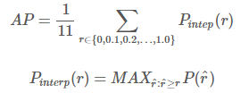

[上一篇文章](AP)  在分类检索中我们知道了AP计算的方法。

而目标检测中评判标准除了类别是否正确之外，还有IoU的限制。

参考：[知乎](https://zhuanlan.zhihu.com/p/37910324)

问题：

1. 检索问题中，对于给定的测试集（比如上一篇文章的飞机与鹅），我们的检索器可以把测试集中所有图像都打上一个分数，从而，调整阈值可以使召回率从0变化到1，得到P-R图，通过计approximated average precision或者interpolated average precision方法计算出AP。

   但是对于目标检测，是需要把物体框出来的。而检测器不可能把测试集中的ground truth 全都定位到，也就是说，在检测结果出来后（每一类一个文件，内含置信度分数及坐标），无论如何降低分类阈值，召回率有可能达不到 1 。可能我的最大召回率只有70%，这种情况下怎么计算AP呢？

2. 暂时没想到。


所以，大多数时候，这些指标很容易理解和计算。例如，在二元分类中，精确度和召回率是一个一个简单直观的统计量。然而，目标检测是一个非常不同且有趣的问题。即使你的目标检测器在图片中检测到飞机，但如果你无法定位，它也没有用处。由于你要预测的是图像中各个物体是否出现及其位置，如何计算mAP将非常有趣。 


训练好的目标检测模型会给出大量的预测结果，但是其中大多数的预测值都会有非常低的置信度（confidence score），因此我们只考虑那些置信度高于某个分类置信度阈值的预测结果。 

IoU是预测框与ground truth的交集和并集的比值。这个量也被称为Jaccard指数，并于20世纪初由Paul Jaccard首次提出。 

为了获得True Positives and False Positives，我们需要使用IoU。计算IoU，我们从而确定一个检测结果（Positive，只要检测到的并且高于IoU阈值我们都称之为Positive）是正确的（True）还是错误的（False）。最常用的阈值是0.5，即如果IoU> 0.5，则认为它是True Positive，否则认为是False Positive。而COCO数据集的评估指标建议对不同的IoU阈值进行计算，但为简单起见，**我们这里仅讨论一个阈值0.5，这是PASCAL VOC数据集所用的指标**。 


为了计算Recall，我们需要Negatives的数量。由于图片中我们没有预测到物体的每个部分都被视为Negative，因此计算True Negatives比较难办（ps：）。但是我们可以只计算False Negatives，即我们模型所漏检的物体。

另外一个需要考虑的因素是模型所给出的各个检测结果的置信度。通过改变置信度阈值，我们可以改变一个预测框是Positive还是 Negative，即改变预测值的正负性(不是box的真实正负性，是预测正负性)。基本上，阈值以上的所有预测（Box + Class）都被认为是Positives，并且低于该值的都是Negatives。

对于每一个图片，ground truth数据会给出该图片中各个类别的实际物体数量。我们可以计算每个Positive预测框与ground truth的IoU值，并取最大的IoU值，认为该预测框检测到了那个IoU最大的ground truth。然后根据IoU阈值，我们可以计算出一张图片中各个类别的正确检测值（True Positives, TP）数量以及错误检测值数量（False Positives, FP）。据此，可以计算出各个类别的precision：precision = TP / ( TP + FP ) 。

既然我们已经得到了正确的预测值数量（True Positives），也很容易计算出漏检的物体数（False Negatives, FN）。据此可以计算出Recall（其实分母可以用ground truth总数）： recall = TP / ( TP+ FN )

## VOC计算mAP

mAP这个术语有不同的定义。此度量指标通常用于信息检索和目标检测领域。然而这两个领域计算mAP的方式却不相同。这里我们只谈论目标检测中的mAP计算方法。在目标检测中，mAP的定义首先出现在PASCAL Visual Objects Classes(VOC)竞赛中，这个大赛包含许多图像处理任务。

前面我们已经讲述了如何计算Precision和Recall，但是，正如前面所述，至少有两个变量会影响Precision和Recall，即IoU和置信度阈值。IoU是一个简单的几何度量，可以很容易标准化，比如在PASCAL VOC竞赛中采用的IoU阈值为0.5，而COCO竞赛中在计算mAP较复杂，其计算了一系列IoU阈值（0.05至0.95）下的mAP。但是置信度却在不同模型会差异较大，可能在我的模型中置信度采用0.5却等价于在其它模型中采用0.8置信度，这会导致precision-recall曲线变化。

### 固定11点

为此，PASCAL VOC组织者想到了一种方法来解决这个问题，即要采用一种可以用于任何模型的评估指标。在paper中，他们推荐使用如下方式计算Average Precision（AP）： 

> For a given task and class, the precision/recall curve is computed from a method’s ranked output. Recall is defined as the proportion of all positive examples ranked above a given rank. Precision is the proportion of all examples above that rank which are from the positive class. The AP summarises the shape of the precision/recall curve, and is defined as the mean precision at a set of eleven equally spaced recall levels [0,0.1,...,1]
>
> 解释准确率和召回率那两句话没看懂。。
>
> 这个方法即上一篇提到的固定11点的方法。但是还是没有问题 1 的答案啊！！

另外，在计算precision时采用一种插值方法（interpolate）： 及对于某个recall值r，precision值取所有recall>=r中的最大值（这样保证了p-r曲线是单调递减的，避免曲线出现摇摆）。



对于Interpolated 形式的 AP，因为recall的阈值变化是等差的（或者recall轴是等分的），所以计算面积和直接计算平均值结果是一样的， 对于11points_Interpolated 来说，虽然recall的阈值也是等差的，但是11points计算平均值时会把recall=0那一点的precision算进去，但实际上那一点是人为添加的，所以计算面积和直接计算平均值会有略微差异。 

### 使用所有点

不过这里VOC数据集在2007年提出的mAP计算方法，而在2010之后却使用了所有数据点（即所有recall可能值），而不是仅使用11个recall值来计算AP（详细参考这篇[paper](http://link.zhihu.com/?target=http%3A//host.robots.ox.ac.uk/pascal/VOC/pubs/everingham15.pdf)）： 

> Up until 2009 interpolated average precision (Salton and Mcgill 1986) was used to evaluate both classification and detection. H**owever, from 2010 onwards the method of computing AP changed to use all data points** rather than TREC-style sampling (which only sampled the monotonically decreasing curve at a fixed set of uniformly-spaced recall values 0, 0.1, 0.2,..., 1). The intention in interpolating the precision–recall curve was to reduce the impact of the ‘wiggles’ in the precision–recall curve, caused by small variations in the ranking of examples. However, the downside of this interpolation was that the evaluation was too crude to discriminate between the methods at low AP. 


对于各个类别，分别按照上述方式计算AP，取所有类别的AP平均值就是mAP。这就是在目标检测问题中mAP的计算方法。可能有时会发生些许变化，如COCO数据集采用的计算方式更严格，其计算了不同IoU阈值和物体大小下的AP（详情参考[COCO Detection Evaluation](http://link.zhihu.com/?target=http%3A//cocodataset.org/%23detection-eval)）。 

## 代码实现

Facebook开源的Detectron包含[VOC数据集的mAP计算](http://link.zhihu.com/?target=https%3A//github.com/facebookresearch/Detectron/blob/05d04d3a024f0991339de45872d02f2f50669b3d/lib/datasets/voc_eval.py)，这里贴出其核心实现，以对mAP的计算有更深入的理解。 

```python
# 按照置信度降序排序
sorted_ind = np.argsort(-confidence)
BB = BB[sorted_ind, :]   # 预测框坐标
image_ids = [image_ids[x] for x in sorted_ind] # 各个预测框的对应图片id

# 便利预测框，并统计TPs和FPs
nd = len(image_ids)
tp = np.zeros(nd)
fp = np.zeros(nd)
for d in range(nd):
    R = class_recs[image_ids[d]]
    bb = BB[d, :].astype(float)
    ovmax = -np.inf
    BBGT = R['bbox'].astype(float)  # ground truth

    if BBGT.size > 0:
        # 计算IoU
        # intersection
        ixmin = np.maximum(BBGT[:, 0], bb[0])
        iymin = np.maximum(BBGT[:, 1], bb[1])
        ixmax = np.minimum(BBGT[:, 2], bb[2])
        iymax = np.minimum(BBGT[:, 3], bb[3])
        iw = np.maximum(ixmax - ixmin + 1., 0.)
        ih = np.maximum(iymax - iymin + 1., 0.)
        inters = iw * ih

        # union
        uni = ((bb[2] - bb[0] + 1.) * (bb[3] - bb[1] + 1.) +
               (BBGT[:, 2] - BBGT[:, 0] + 1.) *
               (BBGT[:, 3] - BBGT[:, 1] + 1.) - inters)

        overlaps = inters / uni
        ovmax = np.max(overlaps)
        jmax = np.argmax(overlaps)
    # 取最大的IoU
    if ovmax > ovthresh:  # 是否大于阈值
        if not R['difficult'][jmax]:  # 非difficult物体
            if not R['det'][jmax]:    # 未被检测
                tp[d] = 1.
                R['det'][jmax] = 1    # 标记已被检测
            else:
                fp[d] = 1.
    else:
        fp[d] = 1.

# 计算precision recall
fp = np.cumsum(fp)  # 顺序累计加和
tp = np.cumsum(tp)
rec = tp / float(npos)
# avoid divide by zero in case the first detection matches a difficult
# ground truth
prec = tp / np.maximum(tp + fp, np.finfo(np.float64).eps)
```

这里最终得到一系列的precision和recall值，并且这些值是按照置信度降低排列统计的，可以认为是取不同的置信度阈值（或者rank值）得到的。然后据此可以计算AP： 

```python
def voc_ap(rec, prec, use_07_metric=False):
    """Compute VOC AP given precision and recall. If use_07_metric is true, uses
    the VOC 07 11-point method (default:False).
    """
    if use_07_metric:  # 使用07年方法
        # 11 个点
        ap = 0.
        for t in np.arange(0., 1.1, 0.1):
            if np.sum(rec >= t) == 0:
                p = 0
            else:
                p = np.max(prec[rec >= t])  # 插值
            ap = ap + p / 11.
    else:  # 新方式，计算所有点
        # correct AP calculation
        # first append sentinel values at the end
        mrec = np.concatenate(([0.], rec, [1.]))
        mpre = np.concatenate(([0.], prec, [0.]))

        # compute the precision 曲线值（也用了插值）
        for i in range(mpre.size - 1, 0, -1):
            mpre[i - 1] = np.maximum(mpre[i - 1], mpre[i])

        # to calculate area under PR curve, look for points
        # where X axis (recall) changes value
        i = np.where(mrec[1:] != mrec[:-1])[0]

        # and sum (\Delta recall) * prec
        ap = np.sum((mrec[i + 1] - mrec[i]) * mpre[i + 1])
    return ap
```


参考：

[目标检测评价标准-AP mAP](https://arleyzhang.github.io/articles/c521a01c/)

[多标签图像分类任务的评价方法-mAP](http://blog.sina.com.cn/s/blog_9db078090102whzw.html)

