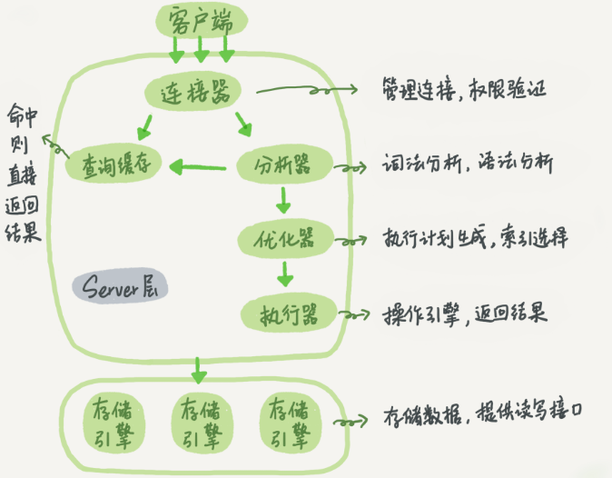
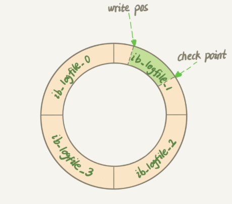
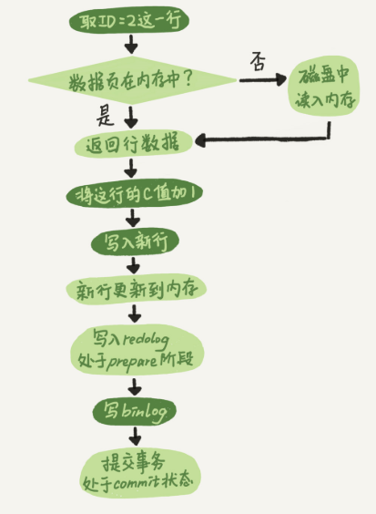

# 执行

确实我也只会写下面的语句：

```mysql
select * from T where ID=10
```

MySQL 的基本架构示意图 :



## 连接

```shell
mysql -hlocalhost -uroot -p

# 连接后，之后，这个连接里面的权限判断逻辑，都将依赖于此时读到的权限。
# 这就意味着，一个用户成功建立连接后，即使你用管理员账号对这个用户的权限做了修改，
# 也不会影响已经存在连接的权限。修改完成后，只有再新建的连接才会使用新的权限设置。
```


```mysql
show databases;   # 一定要有；分号
show processlist; # 查看连接
```


长连接与短连接的抉择：

1. 定期断开长连接。使用一段时间，或者程序里面判断执行过一个占用内存的大查询后，断开连接，之后要查询再重连。
2. 如果你用的是 MySQL 5.7 或更新版本，可以在每次执行一个比较大的操作后，通过执行 mysql_reset_connection 来重新初始化连接资源。这个过程不需要重连和重新做权限验证，但是会将连接恢复到刚刚创建完时的状态。

## 查询缓存

查询缓存的失效非常频繁，只要有对一个表的更新，这个表上所有的查询缓存都会被清空。除非你的业务就是有一张静态表，很长时间才会更新一次。比如，一个系统配置表，那这张表上的查询才适合使用查询缓存。 

MySQL 8.0 版本直接将查询缓存的整块功能删掉了，也就是说 8.0 开始彻底没有这个功能了。 

## 分析器-做什么

编译原理？词法分析、语法分析。

## 优化器-怎么做

优化器是在表里面有多个索引的时候，决定使用哪个索引；或者在一个语句有多表关联（join）的时候，决定各个表的连接顺序。 

```mysql
select * from t1 join t2 using(ID)  where t1.c=10 and t2.d=20;
```

+ 既可以先从表 t1 里面取出 c=10 的记录的 ID 值，再根据 ID 值关联到表 t2，再判断 t2 里面 d 的值是否等于 20。
+ 也可以先从表 t2 里面取出 d=20 的记录的 ID 值，再根据 ID 值关联到 t1，再判断 t1 里面 c 的值是否等于 10。

结果是一样的，但是执行的效率会有不同，而优化器的作用就是决定选择使用哪一个方案。 

## 执行器


开始执行的时候，**要先判断一下你对这个表 T 有没有执行查询的权限（为什么是这里判断？）**，如果没有，就会返回没有权限的错误，如下所示 (在工程实现上，如果命中查询缓存，会在查询缓存返回结果的时候，做权限验证。查询也会在优化器之前调用 precheck 验证权限)。 

```mysql
select * from T where ID=10;
 
ERROR 1142 (42000): SELECT command denied to user 'b'@'localhost' for table 'T'
```


## 问题

如果表 T 中没有字段 k，而你执行了这个语句 `select * from T where k=1;`, 那肯定是会报“不存在这个列”的错误： “Unknown column ‘k’ in ‘where clause’”。你觉得这个错误是在我们上面提到的哪个阶段报出来的呢？ 

分析器！

我创建了一个没有select权限的用户，执行select * from T where k=1，报错“select command denied”，并没有报错“unknown column”，是不是可以说明是在打开表之后才判断读取的列不存在？

> 作者回复: 这个是一个安全方面的考虑。你想想一个用户如果没有查看这个表的权限，你是会告诉他字段不对还是没权限？如果告诉他字段不对，其实给的信息太多了，因为没权限的意思还包含了：没权限知道字段是否存在😄


有个问题不太明白，为什么对权限的检查不在优化器之前做？

> 作者回复: 有些时候，SQL语句要操作的表不只是SQL字面上那些。比如如果有个触发器，得在执行器阶段（过程中）才能确定。优化器阶段前是无能为力的

# 日志模块

假设：

```mysql
create table T(ID int primary key, c int);
update T set c=c+1 where ID=2;
```

与查询流程一样的是，会走所有流程，与查询流程不一样的是，更新流程还涉及两个重要的日志模块，它们正是我们今天要讨论的主角：redo log（重做日志）和 binlog（归档日志）。 

日志的作用：MySQL 可以恢复到半个月内任意一秒的状态，惊叹的同时，你是不是心中也会不免会好奇，这是怎样做到的呢？ 

## 重要的日志模块：redo log

MySQL 里经常说到的 WAL 技术，WAL 的全称是 Write-Ahead Logging，它的关键点就是先写日志，再写磁盘，也就是先写粉板，等不忙的时候再写账本。 

InnoDB 的 redo log 是固定大小的，比如可以配置为一组 4 个文件，每个文件的大小是 1GB，那么这块“粉板”总共就可以记录 4GB 的操作。从头开始写，写到末尾就又回到开头循环写，如下面这个图所示：



write pos 是当前记录的位置，一边写一边后移；checkpoint 是当前要擦除的位置，也是往后推移并且循环的，擦除记录前要把记录更新到数据文件。 有了 redo log，InnoDB 就可以保证即使数据库发生异常重启，之前提交的记录都不会丢失，这个能力称为**crash-safe**。 

## 重要的日志模块：binlog

 redo log 是 InnoDB 引擎特有的日志，而 Server 层也有自己的日志，称为 binlog（归档日志）。

 我想你肯定会问，为什么会有两份日志呢？

> 因为最开始 MySQL 里并没有 InnoDB 引擎。MySQL 自带的引擎是 MyISAM，但是 MyISAM 没有 crash-safe 的能力，**binlog 日志只能用于归档**。而 InnoDB 是另一个公司以插件形式引入 MySQL 的，既然只依靠 binlog 是没有 crash-safe 能力的，所以 InnoDB 使用另外一套日志系统——也就是 redo log 来实现 crash-safe 能力。

不同：

1. redo log 是 InnoDB 引擎特有的；binlog 是 MySQL 的 Server 层实现的，所有引擎都可以使用。
2. redo log 是物理日志，记录的是“在某个数据页上做了什么修改”；binlog 是逻辑日志，记录的是这个语句的原始逻辑，比如“给 ID=2 这一行的 c 字段加 1 ”。
3. redo log 是循环写的，空间固定会用完；binlog 是可以追加写入的。“追加写”是指 binlog 文件写到一定大小后会切换到下一个，并不会覆盖以前的日志。

## 两阶段提交

```mysql
update T set c=c+1 where ID=2;
```

 update 语句的执行流程图，图中浅色框表示是在 InnoDB 内部执行的，深色框表示是在执行器中执行的。 



**怎样让数据库恢复到半个月内任意一秒的状态？** 

当需要恢复到指定的某一秒时，比如某天下午两点发现中午十二点有一次误删表，需要找回数据，那你可以这么做：

+ 首先，找到最近的一次全量备份，如果你运气好，可能就是昨天晚上的一个备份，从这个备份恢复到临时库；
+ 然后，从备份的时间点开始，将备份的 binlog 依次取出来，重放到中午误删表之前的那个时刻。（中午之后的呢）

这样你的临时库就跟误删之前的线上库一样了，然后你可以把表数据从临时库取出来，按需要恢复到线上库去。 

**如果不用两阶段提交？**

仍然用前面的 update 语句来做例子。假设当前 ID=2 的行，字段 c 的值是 0，再假设执行 update 语句过程中在写完第一个日志后，第二个日志还没有写完期间发生了 crash，会出现什么情况呢？

1. **先写 redo log 后写 binlog**。假设在 redo log 写完，binlog 还没有写完的时候，MySQL 进程异常重启。由于我们前面说过的，redo log 写完之后，系统即使崩溃，仍然能够把数据恢复回来，所以恢复后这一行 c 的值是 1。
   但是由于 binlog 没写完就 crash 了，这时候 binlog 里面就没有记录这个语句。因此，之后备份日志的时候，存起来的 binlog 里面就没有这条语句。
   然后你会发现，如果需要用这个 binlog 来恢复临时库的话，由于这个语句的 binlog 丢失，这个临时库就会少了这一次更新，恢复出来的这一行 c 的值就是 0，与原库的值不同。
2. **先写 binlog 后写 redo log**。如果在 binlog 写完之后 crash，由于 redo log 还没写，崩溃恢复以后这个事务无效，所以这一行 c 的值是 0。但是 binlog 里面已经记录了“把 c 从 0 改成 1”这个日志。所以，在之后用 binlog 来恢复的时候就多了一个事务出来，恢复出来的这一行 c 的值就是 1，与原库的值不同。

系统崩溃，可以用redo log恢复？binlog可以恢复临时库？这样理解对吗？为什么说binlog没有crash safe的能力。

我的理解：redo log 记录了物理层面的修改，系统崩溃，可以直接按照redo log恢复。而binlog必须基于一个备份库，因为它记录的是做了什么修改。

## 问题

前面我说到定期全量备份的周期“取决于系统重要性，有的是一天一备，有的是一周一备”。那么在什么场景下，一天一备会比一周一备更有优势呢？或者说，它影响了这个数据库系统的哪个指标？ 


我可以认为redo log 记录的是这个行在这个页更新之后的状态，binlog 记录的是sql吗？ 

> 作者回复: Redo log不是记录数据页“更新之后的状态”，而是记录这个页 “做了什么改动”。  Binlog有两种模式，statement 格式的话是记sql语句， row格式会记录行的内容，记两条，更新前和更新后都有。 

如果提交事务的时候正好重启那么redo log和binlog会怎么处理？此时redo log处于prepare阶段，如果不接受这条log，但是binlog已经接受，还是说binlog会去检查redo log的状态，状态为prepare的不会恢复？ 

> Binlog如果已经接受，那么redolog是prepare, binlog已经完整了对吧，这时候崩溃恢复过程会认可这个事务，提交掉。  

1.写redo日志也是写io（我理解也是外部存储）。同样耗费性能。怎么能做到优化呢 2.数据库只有redo commit 之后才会真正提交到数据库吗 

> 作者回复: 1. **Redolog是顺序写**，不用去“找位置”，而更新数据需要找位置 ，并且可以组提交，还有别的一些优化，收益最大是是这两个因素；  2.是这样，正常执行是要commit 才算完，但是崩溃恢复过程的话，可以接受“redolog prepare 并且binlog完整” 的情况 

