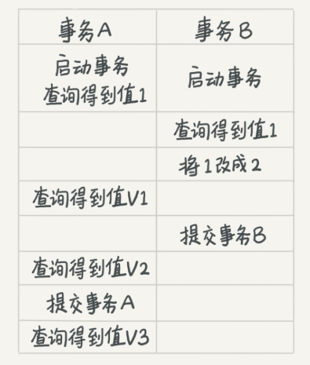
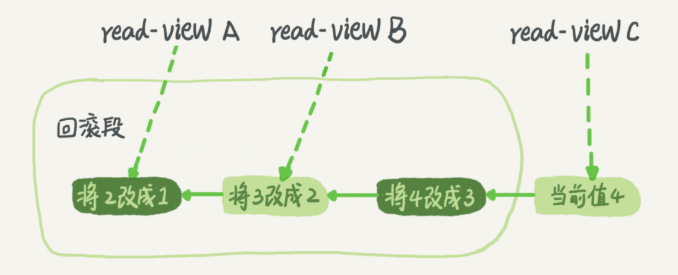

# 事务隔离

MySQL 是一个支持多引擎的系统，但并不是所有的引擎都支持事务。比如 MySQL 原生的 MyISAM 引擎就不支持事务，这也是 MyISAM 被 InnoDB 取代的重要原因之一。 

## 隔离性与隔离级别

提到事务，你肯定会想到 ACID（**Atomicity、Consistency、Isolation、Durability**，即原子性、一致性、隔离性、持久性），今天我们就来说说其中 I，也就是“隔离性”。 

当数据库上有多个事务同时执行的时候，就可能出现脏读（dirty read）、不可重复读（non-repeatable read）、幻读（phantom read）的问题，为了解决这些问题，就有了“隔离级别”的概念。 

以上都是什么意思啊？

**隔离级别**与效率之间要寻找平衡点。SQL 标准的事务隔离级别包括：读未提交（read uncommitted）、读提交（read committed）、可重复读（repeatable read）和串行化（serializable ）。 

+ 读未提交是指，一个事务还没提交时，它做的变更就能被别的事务看到。
  ~~——读了还未提交的。未提交的是可能失败的。~~
+ 读提交是指，一个事务提交之后，它做的变更才会被其他事务看到。
+ 可重复读是指，一个事务执行过程中看到的数据，总是跟这个事务在启动时看到的数据是一致的。当然在可重复读隔离级别下，未提交变更对其他事务也是不可见的。
+ 串行化，顾名思义是对于同一行记录，“写”会加“写锁”，“读”会加“读锁”。当出现读写锁冲突的时候，后访问的事务必须等前一个事务执行完成，才能继续执行。

可以看到我机器上的MySQL隔离级别是可重复读（RR）：而且我怎么觉着除了最后的串行化级别靠谱点，其余的都不太靠谱呢😀？我认为每个级别都有自己的使用场景吧！

```powershell
mysql> show variables like 'transaction_isolation';
+-----------------------+-----------------+
| Variable_name         | Value           |
+-----------------------+-----------------+
| transaction_isolation | REPEATABLE-READ |
+-----------------------+-----------------+
1 row in set, 1 warning (0.00 sec)
```


说实话，不看例子去理解这些解释的含义，真滴是费劲。下面看例子，有如下数据库表：

```c++
mysql> create table T(c int) engine=InnoDB;
insert into T(c) values(1);
```

两个事务行为：




+ 读未提交：V1 = 2 ， V2 = V3 = 2
+ 读提交：V1 = 1，V2 = V3 = 2
+ 可重复读：V1 = V2 = 1，之所以 V2 还是 1，遵循的就是这个要求：事务在执行期间看到的数据前后必须是一致的。 V3 = 2
+ B遇到锁，需要等到事务A提交，所以，V1 = V2 = 1，V3 = 2

在实现上，数据库里面会创建一个视图，访问的时候以视图的逻辑结果为准。

1. 在“可重复读”隔离级别下，这个视图是在事务启动时创建的，整个事务存在期间都用这个视图。所以这也解释了事务在执行期间看到的数据前后一致。
2. 在“读提交”隔离级别下，这个视图是在每个 SQL 语句开始执行的时候创建的。 ？？？岂不是与事务提交无关了❓❓❓
3. 这里需要注意的是，“读未提交”隔离级别下直接返回记录上的最新值，没有视图概念；而“串行化”隔离级别下直接用加锁的方式来避免并行访问。 


我想**你可能会问那什么时候需要“可重复读”的场景呢**？我们来看一个数据校对逻辑的案例。 

> 假设你在管理一个个人银行账户表。一个表存了每个月月底的余额，一个表存了账单明细。这时候你要做数据校对，也就是判断上个月的余额和当前余额的差额，是否与本月的账单明细一致。你一定希望在校对过程中，即使有用户发生了一笔新的交易，也不影响你的校对结果。
>
> 这时候使用“可重复读”隔离级别就很方便。事务启动时的视图可以认为是静态的，不受其他事务更新的影响。
> 666

## 事务隔离的实现

每个视图是怎么看到，与视图建立时一致的数据的。是复制一份表格嘛？肯定不是，太慢了。

“可重复读”的一个例子，事务执行过程中看到的数据，总是跟这个事务在启动时看到的数据是一致的，视图也会在事务启动的时候建立。

在 MySQL 中，实际上每条记录在更新的时候都会同时记录一条回滚操作。记录上的最新值，通过回滚操作，都可以得到前一个状态的值。假设一个值从 1 被按顺序改成了 2、3、4，在回滚日志里面就会有类似下面的记录：



三个事务，三个不同的视图（read view），如图中看到的，在视图 A、B、C 里面，这一个记录的值分别是 1、2、4， 同一条记录在系统中可以存在多个版本，就是数据库的多版本并发控制（MVCC）。对于 read-view A，要得到 1，就必须将当前值依次执行图中所有的回滚操作得到。 

当系统里没有比这个回滚日志更早的 read-view 的时候，回滚日志会被删除。 

## 避免长事务

长事务意味着系统里面会存在很老的事务视图。由于这些事务随时可能访问数据库里面的任何数据，所以这个事务提交之前，数据库里面它可能用到的回滚记录都必须保留，这就会导致大量占用存储空间。 除了对回滚段的影响，长事务还占用锁资源，也可能拖垮整个库，。

## 事务启动方式

一条sql语句算是事务嘛？

MySQL 的事务启动方式有以下几种：

1. 显式启动事务语句， begin 或 start transaction。配套的提交语句是 commit，回滚语句是 rollback。
2. set autocommit=0，这个命令会将这个线程的自动提交关掉。意味着如果你只执行一个 select 语句，这个事务就启动了，而且并不会自动提交。这个事务持续存在直到你主动执行 commit 或 rollback 语句，或者断开连接。

但是有的开发同学会纠结“多一次交互”的问题。对于一个需要频繁使用事务的业务，第二种方式每个事务在开始时都不需要主动执行一次 “begin”，减少了语句的交互次数。如果你也有这个顾虑，我建议你使用 commit work and chain 语法。

在 autocommit 为 1 的情况下，用 begin 显式启动的事务，如果执行 commit 则提交事务。如果执行 commit work and chain，则是提交事务并自动启动下一个事务，这样也省去了再次执行 begin 语句的开销。同时带来的好处是从程序开发的角度明确地知道每个语句是否处于事务中。


## 问题

读未提交：别人改数据的事务尚未提交，我在我的事务中也能读到。 
读已提交：别人改数据的事务已经提交，我在我的事务中才能读到。
可重复读：别人改数据的事务已经提交，我在我的事务中也不去读。
串行：我的事务尚未提交，别人就别想改数据。 
这4种隔离级别，并行性能依次降低，安全性依次提高。 


在“读提交”隔离级别下，这个视图是在每个 SQL 语句开始执行的时候创建的。这句话怎么理解呢 ？跟事务提不提交没啥关系了啊？别的业务提交后，数据才会更改，SQL语句开始执行前创建一个read-view，读到的就是其他业务已经提交过的。 

### 如何避免长事务对业务的影响

这个问题，我们可以从应用开发端和数据库端来看。

**首先，从应用开发端来看：**

1. 确认是否使用了 set autocommit=0。这个确认工作可以在测试环境中开展，把 MySQL 的 general_log 开起来，然后随便跑一个业务逻辑，通过 general_log 的日志来确认。一般框架如果会设置这个值，也就会提供参数来控制行为，你的目标就是把它改成 1。
2. 确认是否有不必要的只读事务。有些框架会习惯不管什么语句先用 begin/commit 框起来。我见过有些是业务并没有这个需要，但是也把好几个 select 语句放到了事务中。这种只读事务可以去掉。
3. 业务连接数据库的时候，根据业务本身的预估，通过 SET MAX_EXECUTION_TIME 命令，来控制每个语句执行的最长时间，避免单个语句意外执行太长时间。（为什么会意外？在后续的文章中会提到这类案例）

**其次，从数据库端来看：**

1. 监控 information_schema.Innodb_trx 表，设置长事务阈值，超过就报警 / 或者 kill；
2. Percona 的 pt-kill 这个工具不错，推荐使用；
3. 在业务功能测试阶段要求输出所有的 general_log，分析日志行为提前发现问题；
4. 如果使用的是 MySQL 5.6 或者更新版本，把 innodb_undo_tablespaces 设置成 2（或更大的值）。如果真的出现大事务导致回滚段过大，这样设置后清理起来更方便。

