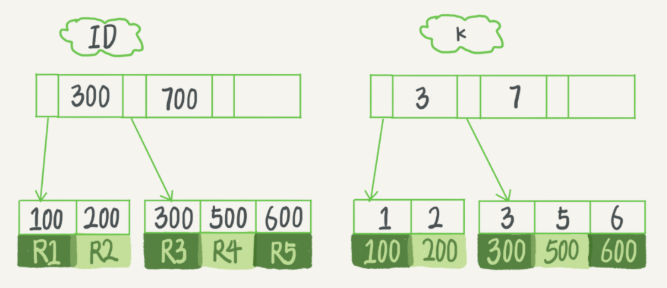
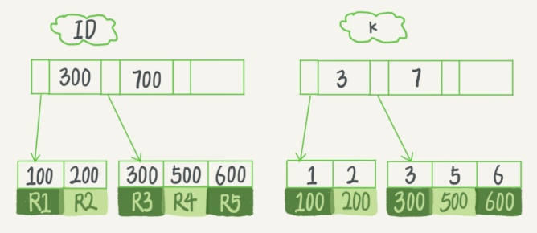
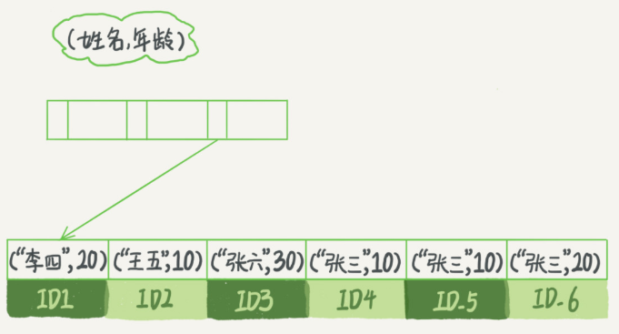

# 索引？

20200528

索引是什么？不知道。比如某一个 SQL 查询比较慢，分析完原因之后，你可能就会说“给某个字段加个索引吧”之类的解决方案。但到底什么是索引，索引又是如何工作的呢？ 

> 一句话简单来说，索引的出现其实就是为了提高数据查询的效率，就像书的目录一样。一本 500 页的书，如果你想快速找到其中的某一个知识点，在不借助目录的情况下，那我估计你可得找一会儿。同样，对于数据库的表而言，索引其实就是它的“目录”。 

## 索引常见模型

+ 哈希表：**哈希表这种结构适用于只有等值查询的场景**，比如 Memcached 及其他一些 NoSQL 引擎。 
+ 有序数组：而**有序数组在等值查询和范围查询场景中的性能就都非常优秀**。 按照字段递增顺序存储。但中间插入一个记录需要挪动后面所有记录，成本高。所以，**有序数组索引只适用于静态存储引擎**，比如你要保存的是 2017 年某个城市的所有人口信息，这类不会再修改的数据。 
+ 二叉搜索树：二叉树是搜索效率最高的，但是实际上大多数的数据库存储却并不使用二叉树。其原因是，索引不止存在内存中，还要写到磁盘上。一棵 100 万节点的平衡二叉树，树高 20。一次查询可能需要访问 20 个数据块。  在机械硬盘时代，从磁盘随机读一个数据块需要 10 ms 左右的寻址时间,单独访问一个行可能需要 20 个 10 ms 的时间，这个查询可真够慢的。
+ N叉树，以 InnoDB 的一个整数字段索引为例，这个 N 差不多是 1200。 这棵树高是 4 的时候，就可以存 1200 的 3 次方个值，这已经 17 亿了。 考虑到树根的数据块总是在内存中的，一个 10 亿行的表上一个整数字段的索引，查找一个值最多只需要访问 3 次磁盘。其实，树的第二层也有很大概率在内存中，那么访问磁盘的平均次数就更少了。 问题：**N叉树怎么搜索呢？？？**奥奥，好像只有叶子节点存储数据。
+ 跳表
+ LSM树


这里有一个问题，如果是不能比较大小的字段呢？


## InnoDB索引模型 B+

在 MySQL 中，索引是在存储引擎层实现的，所以并没有统一的索引标准，即不同存储引擎的索引的工作方式并不一样。而即使多个存储引擎支持同一种类型的索引，其底层的实现也可能不同。由于 InnoDB 存储引擎在 MySQL 数据库中使用最为广泛，所以下面我就以 InnoDB 为例，和你分析一下其中的索引模型。 

+ 在 InnoDB 中，表都是根据主键顺序以索引的形式存放的，这种存储方式的表称为索引组织表。 
+ 每一个索引在 InnoDB 里面对应一棵 B+ 树。 

假设，我们有一个主键列为 ID 的表，表中有字段 k，并且在 k 上有索引。 

```mysql
create table T(
id int primary key, 
k int not null, 
name varchar(16),
index (k))engine=InnoDB;
```

表中 R1~R5 的 (ID,k) 值分别为 (100,1)、(200,2)、(300,3)、(500,5) 和 (600,6)，两棵树的示例示意图如下。:




根据上图可以看出，索引类型分为主键索引和非主键索引。 

+ 主键索引的叶子节点存的是**整行数据**。在 InnoDB 里，主键索引也被称为聚簇索引（clustered index）
+ 非主键索引的叶子节点内容是**主键的值**。在 InnoDB 里，非主键索引也被称为二级索引（secondary index）。
+ 如果语句是 select * from T where k=5，即普通索引查询方式，则需要先搜索 k 索引树，得到 ID 的值为 500，再到 ID 索引树搜索一次。这个过程称为回表。 

## 索引维护

B+树，插入、页分裂（性能自然会受影响，除了性能外，页分裂操作还影响数据页的利用率。原本放在一个页的数据，现在分到两个页中，整体空间利用率降低大约 50%）、合并。


## 基于索引考虑主键设置

> 你可能在一些建表规范里面见到过类似的描述，要求建表语句里一定要有自增主键。当然事无绝对，我们来分析一下哪些场景下应该使用自增主键，而哪些场景下不应该。 

自增主键：插入新记录的时候可以不指定 ID 的值，系统会获取当前 ID 最大值加 1 作为下一条记录的 ID 值。也就是说，自增主键的插入数据模式，正符合了我们前面提到的递增插入的场景。每次插入一条新记录，都是追加操作，都不涉及到挪动其他记录，也不会触发叶子节点的分裂。


场景：除了考虑性能外，我们还可以从存储空间的角度来看。假设你的表中确实有一个唯一字段，比如字符串类型的身份证号，那应该用身份证号做主键，还是用自增字段做主键呢？ 

由于每个非主键索引的叶子节点上都是主键的值。如果用身份证号做主键，那么每个二级索引的叶子节点占用约 20 个字节，而如果用整型做主键，则只要 4 个字节，如果是长整型（bigint）则是 8 个字节。 

**显然，主键长度越小，普通索引的叶子节点就越小，普通索引占用的空间也就越小。** 

**有没有什么场景适合用业务字段直接做主键的呢？**还是有的。比如，有些业务的场景需求是这样的：

1. 只有一个索引；
2. 该索引必须是唯一索引。

你一定看出来了，这就是典型的 KV 场景。由于没有其他索引，所以也就不用考虑其他索引的叶子节点大小的问题。这时候我们就要优先考虑上一段提到的“尽量使用主键查询”原则，直接将这个索引设置为主键，可以避免每次查询需要搜索两棵树。

# 问题

## N叉树的N

“N叉树”的N值在MySQL中是可以被人工调整的么？曾经面试被问到过这问题，当时就懵逼了... 

> 作者回复: 面试中题面越简单的问题越暗藏凶险，可见一斑…  可以按照调整key的大小的思路来说；  如果你能指出来5.6以后可以通过page大小来间接控制应该能加分吧  面试回答不能太精减，计算方法、前缀索引什么的一起上😄  


## 覆盖索引

一个innoDB引擎的表，数据量非常大，根据二级索引搜索会比主键搜索快，文章阐述的原因是主键索引和数据行在一起，非常大搜索慢，我的疑惑是：通过普通索引找到主键ID后，同样要跑一边主键索引，还望老师解惑。。。 

>作者回复: 问出这个问题表示你今天的文章看明白了👍🏿  看完明天的（下），我估计你就有答案了 

20200528确实有答案了。。

## 重建索引问题

对于上面例子中的 InnoDB 表 T，如果你要重建索引 k，你的两个 SQL 语句可以这么写： 

```mysql
alter table T drop index k;
alter table T add index(k);
```

如果你要重建主键索引，也可以这么写： 

```mysql
alter table T drop primary key;
alter table T add primary key(id);
```

我的问题是，对于上面这两个重建索引的作法，说出你的理解。如果有不合适的，为什么，更好的方法是什么？

>  感觉上，使用过数据库的人，并且熟悉数据库的人才能回答。
>
> 重建索引 k 的做法是合理的，可以达到省空间的目的。但是，重建主键的过程不合理。不论是删除主键还是创建主键，都会将整个表重建。所以连着执行这两个语句的话，第一个语句就白做了。这两个语句，你可以用这个语句代替 ： alter table T engine=InnoDB。在专栏的第 12 篇文章《为什么表数据删掉一半，表文件大小不变？》中，我会和你分析这条语句的执行流程。 

20200528这里有个疑问，问什么重建主键索引，其他索引就白做了❓❓❓ 不还是对应的主键值嘛。

为什么要重建索引？

> 我们文章里面有提到，索引可能因为删除，或者页分裂等原因，导致数据页有空洞，重建索引的过程会创建一个新的索引，把数据按顺序插入，这样页面的利用率最高，也就是索引更紧凑、更省空间。 


# 索引(下)

在下面这个表 T 中，如果我执行 select * from T where k between 3 and 5，需要执行几次树的搜索操作，会扫描多少行？

```mysql
create table T (
ID int primary key,
k int NOT NULL DEFAULT 0, 
s varchar(16) NOT NULL DEFAULT '',
index k(k))
engine=InnoDB;
 
insert into T values(100,1, 'aa'),(200,2,'bb'),(300,3,'cc'),(500,5,'ee'),(600,6,'ff'),(700,7,'gg');
```




## 查询流程

现在，我们一起来看看这条 SQL 查询语句的执行流程：

1. 在 k 索引树上找到 k=3 的记录，取得 ID = 300；
2. 再到 ID 索引树查到 ID=300 对应的 R3；
3. 在 k 索引树取下一个值 k=5，取得 ID=500；
4. 再回到 ID 索引树查到 ID=500 对应的 R4；
5. 在 k 索引树取下一个值 k=6，不满足条件，循环结束。

在这个过程中，**回到主键索引树搜索的过程，我们称为回表**。可以看到，这个查询过程读了 k 索引树的 3 条记录（步骤 1、3 和 5），回表了两次（步骤 2 和 4）。 

在这个例子中，由于查询结果所需要的数据只在主键索引上有，所以不得不回表。那么，有没有可能经过索引优化，避免回表过程呢？ 

## 覆盖索引

如果执行的语句是 select ID from T where k between 3 and 5，这时只需要查 ID 的值，而 ID 的值已经在 k 索引树上了，因此可以直接提供查询结果，不需要回表。也就是说，在这个查询里面，索引 k 已经“覆盖了”我们的查询需求，我们称为覆盖索引。 

**由于覆盖索引可以减少树的搜索次数，显著提升查询性能，所以使用覆盖索引是一个常用的性能优化手段。** 

## 扫描行数

需要注意的是，在引擎内部使用覆盖索引在索引 k 上其实读了三个记录，R3~R5（对应的索引 k 上的记录项），但是对于 MySQL 的 Server 层来说，它就是找引擎拿到了两条记录，因此 MySQL 认为扫描行数是 2。 

> 备注：关于如何查看扫描行数的问题，我将会在第 16 文章《如何正确地显示随机消息？》中，和你详细讨论。 

## 联合索引？

覆盖索引场景，市民表：

```mysql
CREATE TABLE `tuser` (
  `id` int(11) NOT NULL,
  `id_card` varchar(32) DEFAULT NULL,
  `name` varchar(32) DEFAULT NULL,
  `age` int(11) DEFAULT NULL,
  `ismale` tinyint(1) DEFAULT NULL,
  PRIMARY KEY (`id`),
  KEY `id_card` (`id_card`),
  KEY `name_age` (`name`,`age`)
) ENGINE=InnoDB
```

身份证索引足以，再建立一个（身份证号、姓名）的联合索引，是不是浪费空间？ 

> 如果现在有一个高频请求，要根据市民的身份证号查询他的姓名，这个联合索引就有意义了。它可以在这个高频请求上用到覆盖索引，不再需要回表查整行记录，减少语句的执行时间。 

索引字段的维护总是有代价的。因此，在建立冗余索引来支持覆盖索引时就需要权衡考虑了。这正是业务 DBA，或者称为业务数据架构师的工作。 

## 最左前缀原则

这里，我先和你说结论吧。**B+ 树这种索引结构，可以利用索引的“最左前缀”，来定位记录。** 为了直观地说明这个概念，我们用（name，age）这个联合索引来分析：



可以看到：索引是按照索引定义里面出现的字段顺序排序的，所以创建索引时的字段顺序也有讲究😀。

当你的 SQL 语句的条件是`where name like '张 %'`。这时，你也能够用上这个联合索引，查找到第一个符合条件的记录是 ID3，然后向后遍历，直到不满足条件为止。 

可以看到，只要满足最左前缀，就可以利用索引来加速检索。这个最左前缀可以是联合索引的最左 N 个字段，也可以是字符串索引的最左 M 个字符。 

## 联合索引字段顺序（最左前缀）

基于上面对最左前缀索引的说明，我们来讨论一个问题：**在建立联合索引的时候，如何安排索引内的字段顺序。** 

这里我们的评估标准是，索引的复用能力。因为可以支持最左前缀，所以当已经有了 (a,b) 这个联合索引后，一般就不需要单独在 a 上建立索引了。因此，**第一原则是，如果通过调整顺序，可以少维护一个索引，那么这个顺序往往就是需要优先考虑采用的。** 

如果既有联合查询，又有基于 a、b 各自的查询呢？ 你需要同时维护 (a,b)、(b) 这两个索引，或者（b,a）、（a）两个索引。如何抉择呢？ 

这时候，我们要**考虑的原则就是空间**了。比如上面这个市民表的情况，name 字段是比 age 字段大的 ，那我就建议你创建一个（name,age) 的联合索引和一个 (age) 的单字段索引。 

## 索引下推？

那些不符合最左前缀的部分，会怎么样呢？ 我们还是以市民表的联合索引（name, age）为例，如上图。

```mysql
select * from tuser where name like '张 %' and age=10 and ismale=1;
```

你已经知道了前缀索引规则，所以这个语句在搜索索引树的时候，只能用 “张”，找到第一个满足条件的记录 ID3。当然，这还不错，总比全表扫描要好。 

> 这里有疑惑，只能用“张”？

+ 在 MySQL 5.6 之前，只能从 ID3 开始一个个回表。到主键索引上找出数据行，再对比字段值。
+ 而 MySQL 5.6 引入的索引下推优化（index condition pushdown)， 可以在索引遍历过程中，对索引中包含的字段先做判断，直接过滤掉不满足条件的记录，减少回表次数。

对比：InnoDB 在 (name,age) 索引内部就判断了 age 是否等于 10，对于不等于 10 的记录，直接判断并跳过。在我们的这个例子中，只需要对 ID4、ID5 这两条记录回表取数据判断，就只需要回表 2 次。 而不利用索引下推需要回表4次。

# 问题

## 联合索引场景问题

实际上主键索引也是可以使用多个字段的（多个字段作为主键？）。DBA 小吕在入职新公司的时候，就发现自己接手维护的库里面，有这么一个表，表结构定义类似这样的： 

```mysql
CREATE TABLE `geek` (
  `a` int(11) NOT NULL,
  `b` int(11) NOT NULL,
  `c` int(11) NOT NULL,
  `d` int(11) NOT NULL,
  PRIMARY KEY (`a`,`b`),
  KEY `c` (`c`),
  KEY `ca` (`c`,`a`),
  KEY `cb` (`c`,`b`)
) ENGINE=InnoDB;
```

公司的同事告诉他说，由于历史原因，这个表需要 a、b 做联合主键，这个小吕理解了。 

但是，学过本章内容的小吕又纳闷了，既然主键包含了 a、b 这两个字段，那意味着单独在字段 c 上创建一个索引，就已经包含了三个字段了呀，为什么要创建“ca”“cb”这两个索引？ 

同事告诉他，是因为他们的业务里面有这样的两种语句： 

```mysql
select * from geek where c=N order by a limit 1;
select * from geek where c=N order by b limit 1;
```

我给你的问题是，这位同事的解释对吗，为了这两个查询模式，这两个索引是否都是必须的？为什么呢？ 

我猜，没必要，既然`select *`了，无论如何都得回表，order by在回表后做，效率应该不比现在差。


## 索引不释放

老师的每一篇都会讲到平常工作用遇到的事情. 这个专栏真的很值. 今天这个 alter table T engine=InnoDB 让我想到了我们线上的一个表, 记录日志用的, 会定期删除过早之前的数据. 最后这个表实际内容的大小才10G, 而他的索引却有30G. 在阿里云控制面板上看,就是占了40G空间. 这可花的是真金白银啊. 后来了解到是 InnoDB 这种引擎导致的,虽然删除了表的部分记录,但是它的索引还在, 并未释放。


## 其他

老师，有这么个问题 一张表两个字段id, uname,id主键，uname普通索引 SELECT * FROM test_like WHERE uname LIKE 'j'/ 'j%' / '%j'/ '%j%' 模糊查询like后面四种写法都可以用到uname的普通索引 

> 作者回复: 好问题，这个是关于“用索引” 和 “用索引快速定位记录”的区别。  08 篇讲到这个问题了，周五关注一下。  简单回答：“用索引”有一种用法是 “顺序扫描索引” 