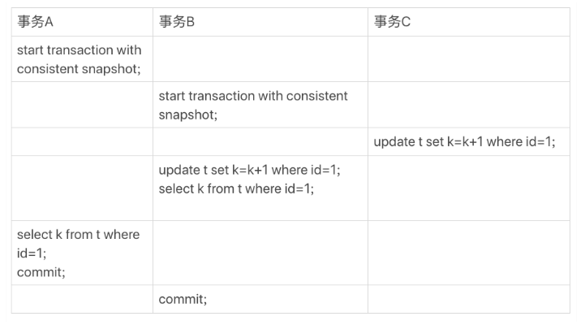
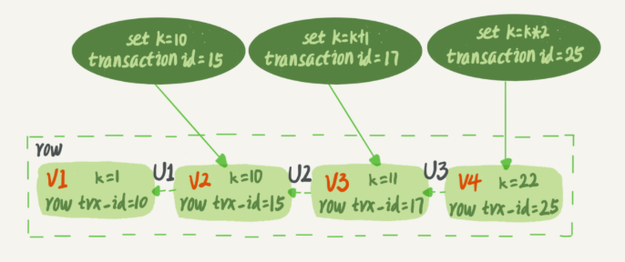
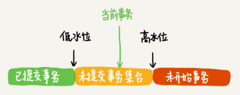
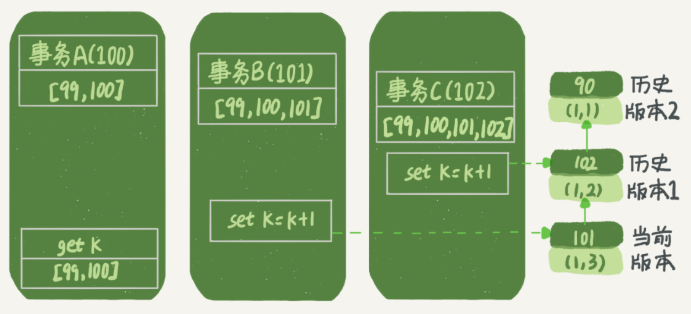
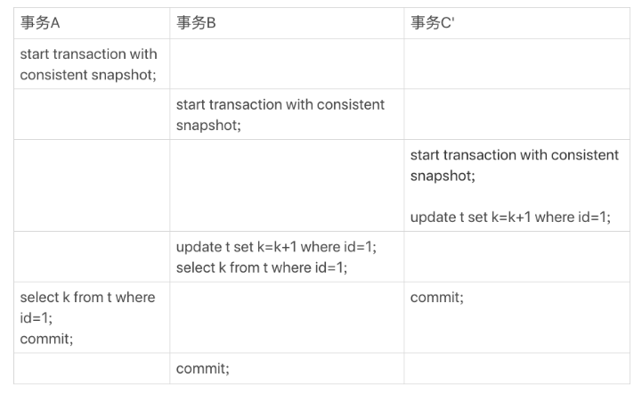
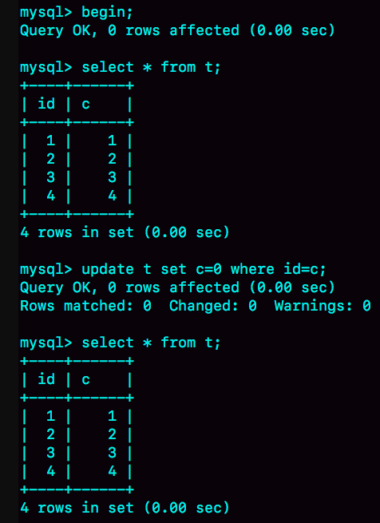
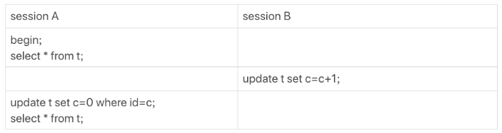
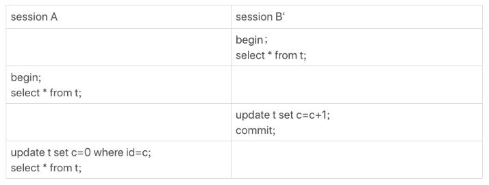

# 事务到底是隔离的还是不隔离的？

## 可重复读

可重复读隔离级别，事务 T 启动的时候会创建一个视图 read-view， 之后事务 T 执行期间，即使有其他事务修改了数据，事务 T 看到的仍然跟在启动时看到的一样。也就是说，一个在可重复读隔离级别下执行的事务，好像与世无争，不受外界影响。 

但是，我在上一篇文章中（锁），和你分享行锁的时候又提到，一个事务要更新一行，如果刚好有另外一个事务拥有这一行的行锁，它又不能这么超然了，会被锁住，进入等待状态。问题是，既然进入了等待状态，那么等到这个事务自己获取到行锁要更新数据的时候，它读到的值又是什么呢？ 

晕不晕😵？举一个例子吧，下面是一个只有两行的表的初始化语句。 

```mysql
CREATE TABLE `t` (
  `id` int(11) NOT NULL,
  `k` int(11) DEFAULT NULL,
  PRIMARY KEY (`id`)
) ENGINE=InnoDB;

insert into t(id, k) values(1,1),(2,2);
```



上图是事务A B C 的执行流程。这里，我们需要注意的是事务的启动时机。

begin/start transaction 命令并不是一个事务的起点，在执行到它们之后的第一个操作 InnoDB 表的语句，事务才真正启动。如果你想要马上启动一个事务，可以使用 start transaction with consistent snapshot 这个命令。

+ 第一种启动方式，一致性视图是在第执行第一个快照读语句时创建的； 
+ 第二种启动方式，一致性视图是在执行 start transaction with consistent snapshot 时创建的。 

还需要注意的是，在整个专栏里面，我们的例子中如果没有特别说明，都是默认 autocommit=1。 在这个例子中，事务 C 没有显式地使用 begin/commit，表示这个 update 语句本身就是一个事务，语句完成的时候会自动提交。事务 B 在更新了行之后查询 ; 事务 A 在一个只读事务中查询，并且时间顺序上是在事务 B 的查询之后。 

>  我认为，A事务 k=1，B 事务开始后，k = 1，期间C修改了数据，B看不到，所以k = k + 1，k = 2（但这一行是写操作，要受到C事务行锁的约束）， 但我不知道行锁该用在哪里。C事务也将k置为2，那么一致性被破坏。应该本来k = 3。

这时，如果我告诉你事务 B 查到的 k 的值是 3，而事务 A 查到的 k 的值是 1，你是不是感觉有点晕呢？ 

## 两个视图？

在 MySQL 里，有两个“视图”的概念：

+ 一个是 view。它是一个用查询语句定义的虚拟表，在调用的时候执行查询语句并生成结果。创建视图的语法是 create view … ，而它的查询方法与表一样。
+ 另一个是 InnoDB 在实现 MVCC 时用到的一致性读视图，即 consistent read view，用于支持 RC（Read Committed，读提交）和 RR（Repeatable Read，可重复读）隔离级别的实现。

它没有物理结构，作用是事务执行期间用来定义“我能看到什么数据” 。

## “快照”在 MVCC 里是怎么工作的？

在可重复读隔离级别下，事务在启动的时候就“拍了个快照”。注意，**这个快照是基于整库的**。 

InnoDB 里面每个事务有一个唯一的事务 ID，叫作 transaction id。它是在事务开始的时候向 InnoDB 的事务系统申请的，是按申请顺序**严格递增的**。 

而每行数据也都是有多个版本的。每次事务更新数据的时候，都会生成一个新的数据版本，并且把 transaction id 赋值给这个数据版本的事务 ID，记为 row trx_id。 （也就是说每一行的数据版本知道当前是哪个事务在更新我，并且我能回退旧的数据版本），也就是说，数据表中的一行记录，其实可能有多个版本 (row)，每个版本有自己的 row trx_id。 如下图：



你可能会问，前面的文章不是说，语句更新会生成 undo log（回滚日志）吗？那么，**undo log 在哪呢？** 疑问：不是redo log 嘛🐎❓实际上，图 2 中的三个虚线箭头，就是 undo log；而 V1、V2、V3 并不是物理上真实存在的，而是每次需要的时候根据当前版本和 undo log 计算出来的。比如，需要 V2 的时候，就是通过 V4 依次执行 U3、U2 算出来。 

明白了多版本和 row trx_id 的概念后，我们再来想一下，InnoDB 是怎么定义那个“100G”的快照的？

可重复读隔离级别：一个事务只需要在启动的时候声明说，“以我启动的时刻为准，如果一个数据版本是在我启动之前生成的，就认；如果是我启动以后才生成的，我就不认，我必须要找到它的上一个版本”。 还有，如果是这个事务自己更新的数据，它自己还是要认的。 

实现上， InnoDB 为每个事务构造了一个数组，用来保存这个事务启动瞬间，当前正在“活跃”的所有事务 ID。“活跃”指的就是，启动了但还没提交。

```c++
int IDS[] = {5,8,10,11};
//数组里面事务 ID 的最小值记为低水位，
//当前系统里面已经创建过的事务 ID 的最大值加 1 记为高水位。
```

 这个视图数组和高水位，就组成了当前事务的一致性视图 ，而数据版本的可见性规则，就是基于**数据的 row trx_id** 和这个一致性视图（数组）的对比结果得到的。

一个数据版本（row trx_id）在这个视图数组看来可以被分为几种情况，如下图：



疑问，当前事务id不是活跃ID数组里面最大的？？这个事务启动的瞬间，后面还有启动的事务❓。。

 对于一个事务的启动瞬间来说，一个数据版本的 row trx_id，有以下几种可能： 

1. 如果落在绿色部分，表示这个版本是已提交的事务或者是当前事务自己生成的（图中当前事务是绿色的✅），这个数据是可见的；
2. 如果落在红色部分，表示这个版本是由将来启动的事务生成的（也就是在我之后启动的事务干的事），是肯定不可见的；
3. 如果落在黄色部分，那就包括两种情况
   a. 若 row trx_id 在数组中，表示这个版本是由还没提交的事务生成的，不可见；
   b. 若 row trx_id 不在数组中，表示这个版本是已经提交了的事务生成的，可见。

比如，对于“行状态变更图”中的数据来说，如果有一个事务，它的低水位是 18，那么当它访问这一行数据时，就会从 V4 通过 U3 计算出 V3，所以在它看来，这一行的值是 11。 

所以你现在知道了，**InnoDB 利用了“所有数据都有多个版本”的这个特性，实现了“秒级创建快照”的能力。** 🐂🍺

现在再来分析一下图中的结果。


事务A k=1，我懂，但事务B 查到的k=3，我还没懂。



好，现在事务 A 要来读数据了，它的视图数组是 [99,100]。当然了，读数据都是从当前版本读起的。所以，事务 A 查询语句的读数据流程是这样的：

+ 找到 (1,3) 的时候，判断出 row trx_id=101，比高水位大，处于红色区域，不可见；
+ 接着，找到上一个历史版本，一看 row trx_id=102，比高水位大，处于红色区域，不可见；
+ 再往前找，终于找到了（1,1)，它的 row trx_id=90，比低水位小，处于绿色区域，可见。

## 更新逻辑(事务B的怪异)

**事务 B 的 update 语句，如果按照一致性读，好像结果不对哦？** 事务 B 的视图数组是先生成的，之后事务 C 才提交，不是应该看不见 (1,2) 吗，怎么能算出 (1,3) 来？ 

所以，这里就用到了这样一条规则：**更新数据都是先读后写的，而这个读，只能读当前的值，称为“当前读”（current read）。** 否则事务 C 的更新就丢失了。 

所以，在执行事务 B 查询语句的时候，一看自己的版本号是 101，最新数据的版本号也是 101，是自己的更新，可以直接使用，所以查询得到的 k 的值是 3。 

除了 update 语句外，select 语句如果加锁，也是当前读。 如果把事务 A 的查询语句 select * from t where id=1 修改一下，加上 lock in share mode 或 for update，也都可以读到版本号是 101 的数据，返回的 k 的值是 3。下面这两个 select 语句，就是分别加了读锁（S 锁，共享锁）和写锁（X 锁，排他锁）。 

```mysql
select k from t where id=1 lock in share mode;
select k from t where id=1 for update;
```

## 事务C延迟提交



这时候，我们在上一篇文章中提到的“两阶段锁协议”就要上场了（事务提交才释放）。 事务 C 没提交，也就是说 (1,2) 这个版本上的写锁还没释放。而事务 B 是当前读，必须要读最新版本，而且必须加锁，因此就被锁住了，必须等到事务 C 释放这个锁，才能继续它的当前读。 

## 读提交呢(RC)

而读提交的逻辑和可重复读的逻辑类似，它们最主要的区别是：

+ 在可重复读隔离级别下，只需要在事务开始的时候创建一致性视图，之后事务里的其他查询都共用这个一致性视图；
+ 在读提交隔离级别下，每一个语句执行前都会重新算出一个新的视图

> 这里需要说明一下，“start transaction with consistent snapshot; ”的意思是从这个语句开始，创建一个持续整个事务的一致性快照。所以，在读提交隔离级别下，这个用法就没意义了，等效于普通的 start transaction。 

对于都一张图（事务C的逻辑直接提交），这时候事务 A 查询语句返回的是 k=2。 显然地，事务 B 查询结果 k=3。 


# 课后题

又到思考题时间了。我用下面的表结构和初始化语句作为试验环境，事务隔离级别是可重复读。现在，我要把所有“字段 c 和 id 值相等的行”的 c 值清零，但是却发现了一个“诡异”的、改不掉的情况。请你构造出这种情况，并说明其原理。 

```mysql
mysql> CREATE TABLE `t` (
  `id` int(11) NOT NULL,
  `c` int(11) DEFAULT NULL,
  PRIMARY KEY (`id`)
) ENGINE=InnoDB;
insert into t(id, c) values(1,1),(2,2),(3,3),(4,4);
```



复现出来以后，请你再思考一下，在实际的业务开发中有没有可能碰到这种情况？你的应用代码会不会掉进这个“坑”里，你又是怎么解决的呢？ 

答案：



其实，还有另外一种场景，同学们在留言区都还没有提到。 



在 session A 视图数组创建的瞬间，session B’是活跃的，属于“版本未提交，不可见”这种情况。业务中如果要绕过这类问题，@约书亚提供了一个“乐观锁”的解法，大家可以去上一篇的留言区看一下。  

