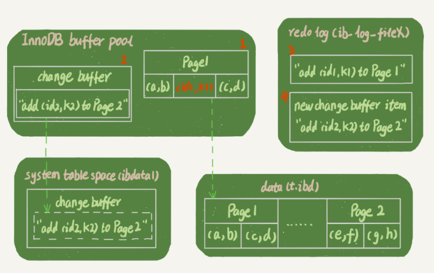
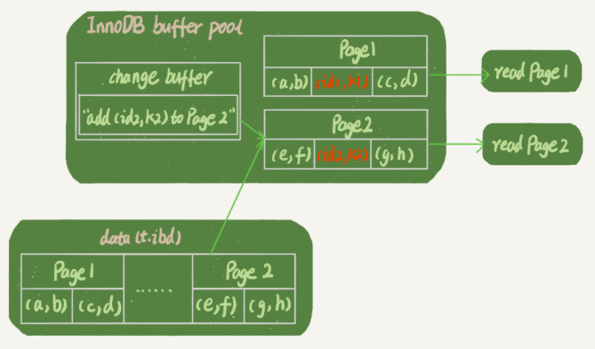

04_05章节的延续

# 普通索引和唯一索引，应该怎么选择？

什么是普通索引，唯一索引，怎么设置？索引的选择会影响数据的查询和更新过程吗？了解change buffer的机制和使用场景，最后讲索引选择的实践。


## 概念

简单来说：普通索引可以重复，唯一索引的值必须唯一。

创建索引：在执行CREATE TABLE语句时可以创建索引，也可以单独用CREATE INDEX或ALTER TABLE来为表增加索引。 

<https://blog.csdn.net/justry_deng/article/details/81458470> 

```mysql
# 普通索引创建
# 1 创建表的时候指定
CREATE TABLE tableName ( [...], INDEX [indexName] (tableColumns(length)) ;
```


## 索引类型抉择——性能

```mysql
select name from CUser where id_card = 'xxxxxxxyyyyyyzzzzz';
```

假设你在维护一个市民系统，每个人都有一个唯一的身份证号，而且业务代码已经保证了不会写入两个重复的身份证号 ，而系统经常执行上面的查询语句，所以，你一定会考虑在 id_card 字段上建索引。 由于身份证号字段比较大，我不建议你把身份证号当做主键（之前讲过为什么），**那么现在你有两个选择，要么给 id_card 字段创建唯一索引，要么创建一个普通索引**。 从性能的角度考虑，你选择唯一索引还是普通索引呢？选择的依据是什么呢？ 

## 索引类型对查询更新的影响？

### 查询过程

```mysql
select id from T where k=5; # 假设k上的值不重复，可以选择普通索引和唯一索引
```

+ 对于普通索引来说，查找到满足条件的第一个记录 (5,500) 后，需要查找下一个记录，直到碰到第一个不满足 k=5 条件的记录。
+ 对于唯一索引来说，由于索引定义了唯一性，查找到第一个满足条件的记录后，就会停止继续检索。

那么，这个不同带来的性能差距会有多少呢？答案是，微乎其微。 why?

> InnoDB 的数据是按数据页为单位来读写的。也就是说，当需要读一条记录的时候，并不是将这个记录本身从磁盘读出来，而是以页为单位，将其整体读入内存。在 InnoDB 中，每个数据页的大小默认是 16KB。 
>
> 对于普通索引来说，要多做的那一次“查找和判断下一条记录”的操作，就只需要一次指针寻找和一次计算。 当然，如果 k=5 这个记录刚好是这个数据页的最后一个记录，那么要取下一个记录，必须读取下一个数据页，这个操作会稍微复杂一些。
>
> 但是，我们之前计算过，对于整型字段，一个数据页可以放近千个 key，因此出现这种情况的概率会很低。所以，我们计算平均性能差异时，仍可以认为这个操作成本对于现在的 CPU 来说可以忽略不计。

## 更新过程 change buffer

当需要更新一个数据页时，如果数据页在内存中就直接更新，而如果这个数据页还没有在内存中的话，在不影响数据一致性的前提下，InooDB 会将这些更新操作缓存在 change buffer 中，这样就不需要从磁盘中读入这个数据页了。在下次查询需要访问这个数据页的时候，将数据页读入内存，然后执行 change buffer 中与这个页有关的操作。通过这种方式就能保证这个数据逻辑的正确性。 显然，如果能够将更新操作先记录在 change buffer，减少读磁盘，语句的执行速度会得到明显的提升。而且，数据读入内存是需要占用 buffer pool 的，所以这种方式还能够避免占用内存，提高内存利用率。 

+ 可持久化，内存中有拷贝 ，也会写入到磁盘上
+ merge，将 change buffer 中的操作应用到原数据页，得到最新结果的过程称为 merge。 1）访问这个数据页会触发 merge ，2）系统有后台线程会定期 merge。3）在数据库正常关闭（shutdown）的过程中，也会执行 merge 操作。 

## 什么条件下可以使用change buffer❤

唯一索引的更新就不能使用 change buffer，实际上也只有普通索引可以使用。 

**因为对于唯一索引来说，所有的更新操作都要先判断这个操作是否违反唯一性约束。 而这必须要将数据页读入内存才能判断**。既然都已经读入到内存了，那直接更新内存会更快，就没必要使用 change buffer 了。 

change buffer 用的是 buffer pool 里的内存，因此不能无限增大。change buffer 的大小，可以通过参数 innodb_change_buffer_max_size 来动态设置。这个参数设置为 50 的时候，表示 change buffer 的大小最多只能占用 buffer pool 的 50%。 

## 插入数据流程—change buffer

你已经理解了 change buffer 的机制，那么我们再一起来看看**如果要在这张表中插入一个新记录 (4,400) 的话，InnoDB 的处理流程是怎样的。** 

第一种情况是，**这个记录要更新的目标页在内存中**。这时，InnoDB 的处理流程如下：

+ 对于唯一索引来说，找到 3 和 5 之间的位置，判断到没有冲突，插入这个值，语句执行结束；
+ 对于普通索引来说，找到 3 和 5 之间的位置，插入这个值，语句执行结束。

这样看来，普通索引和唯一索引对更新语句性能影响的差别，只是一个判断，只会耗费微小的 CPU 时间。

但，这不是我们关注的重点🈲。

第二种情况是，**这个记录要更新的目标页不在内存中**。这时，InnoDB 的处理流程如下：

+ 对于唯一索引来说，需要将数据页读入内存，判断到没有冲突，插入这个值，语句执行结束；
+ 对于普通索引来说，则是将更新记录在 change buffer，语句执行就结束了。

将数据从磁盘读入内存涉及随机 IO 的访问，是数据库里面成本最高的操作之一。change buffer 因为减少了随机磁盘访问，所以对更新性能的提升是会很明显的。 （疑惑：如果是update 即使是普通索引也得判断索引存在不存在吧❓❓❓，主键索引是唯一索引，先update主键索引吧？？然后就知道重不重复了？？）

## 普通索引一定适合change buffer?

普通索引的所有场景，使用 change buffer 都可以起到加速作用吗？ change buffer 的主要目的就是将记录的变更动作缓存下来，所以在一个数据页做 merge 之前，change buffer 记录的变更越多（也就是这个页面上要更新的次数越多），收益就越大。 

+ 适合：写多读少的业务，页面在写完以后马上被访问到的概率比较小 ，常见的就是账单类、日志类的系统。 
+ 不适合：一个业务的更新模式是写入之后马上会做查询 ，立即访问则会立即触发 merge 过程。这样随机访问 IO 的次数不会减少，反而增加了 change buffer 的维护代价。

## change buffer 和 redo log

理解了 change buffer 的原理，你可能会联想到我在前面文章中和你介绍过的 redo log （记录的是在哪个数据页做了哪些修改）和 WAL（先写日志，再写磁盘）（Write-Ahead Logging ，预写日志系统，数据库中一种高效的日志算法，对于非内存数据库而言，磁盘I/O操作是数据库效率的一大瓶颈）

 WAL核心也是尽量减少随机读写，这两个概念确实容易混淆 。

现在，我们要在表上执行这个插入语句 ：

```mysql
mysql> insert into t(id,k) values(id1,k1),(id2,k2);
```

> 作者回复: 第一段的理解不准确哈。 insert的时候，写主键是肯定不能用change buffer了，但是同时也会要写其它索引，而其它索引中的“非唯一索引”是可以用的这个机制的；  
>
> 作者回复: 所以主键索引用不上，都是对于那些二级索引的才有效。  一个insert语句要操作所有索引的嘛，收益在二级索引 
>
> 第二段，你搜出来的这个不太完整。是这样的，change buffer的前身是insert buffer,只能对insert 操作优化；后来升级了，增加了update/delete的支持，名字也改叫change buffer.  

这里，我们假设当前 k 索引树的状态，查找到位置后，k1 所在的数据页在内存 (InnoDB buffer pool) 中，k2 所在的数据页不在内存中。下图所示是带 change buffer 的更新状态图。 



分析这条更新语句，你会发现它涉及了四个部分：内存、redo log（ib_log_fileX）、 数据表空间（t.ibd）、系统表空间（ibdata1）。

这条更新语句做了如下的操作（按照图中的数字顺序）：

1. Page 1 在内存中，直接更新内存；
2. Page 2 没有在内存中，就在内存的 change buffer 区域，记录下“我要往 Page 2 插入一行”这个信息
3. 将上述两个动作记入 redo log 中（图中 3 和 4）。

做完上面这些，事务就可以完成了。所以，你会看到，执行这条更新语句的成本很低，就是写了两处内存，然后写了一处磁盘（两次操作合在一起写了一次磁盘），而且还是顺序写的。 

**同时，图中的两个虚线箭头，是后台操作，不影响更新的响应时间。** 

> change Buffer和数据页一样，也是物理页的一个组成部分，数据结构也是一颗B+树，这棵B+树放在共享表空间中，默认ibdata1中。change buffer 写入系统表空间机制应该和普通表的脏页刷新到磁盘是相同的机制--Checkpoint机制； 

## 查询过程

那在这之后的读请求，要怎么处理呢？

比如，我们现在要执行 select * from t where k in (k1, k2)。这里，我画了这两个读请求的流程图。

如果读语句发生在更新语句后不久，内存中的数据都还在，那么此时的这两个读操作就与系统表空间（ibdata1）和 redo log（ib_log_fileX）无关了。所以，我在图中就没画出这两部分。



从图中可以看到：

1. 读 Page 1 的时候，直接从内存返回。有几位同学在前面文章的评论中问到，WAL 之后如果读数据，是不是一定要读盘，是不是一定要从 redo log 里面把数据更新以后才可以返回？其实是不用的。你可以看一下图 3 的这个状态，**虽然磁盘上还是之前的数据，但是这里直接从内存返回结果，结果是正确的**。（疑问：❓❓❓人晕了❓❓如果change buffer在后台merge了，那岂不是在redo log里面的记录多余了（看问题一节）。。如果查询的数据不在内存中，一定要先从redo log恢复之后才可以返回吗？？）
2. 要读 Page 2 的时候，需要把 Page 2 从磁盘读入内存中，然后应用 change buffer 里面的操作日志，生成一个正确的版本并返回结果。

可以看到，直到需要读 Page 2 的时候，这个数据页才会被读入内存。

所以，如果要简单地对比这两个机制在提升更新性能上的收益的话，**redo log 主要节省的是随机写磁盘的 IO 消耗（转成顺序写），而 change buffer 主要节省的则是随机读磁盘的 IO 消耗。** 

# 问题

通过图 2 （插入流程图）你可以看到，change buffer 一开始是写内存的，那么如果这个时候机器掉电重启，会不会导致 change buffer 丢失呢？change buffer 丢失可不是小事儿，再从磁盘读入数据可就没有了 merge 过程，就等于是数据丢失了。会不会出现这种情况呢？ 

> 这个问题的答案是不会丢失，留言区的很多同学都回答对了。虽然是只更新内存，但是在事务提交的时候，我们把 change buffer 的操作也记录到 redo log 里了，所以崩溃恢复的时候，change buffer 也能找回来 

### merge的过程到底是

在评论区有同学问到，merge 的过程是否会把数据直接写回磁盘，这是个好问题。这里，我再为你分析一下。 

> merge 的执行流程是这样的：
>
> 1. 从磁盘读入数据页到内存（老版本的数据页）；
> 2. 从 change buffer 里找出这个数据页的 change buffer 记录 (可能有多个），依次应用，得到新版数据页；
> 3. 写 redo log。这个 redo log 包含了数据的变更和 change buffer 的变更。
>
> 到这里 merge 过程就结束了。这时候，数据页和内存中 change buffer 对应的磁盘位置都还没有修改，属于脏页，之后各自刷回自己的物理数据，就是另外一个过程了。

想请教一下老师系统表空间跟数据表空间这两个概念各是什么意思.

> 作者回复: 系统表空间就是用来放系统信息的，比如数据字典什么的，对应的磁盘文件是ibdata1,数据表空间就是一个个的表数据文件，对应的磁盘文件就是 表名.ibd


这一篇看得糊里糊涂，有两个问题 1. 真正把数据更新到磁盘，是由change buffer做还是redo log做？ 2. 插入新的一行的话，一定会有唯一primary key的啊，这样是不是插入就不能用change buffer? 

> 作者回复: 1. 数据更新到磁盘是这两个都不少，是内存直接写到磁盘的（也就是说，redo log记录的是内存中的操作？？？？20200202 记录哪个数据页做了哪些操作）。 2. 插入数据的时候，主键索引用不上，但是普通索引可以  看得糊里糊涂的时候可以看看评论区哈 
>
> 作者回复: 如果没有change buffer, 执行更新的“当时那一刻”，就要求从磁盘把数据页读出来（这个操作是随机读）。  change buffer省了这个。 （我的理解，想象一下更新操作set k = k + 3;这种，不读是没办法更新的）

ChangeBuffer就是对《日志系统：一条 SQL 更新语句是如何执行的？》中 update 语句执行流程进一步优化。更新步骤：先更新内存，再通过redo log更新磁盘。 而Change Buffer的引入使得更新内存都是按需更新，只有在需要读的时候才更新。 如果这样理解对的话，就有一个问题，如果在merge之前，redo log执行了磁盘写，那change buffer里的操作是不是就有冲突怎么让失效呢？ 

> 作者回复: 对于page 2, redolog并不知道他要怎么更新，redolog里面记录的是change buffer上的更新，而change buffer上记录的是数据页的更新动作 