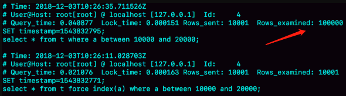
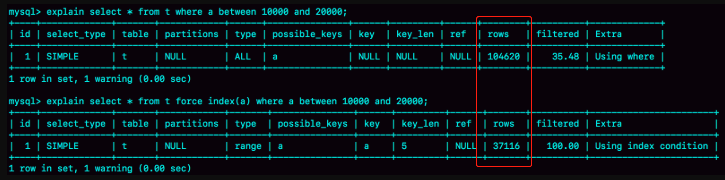
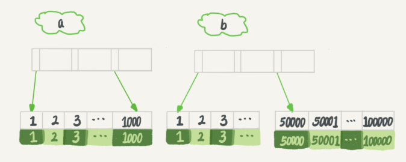

#  MySQL为什么有时候会选错索引？

不知道你有没有碰到过这种情况，一条本来可以执行得很快的语句，却由于 MySQL 选错了索引，而导致执行速度变得很慢？ 

我们一起来看一个例子吧。我们先建一个简单的表，表里有 a、b 两个字段，并分别建上索引：

```mysql
CREATE TABLE `t` (
  `id` int(11) NOT NULL,`a` int(11) DEFAULT NULL,`b` int(11) DEFAULT NULL,
  PRIMARY KEY (`id`),
  KEY `a` (`a`),
  KEY `b` (`b`)
) ENGINE=InnoDB；
```

然后，我们往表 t 中插入 10 万行记录，取值按整数递增，即：(1,1,1)，(2,2,2)，(3,3,3) 直到 (100000,100000,100000)。我是用存储过程来插入数据的，这里我贴出来方便你复现：

```c++
delimiter ;;
create procedure idata()
begin
  declare i int;
  set i=1;
  while(i<=100000)do
    insert into t values(i, i, i);
    set i=i+1;
  end while;
end;;
delimiter ;
call idata();
```

接下来，我们分析一条 SQL 语句： 

```mysql
mysql> select * from t where a between 10000 and 20000;

# 使用explain命令（为了方便查看，结果截断了几列）看到这条语句执行情况，确实优化器选择了索引a
mysql> explain select * from t where a between 10000 and 20000;
+----+-------------+-------+------------+-------+---------------+------+---------+------+-------+
| id | select_type | table | partitions | type  | possible_keys | key  | key_len | ref  | rows  |
+----+-------------+-------+------------+-------+---------------+------+---------+------+-------+
|  1 | SIMPLE      | t     | NULL       | range | a             | a    | 5       | NULL | 10001 |
+----+-------------+-------+------------+-------+---------------+------+---------+------+-------+
```

不过别急，这个案例不会这么简单。在我们已经准备好的包含了 10 万行数据的表上，我们再做如下操作。 

| session A                                   | session B                                                |
| ------------------------------------------- | -------------------------------------------------------- |
| start transaction with consistent snapshot; |                                                          |
|                                             | delete from t;                                           |
|                                             | call idata();                                            |
|                                             |                                                          |
|                                             | explain select * from t where a between 10000 and 20000; |
| commit;                                     |                                                          |

这里，session A 的操作你已经很熟悉了，它就是开启了一个事务。随后，session B 把数据都删除后，又调用了 idata 这个存储过程，插入了 10 万行数据。这时候，session B 的查询语句 `select * from t where a between 10000 and 20000` 就不会再选择索引 a 了。我们可以通过慢查询日志（slow log）来查看一下具体的执行情况。

为了说明优化器选择的结果是否正确，我增加了一个对照，即：使用 force index(a) 来让优化器强制使用索引 a（这部分内容，我还会在这篇文章的后半部分中提到）。 

下面的三条 SQL 语句，就是这个实验过程。 

```mysql
# 将慢查询日志的阈值设置为 0，表示这个线程接下来的语句都会被记录入慢查询日志中；
set long_query_time=0;
select * from t where a between 10000 and 20000; /*Q1 session B 原来的查询；*/

# Q2 是加了 force index(a) 来和 session B 原来的查询语句执行情况对比。
select * from t force index(a) where a between 10000 and 20000;/*Q2*/
```

下图所示是这三条 SQL 语句执行完成后的 慢查询日志：



奇怪的事情发生了：Q1 扫描了 10 万行，显然是走了全表扫描，执行时间是 40 毫秒。Q2 扫描了 10001 行，执行了 21 毫秒。也就是说，我们在没有使用 force index 的时候，MySQL 用错了索引，导致了更长的执行时间。 

这个例子对应的是我们平常不断地删除历史数据和新增数据的场景。这时，MySQL 竟然会选错索引，是不是有点奇怪呢？今天，我们就从这个奇怪的结果说起吧。 

## 优化器的逻辑

选择索引是优化器的工作 。考虑因素：扫描的行数，是否使用临时表、是否排序等。我们这个简单的查询没有用到临时表和排序，**所以MySQL选错索引肯定是在判断扫描行数的时候出问题了** 。

那么，问题就是：**扫描行数是怎么判断的？** 

MySQL执行语句前并不能精确知道这个条件的记录有多少条，而只能能根据统计信息来估算记录数。

这个统计信息就是索引的“区分度”，一个索引上不同的值的个数，我们称之为“基数”（cardinality）。也就是说，这个基数越大，索引的区分度越好。 （那索引的区分度越好，是不是意味着扫描行数越少？？？📕）

```mysql
mysql> show index from t;  # 可以看到cardinality一列
+-------------+
| Cardinality |
+-------------+
|       93026 |
|       91644 |
|       91644 |
+-------------+
# 可以看到，虽然这个表的每一行的三个字段值都是一样的，但是在统计信息中，
# 这三个索引的基数值并不同，而且其实都不准确。
```

## 索引基数的估算

**MySQL 是怎样得到索引的基数的呢？**这里，我给你简单介绍一下 MySQL 采样统计的方法。 

`基数 = 采样N个数据页的平均值 * 索引的页面数`

而数据表是会持续更新的，索引统计信息也不会固定不变。所以，当变更的数据行数超过 1/M 的时候，会自动触发重新做一次索引统计。 

在 MySQL 中，有两种存储索引统计的方式，可以通过设置参数 innodb_stats_persistent 的值来选择：

+ 设置为 on 的时候，表示统计信息会持久化存储。这时，默认的 N 是 20，M 是 10。
+ 设置为 off 的时候，表示统计信息只存储在内存中。这时，默认的 N 是 8，M 是 16。

由于是采样统计，所以不管 N 是 20 还是 8，这个基数都是很容易不准的。 虽然不够精确，但大体上还是差不多的，选错索引一定还有别的原因。 

## 扫描行数

其实索引统计只是一个输入，对于一个具体的语句来说，优化器还要判断，执行这个语句本身要扫描多少行。接下来，我们再一起看看优化器预估的，这两个语句的扫描行数是多少。



根据我们得到的结果，慢日志来看，Q1 的结果还是符合预期的，rows 的值是 104620；但是 Q2 的 rows 值是 37116，偏差就大了。而图 1 中我们用 explain 命令看到的 rows 是只有 10001 行，是这个偏差误导了优化器的判断。 

+ 为什么不准？
+ 即使不准，按照扫描行数也应该选择索引a啊？

这是因为，如果使用索引 a，每次从索引 a 上拿到一个值，都要回到主键索引上查出整行数据，这个代价优化器也要算进去的。而如果选择扫描 10 万行，是直接在主键索引上扫描的，没有额外的代价。优化器会估算这两个选择的代价，从结果看来，**优化器认为**直接扫描主键索引更快。 

但最开始执行查询的时候，优化器认为rows=10001，选择了索引a，也就是说，这个策略并没有问题。 

# 问题

所以冤有头债有主，MySQL 选错索引，这件事儿还得归咎到没能准确地判断出扫描行数。至于为什么会得到错误的扫描行数，这个原因就作为课后问题，留给你去分析了。 

## 修正统计信息

```mysql
analyze table t;

+------------+---------+----------+----------+
| Table      | Op      | Msg_type | Msg_text |
+------------+---------+----------+----------+
| geekbang.t | analyze | status   | OK       |
+------------+---------+----------+----------+
1 row in set (0.04 sec)
```

所以在实践中，如果你发现 explain 的结果预估的 rows 值跟实际情况差距比较大，可以采用这个方法来处理。 

## 另一个奇异案例

其实，如果只是索引统计不准确，通过 analyze 命令可以解决很多问题，但是前面我们说了，优化器可不止是看扫描行数。 

```mysql
select * from t where (a between 1 and 1000)  and (b between 50000 and 100000) order by b limit 1;
```

我选择的话，我会选择索引a，毕竟回表次数少，只需要扫描1000行，而索引b要扫描50001行。

为了便于分析，我们先来看一下 a、b 这两个索引的结构图。 



所以你一定会想，如果使用索引 a 的话，执行速度明显会快很多。那么，下面我们就来看看到底是不是这么一回事儿。 

```mysql
explain select * from t where (a between 1 and 1000) and (b between 50000 and 100000) order by b limit 1;

# 结果，优化器选择了索引b，扫描行数五万多
# 懵逼树下懵逼果
+-------+---------------+------+---------+------+-------+
| type  | possible_keys | key  | key_len | ref  | rows  |
+-------+---------------+------+---------+------+-------+
| range | a,b           | b    | 5       | NULL | 50128 |
+-------+---------------+------+---------+------+-------+
```

从这个结果中，你可以得到两个结论：

1. 扫描行数的估计值依然不准确；
2. 这个例子里 MySQL 又选错了索引。

> 是因为它认为使用索引 b 可以避免排序（b 本身是索引，已经是有序的了，如果选择索引 b 的话，不需要再做排序，只需要遍历），所以即使扫描行数多，也判定为代价更小。 
>
> 50000 × 1000 × log1000与1000 × 50000 × log50000，显然前者代价低，这样看来是order by b造成的。
>
> 而且排序的话， 而如果是用了a, 那就有临时表排序，临时表排序有三种算法，还分内存还是磁盘临时表… 这里展开不了了，后面《order by是怎么工作的》这篇会讲。 

## 索引选择异常和处理

+ **一种方法是，像我们第一个例子一样，采用 force index 强行选择一个索引。** 但是，不够优雅，索引改名问题，迁移问题，语法不兼容等问题。

+ **第二种方法就是，我们可以考虑修改语句，引导 MySQL 使用我们期望的索引。** 

  ```mysql
  “order by b limit 1” 改成 “order by b,a limit 1” # 语义的逻辑是相同的。
  ```

  当然，这种修改并不是通用的优化手段，只是刚好在这个语句里面有 limit 1，因此如果有满足条件的记录， order by b limit 1 和 order by b,a limit 1 都会返回 b 是最小的那一行，逻辑上一致，才可以这么做。 

  如果你觉得修改语义这件事儿不太好，这里还有一种改法： 

  ```mysql
  select * from  (select * from t where (a between 1 and 1000)  and (b between 50000 and 100000) order by b limit 100)alias limit 1;
  ```

  在这个例子里，我们用 limit 100 让优化器意识到（❓怎么意识到的），使用 b 索引代价是很高的。其实是我们根据数据特征诱导了一下优化器，也不具备通用性。 

+ **第三种方法是，在有些场景下，我们可以新建一个更合适的索引，来提供给优化器做选择，或删掉误用的索引。**

  不过，在这个例子中，我没有找到通过新增索引来改变优化器行为的方法。这种情况其实比较少，尤其是经过 DBA 索引优化过的库，再碰到这个 bug，找到一个更合适的索引一般比较难。

  如果我说还有一个方法是删掉索引 b，你可能会觉得好笑。但实际上我碰到过两次这样的例子，最终是 DBA 跟业务开发沟通后，发现这个优化器错误选择的索引其实根本没有必要存在，于是就删掉了这个索引，优化器也就重新选择到了正确的索引。


# 问题

前面我们在构造第一个例子的过程中，通过 session A 的配合，让 session B 删除数据后又重新插入了一遍数据，然后就发现 explain 结果中，rows 字段从 10001 变成 37000 多。

而如果没有 session A 的配合，只是单独执行 delete from t 、call idata()、explain 这三句话，会看到 rows 字段其实还是 10000 左右。你可以自己验证一下这个结果。

这是什么原因呢？也请你分析一下吧。


假如要查 A in () AND B in (), 怎么建索引? 

> 作者回复: 好问题 where A in (a,b,c) AND B in (x,y,z) 会转成   (A=a and B=x) or (A=a and B=y) or (A=a and B=z) or (A=b and B=x) or (A=b and B=y) or (A=b and B=z) or (A=c and B=x) or (A=c and B=y) or (A=c and B=z) 


那执行器调用存储层的接口是不是只能获取到最原始的数据，后续的加工，比如order，join和group操作也都是在执行器里进行的吗？对应的buffer和内存临时表也都是server层的东西？ 

> 作者回复: 是的，你提到的这些，都在server层  很早之前连过滤数据都在server层，后来有了index condition pushdown下推了一点到引擎层 