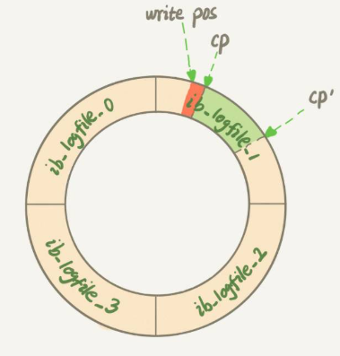

平时的工作中，不知道你有没有遇到过这样的场景，一条 SQL 语句，正常执行的时候特别快，但是有时也不知道怎么回事，它就会变得特别慢，并且这样的场景很难复现，它不只随机，而且持续时间还很短。 

**当内存数据页跟磁盘数据页内容不一致的时候，我们称这个内存页为“脏页”。内存数据写入到磁盘后，内存和磁盘上的数据页的内容就一致了，称为“干净页”**。 

脏页？MySQL怎么知道内存的数据与磁盘里的不一致呢？也就是说怎么判断是脏页还是干净页。

## flush场景

第二节我为你介绍了 WAL 机制。现在你知道了，InnoDB 在处理更新语句的时候，只做了写日志这一个磁盘操作。这个日志叫作 redo log（重做日志），在更新内存写完 redo log 后，就返回给客户端，本次更新成功。

做下类比的话，掌柜记账的账本是数据文件，记账用的粉板是日志文件（redo log），掌柜的记忆就是内存。

掌柜总要找时间把账本更新一下，这对应的就是**把内存里的数据写入磁盘**的过程（不管redo log？？不冲突好像，redo log 也是刷脏页），术语就是 flush。

那么，什么情况会引发数据库的 flush 过程呢？

+ **InnoDB 的 redo log 写满了**。 这时候系统会停止所有更新操作，把 checkpoint 往前推进，redo log 留出空间可以继续写。 checkpoint 可不是随便往前修改一下位置就可以的。比如图 2 中，把 checkpoint 位置从 CP 推进到 CP’，就**需要将两个点之间的日志（浅绿色部分），对应的所有脏页都 flush 到磁盘上**。 

  

+ **系统内存不足**。 这时候就要淘汰一些数据页，空出内存给别的数据页使用。如果淘汰的是“脏页”，就要先将脏页写到磁盘。 

  你一定会说，这时候难道不能直接把内存淘汰掉，下次需要请求的时候，从磁盘读入数据页，然后拿 redo log 出来应用不就行了？这里其实是从性能考虑的。如果刷脏页一定会写盘，就保证了每个数据页有两种状态： 

  + 一种是内存里存在，内存里就肯定是正确的结果，直接返回；
  + 另一种是内存里没有数据，就可以肯定数据文件上是正确的结果，读入内存后返回。

  这样保证了效率最高。

+  **MySQL 认为系统“空闲”的时候**。 即使是“生意好”的时候，也要见缝插针地找时间，只要有机会就刷一点“脏页”。 

+  **MySQL 正常关闭的情况**。 MySQL 会把内存的脏页都 flush 到磁盘上，这样下次 MySQL 启动的时候，就可以直接从磁盘上读数据，启动速度会很快。 

## 四种场景对性能的影响

三四种情况对系统没什么压力。我们主要来分析一下前两种场景下的性能问题。 

第一种是“redo log 写满了，要 flush 脏页”，这种情况是 InnoDB 要尽量避免的。因为出现这种情况的时候，整个系统就不能再接受更新了，所有的更新都必须堵住。如果你从监控上看，这时候更新数会跌为 0。 

第二种是“内存不够用了，要先将脏页写到磁盘”，这种情况其实是常态。**InnoDB 用缓冲池（buffer pool）管理内存，缓冲池中的内存页有三种状态：** 

+ 第一种是，还没有使用的；
+ 第二种是，使用了并且是干净页；
+ 第三种是，使用了并且是脏页。

InnoDB 的策略是尽量使用内存，因此对于一个长时间运行的库来说，未被使用的页面很少（这句话没有理解）。

而当要读入的数据页没有在内存的时候，就必须到缓冲池中申请一个数据页。这时候只能把最久不使用的数据页从内存中淘汰掉：如果要淘汰的是一个干净页，就直接释放出来复用；但如果是脏页呢，就必须将脏页先刷到磁盘，变成干净页后才能复用。

所以，刷脏页虽然是常态，但是出现以下这两种情况，都是会明显影响性能的：

1. 一个查询要淘汰的脏页个数太多，会导致查询的响应时间明显变长（抖了一下）；
2. 日志写满，更新全部堵住，写性能跌为 0，这种情况对敏感业务来说，是不能接受的。

所以，InnoDB 需要有控制脏页比例的机制，来尽量避免上面的这两种情况。


## InnoDB 刷脏页的控制策略

+ 告诉 InnoDB 所在主机的 IO 能力， 这就要用到 innodb_io_capacity 这个参数了， 这个值我建议你设置成磁盘的 IOPS。 
+ “全力刷脏页” ，但毕竟磁盘IO还要有其他服务。所以接下来，我们就一起看看 InnoDB 怎么控制引擎按照“全力”的百分比来刷脏页。 

这个问题可以这么想，如果刷太慢，会出现什么情况？首先是内存脏页太多，其次是 redo log 写满。所以，InnoDB 的刷盘速度就是要参考这两个因素：**一个是脏页比例，一个是 redo log 写盘速度**。

+ 脏页比例，参数 innodb_max_dirty_pages_pct 是脏页比例上限，默认值是 75% ，InnoDB 会根据当前的脏页比例（假设为 M），算出一个范围在 0 到 100 之间的数字，计算这个数字的伪代码类似这样： 

  ```c++
  F1(M)
  {
    if M>=innodb_max_dirty_pages_pct then
        return 100;
    return 100*M/innodb_max_dirty_pages_pct; //也就是脏页占脏页上限的百分比
  }
  ```

+ InnoDB 每次写入的日志都有一个序号，当前写入的序号跟 checkpoint 对应的序号之间的差值，我们假设为 N。 InnoDB 会根据这个 N 也算出一个范围在 0 到 100 之间的数字 。这个计算公式可以记为 F2(N)。 F2(N) 算法比较复杂，你只要知道 N 越大，算出来的值越大就好了。 

+ R = max(F1, F2)，然后按照 ` innodb_io_capacity * R%`的速度刷脏页。

要尽量避免这种抖了一下的情况，你就要合理地设置 innodb_io_capacity 的值，并且**平时要多关注脏页比例，不要让它经常接近 75%**。 

脏页比例：

```mysql
select VARIABLE_VALUE into @a from global_status where VARIABLE_NAME = 'Innodb_buffer_pool_pages_dirty';
select VARIABLE_VALUE into @b from global_status where VARIABLE_NAME = 'Innodb_buffer_pool_pages_total';
select @a/@b;
```

## 另一个有趣的策略

“连坐”机制。

在准备刷一个脏页的时候，如果这个数据页旁边的数据页刚好是脏页，就会把这个“邻居”也带着一起刷掉； 递归操作。

在 InnoDB 中，innodb_flush_neighbors 参数就是用来控制这个行为的，值为 1 的时候会有上述的“连坐”机制，值为 0 时表示不找邻居，自己刷自己的。 在 MySQL 8.0 中，innodb_flush_neighbors 参数的默认值已经是 0 了。

找“邻居”这个优化在机械硬盘时代是很有意义的，可以减少很多随机 IO。机械硬盘的随机 IOPS 一般只有几百，相同的逻辑操作减少随机 IO 就意味着系统性能的大幅度提升。

而如果使用的是 SSD 这类 IOPS 比较高的设备的话，我就建议你把 innodb_flush_neighbors 的值设置成 0。因为这时候 IOPS 往往不是瓶颈，而“只刷自己”，就能更快地执行完必要的刷脏页操作，减少 SQL 语句响应时间。

# 问题

一个内存配置为 128GB、innodb_io_capacity 设置为 20000 的大规格实例，正常会建议你将 redo log 设置成 4 个 1GB 的文件。

但如果你在配置的时候不慎将 redo log 设置成了 1 个 100M 的文件，会发生什么情况呢？又为什么会出现这样的情况呢？

> 经常卡更新，那就得经常fluch呀。100M按道理应该会很快吧，不会卡的太久。内存里基本没有脏页了。不知道我理解的对不对。
>
> 作者：每次事务提交都要写 redo log，如果设置太小，很快就会被写满， write pos 一直追着 CP。 这时候系统不得不停止所有更新，去推进 checkpoint。
>
> 这时，你看到的现象就是**磁盘压力很小，但是数据库出现间歇性的性能下跌。**


当内存不够用了，要将脏页写到磁盘，会有一个数据页淘汰机制（最久不使用），假设淘汰的是脏页，则此时脏页所对应的redo log的位置是随机的，当有多个不同的脏页需要刷，则对应的redo log可能在不同的位置，这样就需要把redo log的多个不同位置刷掉，这样对于redo log的处理不是就会很麻烦吗？（合并间隙，移动位置？） 

> 这个问题其实我也疑惑，后来想想，确实不用动redo log
>
> 作者回复: 好问题。  其实由于淘汰的时候，刷脏页过程不用动redo log文件的。  这个有个额外的保证，是redo log在“重放”的时候，如果一个数据页已经是刷过的，会识别出来并跳过。 


老师，我想问一下，innodb是如何知道一个页是不是脏页的，是有标记位还是通过redolog的ckeckpoint来确定的？ 

> 作者回复: 每个数据页头部有LSN，8字节，每次修改都会变大。  对比这个LSN跟checkpoint 的LSN，比checkpoint小的一定是干净页 
>
> LSN，每次写redo log都带的一个数字， 数据页上也有，对比大小的，因为太细节没有写到文章中。 

老师，请问下访问某条记录时，存储引擎是如何判断这条记录所在的数据页是否在内存当中，这个查内存机制是如何实现的？ 

> 作者回复: 每个页面有编号的。拿着编号去内存看，没有，就去磁盘 

很多测试人员再做压力测试的时候 出现刚开始 insert update 很快 一会 就出现很慢,并且延迟很大，大部分是因为redo log 设置太小 引起的,完美诠释 

> 作者回复: 👍🏿 常见的误用场景 

