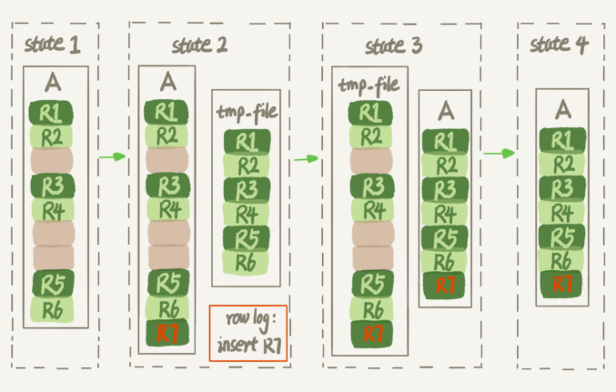

数据库表的空间回收

我们仍然讨论InnoDB引擎

+ InnoDB表 = 表结构定义 + 数据。 MySQL 8.0 版本以前，表结构是存在以.frm 为后缀的文件里。 
+ 而 MySQL 8.0 版本，则已经允许把表结构定义放在系统数据表中了。 

接下来，我会先和你说明为什么1）简单地删除表数据达不到表空间回收的效果，然后再和你介绍2）正确回收空间的方法。 

## 参数 innodb_file_per_table

表数据既可以存在共享表空间里，也可以是单独的文件。这个行为是由参数 innodb_file_per_table 控制的：

1. 这个参数设置为 OFF 表示的是，表的数据放在系统共享表空间，也就是跟数据字典❓放在一起；
2. 这个参数设置为 ON 表示的是，每个 InnoDB 表数据存储在一个以 .ibd 为后缀的文件中。

从 MySQL 5.6.6 版本开始，它的默认值就是 ON 了。

我建议你不论使用 MySQL 的哪个版本，都将这个值设置为 ON。因为，

+ 一个表单独存储为一个文件更容易管理
+ 不需要这个表的时候，通过 drop table 命令，系统就会直接删除这个文件。而如果是放在共享表空间中，即使表删掉了，空间也是不会回收的。 

## 数据删除流程，标记删除

情景：

+ 我们在删除整个表的时候，可以使用 drop table 命令回收表空间。 
+ 但是，我们遇到的更多的删除数据的场景是删除某些行，表中的数据被删除了，但是表空间却没有被回收。 

我们要彻底搞明白这个问题的话，就要从数据删除流程说起了。 

索引，InnoDB 里的数据都是用 B+ 树的结构组织的。 

而删除是标记删除，之后的插入可能会复用这个位置。磁盘文件并不会缩小。

现在，你已经知道了 InnoDB 的数据是按页存储的，那么如果我们删掉了一个数据页上的所有记录，会怎么样？

答案是，整个数据页就可以被复用了。（┗|｀O′|┛ 嗷~~，磁盘文件还是不会缩小）

但是，**数据页的复用跟记录的复用是不同的。** 

+ 记录可复用，只限于符合范围的，要看前后的数据大小。
+ 数据页可复用，需要新页的时候可以被复用。

如果相邻的两个数据页利用率都很小，系统就会把这两个页上的数据合到其中一个页上，另外一个数据页就被标记为可复用。 

进一步地，如果我们用 delete 命令把整个表的数据删除呢？结果就是，所有的数据页都会被标记为可复用。但是磁盘上，文件不会变小。 这些可以复用，而没有被使用的空间，看起来就像是“空洞”。 

## 插入也会造成空洞？

实际上，**不止是删除数据会造成空洞，插入数据也会。** 如果数据是按照索引递增顺序插入的，那么索引是紧凑的。但如果数据是随机插入的，就可能造成索引的数据页分裂。 

另外，更新索引上的值，可以理解为删除一个旧的值，再插入一个新值。不难理解，这也是会造成空洞的。

也就是说，经过大量增删改的表，都是可能是存在空洞的。所以，如果能够把这些空洞去掉，就能达到收缩表空间的目的。

而重建表，就可以达到这样的目的。

## 重建表

这里，你可以使用 `alter table A engine=InnoDB` 命令来重建表。在 MySQL 5.5 版本之前，这个命令的执行流程跟我们前面描述的差不多， 这个临时表 B 不需要你自己创建，MySQL 会自动完成转存数据（按照主键顺序一行一行读出来，然后插入到表B）、交换表名、删除旧表的操作 。

显然，花时间最多的步骤是往临时表插入数据的过程，如果在这个过程中，有新的数据要写入到表 A 的话，就会造成数据丢失。因此，在整个 DDL 过程中，表 A 中不能有更新。也就是说，这个 DDL 不是 Online 的。 

而在**MySQL 5.6 版本开始引入的 Online DDL，对这个操作流程做了优化。** 

我给你简单描述一下引入了 Online DDL 之后，重建表的流程：

1. 建立一个临时文件，扫描表 A 主键的所有数据页；
2. 用数据页中表 A 的记录生成 B+ 树，存储到临时文件中；
3. 生成临时文件的过程中，将所有对 A 的操作记录在一个日志文件（row log）中，对应的是图中 state2 的状态；
4. 临时文件生成后，将日志文件中的操作应用到临时文件，得到一个逻辑数据上与表 A 相同的数据文件，对应的就是图中 state3 的状态；
5. 用临时文件替换表 A 的数据文件。



由于日志文件记录和重放操作这个功能的存在，这个方案在重建表的过程中，允许对表 A 做增删改操作（查询呢❓）。这也就是 Online DDL 名字的来源。 

## Online 和 inplace

说到 Online，我还要再和你澄清一下它和另一个跟 DDL 有关的、容易混淆的概念 inplace 的区别。

你可能注意到了，在图 3 中，我们把表 A 中的数据导出来的存放位置叫作 tmp_table。这是一个临时表，是在 server 层创建的。

在图 4 中，根据表 A 重建出来的数据是放在“tmp_file”里的，这个临时文件是 InnoDB 在内部创建出来的。整个 DDL 过程都在 InnoDB 内部完成。**对于 server 层来说，没有把数据挪动到临时表，是一个“原地”操作**，这就是“inplace”名称的来源。

所以，我现在问你，如果你有一个 1TB 的表，现在磁盘间是 1.2TB，能不能做一个 inplace 的 DDL 呢？

答案是不能。因为，tmp_file 也是要占用临时空间的，原地操作只是相对于server层来说的。

```mysql
alter table t engine=InnoDB; # 隐含意思是下面的语句
alter table t engine=innodb,ALGORITHM=inplace;
# 跟 inplace 对应的就是拷贝表的方式了，用法是：
# 表示的是强制拷贝表，对应的流程就是图 3 的操作过程。就不是online了
alter table t engine=innodb,ALGORITHM=copy; 
```

如果说这两个逻辑之间的关系是什么的话，可以概括为：

1. DDL 过程如果是 Online 的，就一定是 inplace 的；
2. 反过来未必，也就是说 inplace 的 DDL，有可能不是 Online 的。截止到 MySQL 8.0，添加全文索引（FULLTEXT index）和空间索引 (SPATIAL index) 就属于这种情况。

# 问题

我记得有同学在第 6 篇讲表锁的文章[《全局锁和表锁 ：给表加个字段怎么索这么多阻碍？》](https://time.geekbang.org/column/article/69862)的评论区留言说，DDL 之前是要拿 MDL 写锁的，这样还能叫 Online DDL 吗？

> 确实，图 4 的流程中，alter 语句在启动的时候需要获取 MDL 写锁，但是这个写锁在真正拷贝数据之前就退化成读锁了。为什么要退化呢？为了实现 Online，MDL 读锁不会阻塞增删改操作。
>
> 那为什么不干脆直接解锁呢？为了保护自己，禁止其他线程对这个表同时做 DDL。

在第 10 篇文章[《MySQL 为什么有时候会选错索引》](https://time.geekbang.org/column/article/71173)的评论区中，有同学问到使用 optimize table、analyze table 和 alter table 这三种方式重建表的区别。这里，我顺便再简单和你解释一下。

+ 从 MySQL 5.6 版本开始，alter table t engine = InnoDB（也就是 recreate）默认的就是上面图 4 的流程了；
+ analyze table t 其实不是重建表，只是对表的索引信息做重新统计，没有修改数据，这个过程中加了 MDL 读锁；
+ optimize table t 等于 recreate+analyze。


最后，又到了我们的课后问题时间。

假设现在有人碰到了一个“想要收缩表空间，结果适得其反”的情况，看上去是这样的：

1. 一个表 t 文件大小为 1TB；
2. 对这个表执行 alter table t engine=InnoDB；
3. 发现执行完成后，空间不仅没变小，还稍微大了一点儿，比如变成了 1.01TB。

你觉得可能是什么原因呢 ？

> 不知道。
>
> 在这篇文章的评论区里面，大家都提到了一个点，就是这个表，本身就已经没有空洞的了，比如说刚刚做过一次重建表操作。
>
> 在 DDL 期间，如果刚好有外部的 DML 在执行，这期间可能会引入一些新的空洞。
>
> @飞翔 提到了一个更深刻的机制，是我们在文章中没说的。在重建表的时候，InnoDB 不会把整张表占满，每个页留了 1/16 给后续的更新用。也就是说，其实重建表之后不是“最”紧凑的。 