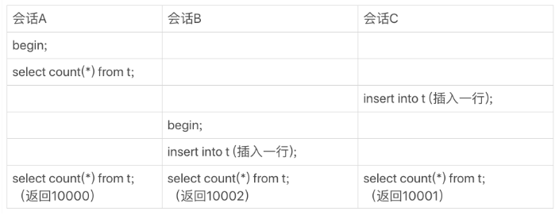

在开发系统的时候，你可能经常需要计算一个表的行数，比如一个交易系统的所有变更记录总数。这时候你可能会想，一条 select count(*) from t 语句不就解决了吗？ 但是，你会发现随着系统中记录数越来越多，这条语句执行得也会越来越慢。 

今天我们来聊聊：

+ MySQL为什么这么笨！`count(*)`到底是怎么实现的，以及MySQL为什么会这么实现。
+ 如果应用中有这种频繁变更并需要统计表行数的需求，业务设计上可以怎么做。 

## count(*) 的实现方式

你首先要明确的是，在不同的 MySQL 引擎中，count(*) 有不同的实现方式。 

+ MyISAM 引擎把一个表的总行数存在了磁盘上，因此执行 count(*) 的时候会直接返回这个数，效率很高；
+ 而 InnoDB 引擎就麻烦了，它执行 count(*) 的时候，需要把数据一行一行地从引擎里面读出来，然后累积计数。

这里需要注意的是，我们在这篇文章里讨论的是没有过滤条件的 count(*)，如果加了 where 条件的话，MyISAM 表也是不能返回得这么快的。

那**为什么 InnoDB 不跟 MyISAM 一样，也把数字存起来呢？** 

这是因为即使是在同一个时刻的多个查询，由于多版本并发控制（MVCC）的原因，InnoDB 表“应该返回多少行”也是不确定的。这里，我用一个算 count(*) 的例子来为你解释一下。 第三篇和第八篇讲的是事务隔离。

假设表 t 中现在有 10000 条记录，我们设计了三个用户并行的会话。 



也有一定的优化：

MySQL 优化器会找到最小的那索引棵树来遍历。**在保证逻辑正确的前提下，尽量减少扫描的数据量，是数据库系统设计的通用法则之一。** 

到这里我们小结一下：

+ MyISAM 表虽然 count(*) 很快，但是不支持事务；
+ show table status 命令虽然返回很快，但是不准确（TABLE_ROWS字段，采样得到）；
+ InnoDB 表直接 count(*) 会遍历全表，虽然结果准确，但会导致性能问题。

## 频繁统计总数

那么，回到文章开头的问题，如果你现在有一个页面经常要显示交易系统的操作记录总数，到底应该怎么办呢？答案是，我们只能自己计数。 

### 用缓存系统保存计数

比如Redis服务，来保存这个表的总行数。但会出现一些问题：

+ 缓存系统可能丢失更新。

  > Redis 的数据不能永久地留在内存里，所以你会找一个地方把这个值定期地持久化存储起来。 如果刚刚在数据表中插入了一行，Redis 中保存的值也加了 1，然后 Redis 异常重启了，重启后你要从存储 redis 数据的地方把这个值读回来，而刚刚加 1 的这个计数操作却丢失了。 
  >
  > 当然了，这还是有解的。比如，Redis 异常重启以后，到数据库里面单独执行一次 count(*) 获取真实的行数，再把这个值写回到 Redis 里就可以了。异常重启毕竟不是经常出现的情况，这一次全表扫描的成本，还是可以接受的。 

+ **即使 Redis 正常工作，这个值还是逻辑上不精确的。** Redis更新与插入数据之间，有其他会话查询计数和记录。

  >1. 一种是，查到的 100 行结果里面有最新插入记录，而 Redis 的计数里还没加 1；
  >2. 另一种是，查到的 100 行结果里没有最新插入的记录，而 Redis 的计数里已经加了 1。


### 在数据库保存计数

  + 解决了崩溃丢失的问题，InnoDB支持崩溃恢复。
  + 解决不一致，计数不精确问题。利用“事务”这个特性。

| 会话A          | 会话B              |
| -------------- | ------------------ |
| begin;         |                    |
| 表C计数值加1;  |                    |
|                | begin;             |
|                | 读表C计数值;       |
|                | 查询最近100条记录; |
| 插入一行数据R; | commit;            |
| commit;        |                    |

  

  ## 不同的count用法

  今天谈到了 count(*) 的性能问题，我就借此机会和你详细说明一下这几种用法的性能差别。需要注意的是，下面的讨论还是基于 InnoDB 引擎的。  

  这里，首先你要弄清楚 count() 的语义。count() 是一个聚合函数，对于返回的结果集，**一行行地判断，如果 count 函数的参数不是 NULL，累计值就加 1，否则不加**。最后返回累计值。 

  ```mysql
  count(字段)   # not null的话，读出这个字段，判断不能为null，累加。null的话，还需要取值判空。
  count(主键id) # 引擎遍历整张表，取出来每一行的id给server层。判空
  count(1)      # 遍历整张表，但不取值。server层对于返回的每一行，放一个数字1进去，判空
  count(*)	 # 例外，并不会把全部字段取出来，而实专门做了优化，不取值，肯定不是null，按行累加 
  ```

  分析性能差别的时候，你可以记住这么几个原则：

    1. server 层要什么就给什么；
    2. InnoDB 只给必要的值；
    3. 现在的优化器只优化了 count(*) 的语义为“取行数”，其他“显而易见”的优化并没有做。

看到这里，你一定会说，优化器就不能自己判断一下吗，主键 id 肯定非空啊，为什么不能按照 `count(*) `来处理，多么简单的优化啊。 

当然，MySQL 专门针对这个语句进行优化，也不是不可以。但是这种需要专门优化的情况太多了，而且 MySQL 已经优化过 `count(*) `了，你直接使用这种用法就可以了。 

所以结论是：按照效率排序的话，`count(字段)<count(主键 id)<count(1)≈count(*)`，所以我建议你，尽量使用 count(*)。 

## 小结

其实，把计数放在 Redis 里面，不能够保证计数和 MySQL 表里的数据精确一致的原因，是**这两个不同的存储构成的系统，不支持分布式事务，无法拿到精确一致的视图。**而把计数值也放在 MySQL 中，就解决了一致性视图的问题。 

# 问题

[Mysql中DDL, DML, DCL, 和TCL是什么？](https://www.cnblogs.com/heyonggang/p/9284271.html)


最后，又到了今天的思考题时间了。

在刚刚讨论的方案中，我们用了事务来确保计数准确。由于事务可以保证中间结果不被别的事务读到，因此修改计数值和插入新记录的顺序是不影响逻辑结果的。但是，从并发系统性能的角度考虑，你觉得在这个事务序列里，应该先插入操作记录，还是应该先更新计数表呢？

> 性能的角度？ 行锁？

count（id）和count（这段）都是要把每一行的该字段值取出来，然后判断是否为空，那为什么count（id）的效率要高？ 

> 作者回复: count(id)可能会选择最小的索引来遍历 而count(字段)的话，如果字段上没有索引，就只能选主键索引 

对于 count(主键 id) ，server层拿到ID，判断ID是不可能为空的按行累加。这个地方，是不是又点问题，既然是主键ID，是一定不会为空的，这个server层还需要判断不为空吗 

> 作者回复: 嗯，代码就是这么写的 我也觉得可以优化一下… 不过现在就这样😓 


