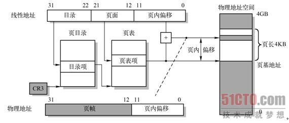

进程之间通信方式IPC。

共享内存怎么实现。

## MVCC机制

<https://blog.csdn.net/whoamiyang/article/details/51901888> 

# 中兴

项目难点

编译时 运行时

# vivo提前批

操作系统读写操作，写文件，read的三种模式。写成功是怎样，什么情况下会写失败

## malloc底层原理

<https://blog.csdn.net/mmshixing/article/details/51679571> 

[malloc 底层实现及原理](https://www.cnblogs.com/zpcoding/p/10808969.html)

空闲内存块链表？内存块的获取，寻找合适的内存块？

分配的都是虚拟内存，没有分配物理内存。在第一次访问已分配的虚拟地址空间的时候，发生缺页中断，操作系统负责分配物理内存，然后建立虚拟内存和物理内存之间的映射关系。 

## 进程与线程

这个博主的链接讲解了进程与线程，我觉着写的不错：[面试-进程与线程](https://sunweiguo.github.io/2019/01/19/%E9%9D%A2%E8%AF%95-%E8%BF%9B%E7%A8%8B%E4%B8%8E%E7%BA%BF%E7%A8%8B/ )

我觉着有一句话，解开了我以为的”exe文件就是程序，程序是进程“的疑惑。

> 将可执行文件、当前进程的上下文、内存等资源结合起来，才是一个真正的进程。**那么，我们就可以理解一句话：进程是资源分配的基本单位。** 

线程是调度的基本单位。线程只需要分配栈和PC（就是程序计数器，指向的下一条指令执行的地址。 ）即可。 

## 逻辑地址到物理地址的映射

参考博客：[逻辑地址，页表，mmu等](https://blog.csdn.net/fengxiaocheng/article/details/106440749)

两级页表结构：MMU中存储**页表**，用来匹配虚拟内存和物理内存。 

其中CR3寄存器指定页目录表的基地址。逻辑地址的高10位用于索引这个页目录表，以获得指向相关第二级页表的指针。逻辑地址中间10位用于索引二级页表，以获得物理地址的高20位。逻辑地址的低12位直接作为物理地址低12位，从而组成一个完整的32位物理地址。 

+ 页目录，1个页，2^10个项，每项4Byte，用于寻址页表地址
+ 页表，每个页表的页表项个数也是2^10，每项大小4Byte，总共4kB大小，每个表项含有相关20位物理基地址的表项。二级页表使用线性地址中间10位（21-12）作为表项索引值。

该20位页面物理基地址（页基地址）和逻辑地址中的低12位（页内偏移）组合在一起就得到了分页转换过程的输出值，即对应的最终物理地址。 

> MMU中存储页表，用来匹配虚拟内存和物理内存。页表中每个项通常为32位，即4byte,除了存储虚拟地址和页框地址之外，还会存储一些标志位，比如是否缺页，是否修改过，写保护等。因为页表中每个条目是4字节，现在的32位操作系统虚拟地址空间是2^32，假设每页分为4k，也需`(2^32/(4*2^10))*4=4M`的空间，为每个进程建立一个4M的页表并不明智。因此在页表的概念上进行推广，产生二级页表，虽然页表条目没有减少，但内存中可以仅仅存放需要使用的二级页表和一级页表，大大减少了内存的使用。
>
> 公式讲解：地址总个数2^32，一页包含了2^12个字节（4KB），除一下，需要2^20个索引项，其实用20位就可以索引，但是页表项每项32位，高20位用来索引。所以每一项大小仍是32bit（4Byte），页表总大小是：索引项个数乘以每一项大小：`2^20×4B = 4MB`
>
> 为每个进程建立一个4M的页表并不明智。因此在页表的概念上进行推广，产生**二级页表**，虽然页表条目没有减少，但内存中可以仅仅存放需要使用的二级页表和一级页表，大大减少了内存的使用。 

一个页表的大小为4K字节，页表项(PTE, page table entry)的大小为4个字节(32bit)，所以一个页表中有1024个页表项。

+ 二级页表中的每一项的内容高20bit用来放一个物理页的物理地址，低12bit放着一些标志。
+ 一级页表中的每一项的内容高20bit ？ 10bit 20 bit？，用来放一个二级页表的物理地址，低12bit放着一些标志。

## c++内存四区

<https://zhuanlan.zhihu.com/p/120997610> 

1. 代码区，存放函数体的二进制代码，由操作系统进行管理 

2. 全局区，全局静态存储区。这部分可以细分为data区和bss区，全局变量静态变量常量。程序编译完成后，生成可执行文件后，未执行程序前分配（这句话没明白，现在还编译什么？）

   **2.1 data区**

   data区里主要存放的是已经初始化的全局变量、静态变量和常量

   **2.2 bss区**

   bss区主要存放的是未初始化的全局变量、静态变量，这些未初始化的数据在程序执行前会自动被系统初始化为0或者NULL

   **2.3 常量区**

   常量区是全局区中划分的一个小区域，里面存放的是常量，如const修饰的全局变量、字符串常量等

3. 栈区👇，栈是一种先进后出的内存结构，由编译器自动分配释放，存放函数的参数值、返回值、局部变量等。在程序运行过程中实时加载和释放，因此，局部变量的生存周期为申请到释放该段栈空间。 
   比如：局部变量、const修饰的局部变量

4. 堆区👆，用于动态内存分配。堆在内存中位于BSS区和栈区之间。一般由程序员分配和释放，若程序员不释放，程序结束时由操作系统回收。 

## TCP粘包现象，怎么解决

参考知乎：[tcp的拆包和粘包](https://zhuanlan.zhihu.com/p/77275039)

参考csdn：<https://www.cnblogs.com/kex1n/p/6502002.html> 

不是所有的粘包现象都需要处理，若传输的数据为不带结构的连续流数据（如文件传输），则不必把粘连的包分开（简称分包）。但在实际工程应用中，传输的数据一般为带结构的数据，这时就需要做分包处理。 

**粘包出现原因**

简单得说，在流传输中出现，UDP不会出现粘包，因为它有**消息边界**(参考Windows网络编程)

1. 发送端需要等缓冲区满才发送出去，造成粘包

2. 接收方不及时接收缓冲区的包，造成多个包接收

**TCP无保护消息边界的解决**

**针对这个问题，一般有3种解决方案：**

1. 发送固定长度的消息
2. 把消息的尺寸与消息一块发送
3. 使用特殊标记来区分消息间隔

**封包**

封包就是给一段数据加上包头,这样一来数据包就分为包头和包体两部分内容了(以后讲过滤非法包时封包会加入"包尾"内容)。包头其实上是个大小固定的结构体，其中有个结构体成员变量表示包体的长度，这是个很重要的变量，其他的结构体成员可根据需要自己定义。根据包头长度固定以及包头中含有包体长度的变量就能正确的拆分出一个完整的数据包。

死锁现象，四个条件，怎么解决，银行家算法

数据库，B+树

进程间通信，线程间通信。

