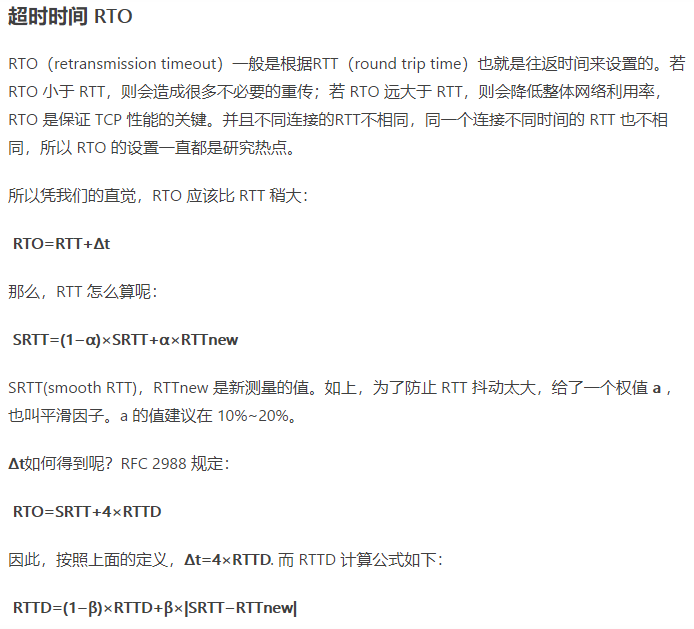
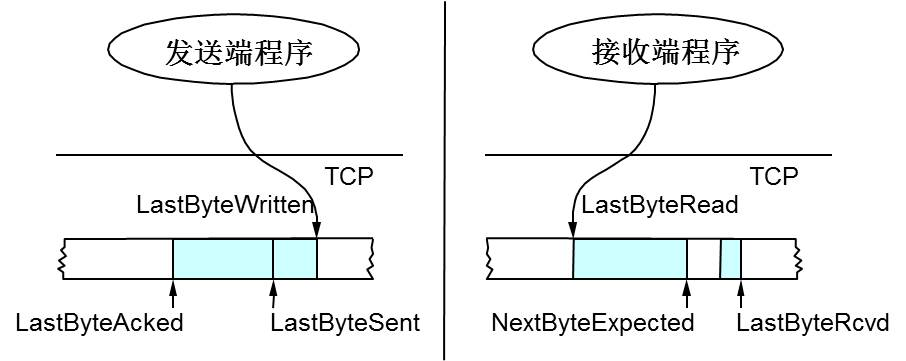
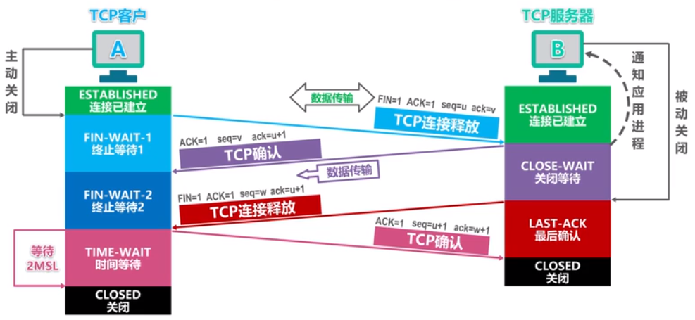

基础知识以及一些延申问题的收集。

[TCP 的那些事儿（上）](https://coolshell.cn/articles/11564.html)

[TCP 的那些事儿（下）](https://coolshell.cn/articles/11609.html)

+ 网络模型，以及各层的运行的协议等。

  应用层、传输层、网络层、链路层、物理层？

+ 我们知道TCP是面向连接的可靠的运输协议，那么TCP是如何保证可靠性的呢？

  这道题可以从TCP的头部字段来解释。

  1. 可靠性是要保证接收方会接收到全部数据，即接收方接收的字节流与发送方发送的字节流完全相同。
     1）首部字段中的【序号、确认号】对字节流(数据)编号，用来实现可靠数据传输服务。2）【超时/重传】机制，来处理报文段的丢失，此机制需要【定时器】。3）【累积确认】，只确认字节流中第一个丢失的字节。接收方收到失序报文段时，应立即生成确认信息（重复 ACK），以便发送方尽快、高效地填补空缺。 4）【快速重传】，收到3个冗余ACK。这时可以认为是数据包丢失，即便还未超时，也立即发送丢失的分组。

     涉及知识点：序号、确认号字段究竟放置了什么？？超时重传机制中，每一个已发送但未被确认的报文段都与一个计时器相关联吗？？定时器的过期间隔`TimeoutInterval`如何计算？？是`2*RTT + offset`？？起始的RTT应该如何估计呢？？

     序号：一个报文段的序号，是该报文段首字节的字节流编号。不携带数据的TCP报文段仍有序号！
     确认号：是期望从发送方收到的下一个字节的序号（还未收到）。

  2. 流量控制（Flow Control），

  3. 拥塞控制

+ 超时重传计时器设计，RTT如何计算？

  推荐的定时器管理过程仅使用【单一】的定时器，将定时器想象与最早的未被确认的报文段相关联，具体如何实现不知道。。

  显然，超时间隔必须大于连接的往返事件（RTT，round trip time）。

  下图来自：<https://www.jianshu.com/p/68afdcb98dfb> 

  **SRTT = ( α \* SRTT ) + ((1- α) * RTT)** 

  

  实际上，RTTD 就是一个均值偏差，它就相当于某个样本到其总体平均值的距离。 用于估算新的样本RTTnew一般会偏离SRTT的程度。RFC推荐β=0.25

  重传二义性：
  TCP绝不为已被重传的报文段估计RTT，因为无法分辨是对那一次的确认。

  目的度量

  从前面可以看出，TCP 可以学习链路特征，如 RTT、SRTT 等，但一旦连接关闭，这些信息就会丢失。即使相同的接收方与发送方建立新的连接，也必须从头开始“学习”。较新的 TCP 实现维护了这些值，在 Linux 中可以通过如下命令查看：

  ```shell
  ip route show cache [ip]
  ```

+ TCP连接由什么组成？

  两端各自的：发送缓存和接收缓存，变量、和与进程连接的套接字。

# TCP滑动窗口

TCP缓冲区的数据结构：

 

+ 流量控制是一个速度匹配服务，请简述具体算法实现。zero window的特殊情况。

  接收方：接收缓存，大小为`MaxRcvBuffer`，两个变量，`LastByteRead`，`LastByteRcvd`，（应该是三个变量，第三个是`NextByteExpected`，这里简化了模型，假设接收方丢弃失序的报文段）。已经读入应用程序的最后一个字节编号Read小于等于收到的最后一个字节编号Rcvd。

  9 8 7 6 5 4 **3 2 1 0** ---->应用进程
  r                  r
  0 1 2 3 字节已经被读入应用程序，read指针指向应用程序从缓存读出数据流的最后一个字节编号 3，rcvd指针指向从网络中到达并且已经放入接收缓存中的数据流的最后一个字节的编号 9。

  发送方：轮流跟踪两个变量，`LastByteSent `  >=   `LastByteAcked`。`LastByteWritten`指向上层应用最后写入的字节。

  **0 1 2 3 4 5** 6 7 8 9 <---- 应用进程
                  a           s

  0 - 5 已经ACK。

  ```python
  rwnd = MaxRcvBuffer - (LastByteRcvd - LastByteRead)
  # 接收端给发送端回ACK中会汇报自己的rwnd
  
  # 发送端要保证，具体实现只有这两个指针吗？需不需要一个指向窗口最右侧的指针？
  LastByteSent - LastByteAcked <= rwnd
  ```

   

  + \#1已收到ack确认的数据。LastByteAcked = 31
  + \#2发还没收到ack的。LastByteSent = 45
  + \#3在窗口中还没有发出的（接收方还有空间）。rwnd = 20
  + \#4窗口以外的数据（接收方没空间）


+ Zero Windows

  TCP使用了Zero Window Probe技术，缩写为ZWP，也就是说，发送端在窗口变成0后，会发ZWP的包给接收方（一个字节的数据），让接收方来ack他的Window尺寸，一般这个值会设置成3次，第次大约30-60秒（不同的实现可能会不一样）。如果3次过后还是0的话，有的TCP实现就会发RST把链接断了。 

# 拥塞控制

发送端的发送速率不止受rwnd影响，还与网络的拥塞状况有关。而IP层不向端系统提供显式的网络拥塞反馈，所以TCP必须使用端到端拥塞控制而不是使网络辅助的拥塞控制。

先指数、后线性。超时、冗余分情况。”要糖果的孩子“，”不撞南墙不死心“。

1）慢启动，2）拥塞避免，3）快速恢复。

简单来说，就是网络没有拥塞就增加发送速率，有拥塞就会降低发送速率。这种方法需要解决三个问题：1）如何限制发送端的发送速率，2）如何感知拥塞，3）感知到拥塞，采用何种算法来改变发送速率。

针对第一个问题，其实与流量控制的逻辑类似，运行在发送方的拥塞机制维护跟踪一个额外的变量，拥塞窗口cwnd：

```python
LastByteSend - LastByteAcked <= min(cwnd, rwnd)
```

如何感知拥塞？”丢包事件“：要么出现超时，要么收到来自接收方的3个冗余ACK。 丢包事件和ACK其实都是充当了隐式信号。

第三点，实际上是要动态改变cwnd的值，从而改变发送速率。👇

## 慢启动

+ init，初始化状态：cwnd = 1 MSS，ssthresh = 64KB，dupACKcount = 0

+ **收到 new ACK：cwnd  += 1 MSS，dupACKcount = 0，发送新的报文段as allowed**

  疑问：对每个确认报文段，cwnd++，所以没过一个RTT，cwnd = cwnd*2，后者只是结果？

+ 收到重复ACK：dupACKcount++

+ timeout: ssthresh = cwnd/2，cwnd = 1MSS，dupACKcount = 0，重传超时报文段。

  TCP认为这种超时情况太糟糕，反应也很强烈(⊙o⊙)。 

进入其他状态>>>>>>>>🚗>>>>>>>>：

+ **cwnd >= ssthresh：进入【拥塞避免】状态，网络不拥塞的话，一般会进入此状态。**

+ dupACKcount == 3：ssthresh = cwnd/2，cwnd = ssthresh+3MSS，重传丢失报文段，进入【快速恢复】状态。
  注意：这里是TCP Reno算法，否则处理方式与timeout超时一致（TCP Tahoe版本）。此时没有超时，认为网络不是太堵。。
  其次注意：这里 +3MSS，以及重传报文段，是在进入快速恢复算法之后？？书中状态机画的有误？？

  

拥塞状态时的算法：可以看到”丢包“事件分为两种，RTO超时，和3个duplicate ACK。一个进入慢启动过程，一个进入快速恢复算法。相同点：ssthresh = cwnd/2，不同点是对cwnd的设置。


## 拥塞避免

+ 收到一个new ACK，cwnd = cwnd + MSS*（MSS/cwnd）
  这里要是实现：**每过一个RTT，cwnd += 1**。想象在一个RTT内，发送cwnd/MSS个报文段，每个到达的ACK都增加MSS*（MSS/cwnd）的拥塞窗口长度，全部确认后，拥塞窗口增加了1MSS。
  这里我有点懵，cwnd在每个ACK都是变大的，难道此处是近似？？

进入其他状态🚗，与慢启动的情况一样：

+ 超时
+ 冗余ACK


## 快速恢复

注意，进入Fast Recovery之前，cwnd 和 sshthresh已被更新：

+ cwnd = cwnd /2
+ sshthresh = cwnd   //这里没有 + 3MSS

然后真正的真正的Fast Recovery算法如下： 

+ cwnd = sshthresh  + 3 * MSS （3的意思是确认有3个数据包被收到了，就是3个冗余的ACK） 
+ 重传diplicated ACKs丢失的数据包

+ 对于引起进入快速恢复状态的缺失报文段，再收到duplicate ACK：cwnd = cwnd + MSS，重传报文段。

进入其他状态🚗：

+ 超时
+ new ACK，cwnd = ssthresh，dupACKcount = 0，进入【拥塞避免】状态。降低了cwnd哦！

> 如果你仔细思考一下上面的这个算法，你就会知道，**上面这个算法也有问题，那就是——它依赖于3个重复的Acks**。注意，3个重复的Acks并不代表只丢了一个数据包，很有可能是丢了好多包。但这个算法只会重传一个，而剩下的那些包只能等到RTO超时，于是，进入了恶梦模式——超时一个窗口就减半一下，多个超时会超成TCP的传输速度呈级数下降，而且也不会触发Fast Recovery算法了。
>
> 通常来说，正如我们前面所说的，SACK或D-SACK的方法可以让Fast Recovery或Sender在做决定时更聪明一些，但是并不是所有的TCP的实现都支持SACK（SACK需要两端都支持），所以，需要一个没有SACK的解决方案。而通过SACK进行拥塞控制的算法是FACK


# 为什么是三次握手

不如说成是两次ACK，在此期间交换变量。

或者说，TCP是全双工的，双方是平等的，本可以是四次，只是接收方的ACK和发起连接（SYN）合并为一次了。

# 为什么是四次挥手


# 客户端TIME_WAIT状态？



为何等待 2MSL时长，

+ 可靠的中止TCP连接。 最后的TCP确认可能丢失
+ 让还在网络中的报文段消失干净。