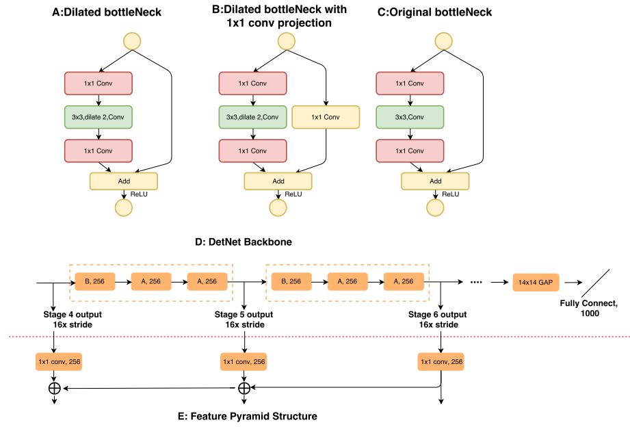

DetNet: A **Backbone network** for Object Detection

ECCV2018

参考：https://blog.csdn.net/u014380165/article/details/81582623 

To summarize, we have the following contributions: 

1.  We are the **first to** analyze the inherent drawbacks of traditional ImageNet pre-trained model for fine-tunning recent object detectors. 
2. We propose a novel backbone, called DetNet, which **is specifically designed** for object detection task by maintaining the spatial resolution and enlarging the receptive field. 
3. We achieve new **state-of-the-art results** on MSCOCO obect detection and instance segmentation track based on a low complexity DetNet59 backbone.    

那么，传统采用的预训练模型有哪些固有缺点？本文又是怎么针对问题来设计目标检测专用DetNet网络的呢？

我们自己想象一下，对于分类和检测的最大的区别就在于，目标检测要把物体框出来。分类~~可能~~只用到了语义特征，语义特征越丰富，分类越准确。可以预测，把分类网络直接移植到目标检测，语义特征是提取出来了，可是也影响了其他的一些信息，比如：**位置信息（object localization），尺度信息**。二者互相矛盾，难以协调。

传统模型缺点：

> the spatial resolution of the feature maps is gradually decreased for the standard networks like VGG16 and Resnet    
>
> 空间分辨率在降采样的过程中逐渐降低。

> there still exists the following **three problems** when trained with these backbone networks which is pretrained on the ImageNet classification dataset.    

1. The number of network stages is different.

   典型的分类网络有5次降采样，也就是说特征图尺寸被"32x" sub-sampled，假如224×244会得到7×7的特征图，但检测网络往往会假如额外的阶段。ps：并不知道这是为什么。

2. Weak visibility of large objects.

   32倍的降采样，会得到强壮的语义信息、会带来更大的感受野，有利于分类。

   可是，位置信息损失太多啦！！the boundary of large object may be too blurry to get an accurate regression，说的是特征图越深，边缘信息越模糊，难以准确回归。

   ps：虽然说难以回归，但毕竟还是大，不准确可能就会被稀释。

3. Invisibility of small objects.

   由于空间分辨率的降低，小物体不仅位置信息丢失，甚至语义信息都会丢失，反正就是都丢了，be easily weaken ，FPN为了解决这一问题，运用了浅层的特征图（语义信息又不足以识别类别），所以又结合了高层特征图。

   > The information from the small objects will be easily weaken as the spatial resolution of the feature maps is decreased and the large context information is integrated. 
   >
   > large context information is integrated的意思可能是说，小物体的信息早已消失在茫茫的上下文信息中，就像大海捞针？

   > However, if the small objects is missing in deeper layers, these context cues will miss simultaneously.
   >
   > 这句话可能想说，小物体在高层特征上彻底消失，语义特征也基本消失。

所以说，DetNet减少降采样（即提高空间分辨率，不仅解决了大物体位置信息丢失的问题，还解决了小物体失踪问题），但在降采样减少的同时，感受野却降低了，所以还要保持感受野不要降低（要对大目标公平，语义还是要提的），所以引入了更多的stage（6-7），那么同时也就面临两个挑战：

> On one hand, keeping the spatial resolution for deep neural network costs extremely large amount of time and memory.  
>
> + 计算量增加了。ps：如果通道数不变的情况下，计算量变大。
>
> On the other hand, reducing the down-sampling factor equals to reducing the valid receptive field, which will be harmful for many vision tasks, such as image classification and semantic segmentation.
>
> + 感受野减小，某些信息丢失。 ps：如果不用dilated bottleneck 

FIgure2：

为了解决上述两个问题：

> We introduce the extra stages, e.g., P6, in the backbone which will be later utilized for object detection as in FPN. Meanwhile, we fix the spatial resolution as 16x downsampling even after stage 4. 
>
> Since the spatial size is fixed after stage 4, in order to introduce a new stage, we employ a dilated [29,30,31] bottleneck with 1x1 convolution projection (Fig. 2 B) in the begining of the each stage. We find the model in Fig. 2 B is important for multi-stage detectors like FPN. 
>
> We apply bottleneck with dilation as a basic network block to efficiently enlarge the receptive filed. Since dilated convolution is still time consuming, our stage 5 and stage 6 keep the same channels as stage 4 (256 input channels for bottleneck block). This is different from traditional backbone design, which will double channels in a later stage.    

针对问题1，主要是降低了网络高层的宽度，这个在Figure2D中展示得比较清楚了，高层的几个stage的每个block的输入特征通道都是256。而常见的分类算法中，比如ResNet越往高层的stage，特征通道数往往越大。 

针对问题2，主要引入dilated卷积层来增大感受野，如Figure2的A和B所示，通过对比ResNet网络的residual block（Figure2C）可以看出主要是替换了传统的3×3卷积为dilated卷积层。因此Figure2中的A和B是DetNet网络中的基础结构（Figure2D所示）。

其他：

最大的创新点，其实就是将原本的32X的下采样，用两个16X的卷积来替换。这样既能通过叠加卷积实现感受野的扩张，也避免了因为下采样所导致的位置信息的丢失 

**主要改进点包括：**

**1、增加网络高层输出特征的分辨率，换句话说就是高层不对特征图做尺寸缩减。**

**2、引入dilated卷积层增加网络高层的感受野，这是因为第一个改进点引起的感受野减小。**

**3、减小网络高层的宽度，减少因增大分辨率带来的计算量。** 

可以说1是主要解决方案，但带来了2和3的问题。