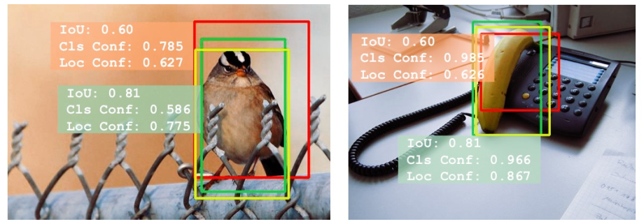
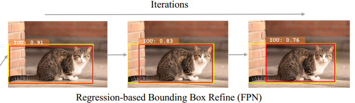
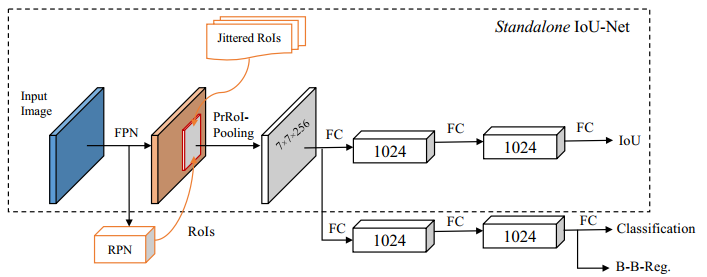

Acquisition of Localization Confidence for Accurate Object Detection

ECCV2018

从网络的名字IoUNet来看，与IoU有关。

从摘要中可以看出本文两点创新：

1. 网络IoUNet预测了预测框与groundtruth的IoU。这个IoU代表了位置置信度，优化NMS算法。
2. **an optimization-based bounding box refinement method** is proposed, where the predicted IoU is formulated as the objective.

## 解决的问题

在Introduction作者提到发现的问题：

+ 网络预测的类别概率自然而然地可以代表类别置信度，但是网络并不预测位置置信度，依靠预测的坐标并不能知道哪一个预测框更加准一些。**2.1 Misaligned classification and localization accuracy**

  NMS的排序也是按照类别置信度来排序，这回忆一下NMS步骤：

  1. 将所有框的得分排序，选中最高分及其对应的框。
  2. 遍历其余的框，如果和当前最高分框的重叠面积(IOU)大于一定阈值，我们就将框删除。 
  3. 从未处理的框中继续选一个得分最高的，重复上述过程。 

  那么得分高的预测框就是最最匹配的预测框吗？作者给出了分析即几个示例：

  > the misalignment between classification confidence and localization accuracy may lead to accurately localized bounding boxes being suppressed by less accurate ones in the NMS
  >
  > 得分高的不一定框的准，NMS可能扼杀了他们。

  

  黄色是groundtruth，如果按照类别得分，red bounding box获胜；如果是我们的IoUNet，green获胜。

  可以看到red和green都把目标框出，green位置更加准一些。

+ bounding box regression越迭代，效果越差。**2.2Non-monotonic bounding box regression**

  > As an example, previous works [3] report the non-monotonicity of iterative bounding box regression. That is, bounding box regression may degenerate the localization of input bounding boxes if applied for multiple times.

  

上述两个问题在第二节Delving into object localization中被详细阐述，有数据支撑哦。

## IoUNet

### IoUNet怎么训练

> We generate bounding boxes and labels for training the IoU-Net by **augmenting the ground-truth**, instead of taking proposals from RPNs 
>
> 训练的输入框是手动生成的（具体规则不知道，论文中只是一句话：we manually transform them with a set of randomized parameters），然后去掉IoU小于0.5的，可能因为位置回归在偏差小的时候近似于线性回归。

文中还提到IoUNet的两个优点：鲁棒性和联合训练

+ it is robust to the change of the input distributions
+ this module can be jointly optimized in a full detection pipeline 

### IoU-guided NMS 

IoU-guided NMS resolves the misalignment between classification confidence and localization accuracy. 

有了IoUNet，我们就能得到预测的位置确信度。总之，是下面一句话：

> In short, we use the predicted IoU instead of the classification confidence as the ranking keyword for bounding boxes. 
>
> NMS的排序不再按照类别得分。

需要注意的是，按照位置置信度排序的IoU-guided NMS在抑制的过程中有一个更新类别置信度的操作，解释如下：

> This procedure can also be interpreted as a confidence clustering: for a group of bounding boxes matching the same ground-truth, **we take the most confident prediction for the class label**.    
>
> 不知道这是什么意思，可能是，这一组框，类别是大概率是一样一样的，所以也要把最好的预测赋予位置最准确的bounding box

### Bounding box refinement as an optimization procedure

这块没搞懂，包括公式1，算法2：Optimization-based bounding box refinement，改进的Pooling：PrRoI Pooling

### PrRoI Pooling

给出了参数初始化，超参数设定等等。