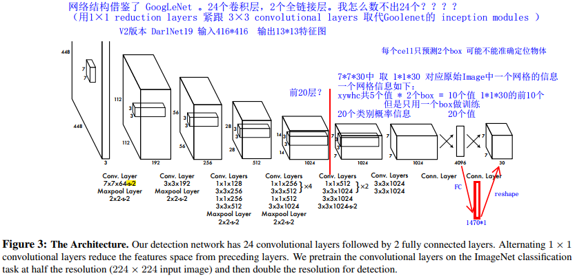
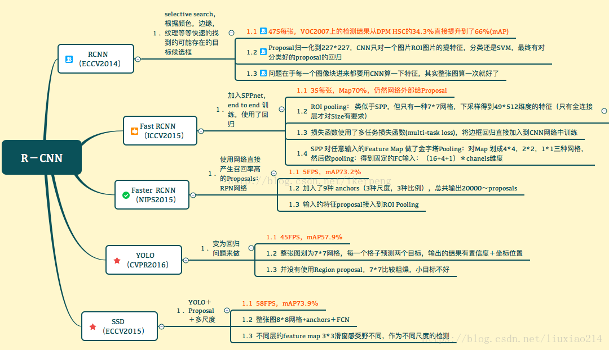

# 一、背景与意义

目标检测是图像处理（计算机视觉领域）任务之一，其他还包括图像分类、语义分割、实例分割。

## 1.1 背景

目标检测任务有着近20年的历史，就基于深度神经网络的目标检测任务来说，也有大约5年历史。基于深度学习目标检测方法的发展是在图像分类大放异彩之后逐渐发展起来的。2012年的AlexNet网络算是深度神经网络发展的里程碑，也是从它开始，各类图像分类和目标检测网络百花齐放。

2014年，Ross Girshick（RBG）在利用CNN成功取代了HOG、DPM等特征提取， 结合Selective Search做区域推荐， 再结合SVM做分类算法， 成功推出R-CNN目标检测网络，打开了基于CNN目标检测的大门。值得一提的是，RBG在读博期间和他的导师一起提出了DPM算法，改进了提取HoG特征的方法，在传统的目标检测也做出了很大的贡献。

目标检测的目的就是检测出物体的位置和大小，同时确定类别。分类任务是位置大小不敏感的，而定位则是位置大小敏感的。所以，检测中分类与定位在平移不变性上有着矛盾 ，检测会受到目标尺寸的影响，这也是当前检测任务的难点之一。

目标检测也在准确度和速度这两方面努力提高。一般来说，在目前的深度学习技术中，两者不可兼得，采用区域建议的网络在准确度方面领先，但同时，区域建议的产生会花费大量时间。而采用region-free的网络识别速度大大提高，可用于实时任务，但牺牲的是准确度。

## 1.2 意义

# 二、国内外研究现状

## 2.1 传统方法（没看）

+ Haar/LBP/积分HOG/ACF feature+Adaboost
+ HoG+SVM
+ Discriminatively trained deformable part models(DPM)

## 2.2 深度学习方法

就检测步骤上来说分为两大类：two-stage算法和one-stage算法。

### 2.2.1 Two-stage(基于region proposal)

两阶段方法分为两大步骤：

1. RPN网络生成建议区域（region proposal），然后按照一定规则生成正负样本（不同文章做法稍有不同），其余anchor样本被丢弃，然后训练这些样本，回归区域坐标和此区域是否是物体（二分类，这里不需要回归具体类别）。
2. 检测网络，把第一步得到的正负样本作为子图输入，对这些子图进行具体的类别的预测和位置回归。

RCNN系列的网络是典型的两阶段方法，这里以Faster-RCNN为例介绍two-stage方法，并总结其优缺点，以及其他文章改进方法。

#### Faster-RCNN

详细请移步[github](https://github.com/liruixl/paperreading/blob/master/FasterRCNN.md)，这里给出关键的几个问题，也是目标检测中共同面临的问题：

**anchor的生成和标签：**

生成：heuristic、人为规定的。

对特征图

因为anchor的设计是人为规定的，所以不同的文章采用的尺度和长宽比略有不同，Faster-RCNN中才采用：

> For anchors, we use 3 scales with box areas of 128×,128 256×256, and 512×512 pixels, and 3 aspect ratios of 1:1, 1:2, and 2:1.     

打标签：

无论是RPN网络还是检测网络的训练，都需要打标签，这不同于标签事先给出的其他视觉任务，比如，图像分类和语义分割，对于目标检测，是要对我们预先设置的anchor（Faster-RCNN中的称呼）打标签。

+ 正样本:

1. 与ground truth IoU最大的anchor
2. 与ground truth IoU大于0.7（可能不会发生）

条件1保证了每个ground truth至少都有1个anchor

+ 负样本:

1. 与ground truth IoU小于0.3的

+ 其余的不参与训练

+ 越界的不参与训练

  > During testing, however, we still apply the fully convolutional RPN to the entire image. This may generate cross-boundary proposal boxes, which we clip to the image boundary. 

这里的不参与训练应该是不贡献损失，不参与计算损失，但依然是要参与前向与反向的传播，毕竟都在那一张特征图上。

 **RPN训练**

> We re-scale the images such that their shorter side is s = 600 pixel。
>
> 不知道这是为什么？

抽样方式：

+ 每张图为1个mini-batch, 去掉越界的，剩下约6000个候选的样本(anchor)
+ 1个mini-batch中, 从6000个候选样本中, 按正负样本1:1比例随机抽取256个样本，如果正样本不满足128个，则用负样本补充

损失函数是二分类交叉熵和经典的坐标回归，不提了。在其他文章中，回归的也都是这两个损失，可能只是两个损失的权重有所区别。

**检测网络训练**

注意输入检测网络的区域不再是初始的anchor，而是加上了回归后的偏移量而来的RPN proposals。

> Some RPN proposals highly overlap with each other. To reduce redundancy, we **adopt non-maximum suppression (NMS) on the proposal regions based on their cls scores.** We fix the IoU threshold for NMS at **0.7**, which **leaves us about 2000 proposal regions per image**. As we will show, NMS does not harm the ultimate detection accuracy, but substantially reduces the number of proposals. **After NMS, we use the top-N ranked proposal regions for detection**. In the following, **we train Fast R-CNN using 2000 RPN proposals**, but evaluate different numbers of proposals at test-time. 

训练方式：

> In the first step, we train the RPN as described in Section 3.1.3. This network is initialized with an ImageNet-pre-trained model and fine-tuned end-to-end for the region proposal task. 
>
> In the second step, we train a separate detection network by Fast R-CNN using the proposals generated by the step-1 RPN. This detection net work is also initialized by the ImageNet-pre-trained model. At this point the two networks do not share convolutional layers.
>
>  In the third step, we use the detector network to initialize RPN training, but we fix the shared convolutional layers and only fine-tune the layers unique to RPN. Now the two networks share convolutional layers. 
>
> Finally, keeping the shared convolutional layers fixed, we fine-tune the unique layers of Fast R-CNN. As such, both networks share the same convolutional layers and form a unified network. A similar alternating training can be run for more iterations, but we have observed negligible improvements.    

可以看到，这种训练方式非常繁琐，每一步与每一步的衔接也有依赖，所以两阶段的这种方式有待改进。事实上之后很多文章针对此问题来改进。

### 2.2.2 One-stage(基于回归)

单阶段算法没有”区域建议“一说，直接一次性完成分类和回归，相比于两阶段算法速度快，但准确率/召回率略低。最开始是OverFeat网络将分类、定位、检测功能融合在一个网络之中，虽然速度够快，但准确率和召回率不敢恭维。 这里以YOLO和SSD网络为例讲解one-stage的：

#### [YOLO](https://github.com/liruixl/paperreading/blob/master/YOLO.md)

可以说YOLO网络正真实现了单阶段网络实时检测任务。总体来说，网络超级简单，训练时一次性回归，速度也够快，但对小物体检测不准，框的也不太准，损失函数也挺奇葩（目前看到的唯一一个与其他文章不同的损失函数）。

> We reframe object detection as **a single regression problem**, straight from image pixels to bounding box coordinates and class probabilities.

这句话很好的诠释了单阶段算法，直接为每个像素点预测类别和回归坐标，要什么建议框！

从图上可以看出，结构十分简单（没任何其他技巧）。最后的输出是7×7×30维度。文中是将整张图片分成7×7的grid。而Each grid cell predicts **B bounding boxes** and **confidence scores** for those boxes。文中每个格子只预测 B=2 两个box。所以，每个格子需要预测（x，y，w，h，confidence）5个值，那么两个格子就是10个值，再加上每个格子也要预测C=20（文中VOC数据集C=20）个conditional class probabilities：即Pr(Class_i|Object) ，一共要预测30个值。

奇葩的损失函数设计可能与输出的编码设计有关，并不是像faster-rcnn预测每个anchor。

其**缺点**也尤为明显，准确率与Faster RCNN差了好多；并且由于没有建议框，框的也不准。但是以下两点足以使这个简单的网络

> Since the whole detection pipeline is a single network, it can be optimized end-to-end directly on detection performance.    
>
> Our unified architecture is extremely fast.

#### [SSD](https://github.com/liruixl/paperreading/blob/master/SSD.md)

对比Faster R-CNN和YOLO：

SSD的结构像是Faster RCNN中的RPN，也使用anchor策略，同样分类和回归坐标偏移，只不过RPN网络是二分类，输出的结果是用于检测网络的输入，从这一点看SSD是RPN的修改版。

对比YOLO，如果增加两个全连接层，只使用最高层特征图来预测（同时也就没有了多尺寸box），那么它就类似于YOLO。由于少了两个卷积层，只是增加了6个extra feature layers，速度增加。使用了default box（faster cnn叫做anchor）和aspect ratios策略，并应用于多特征图（低层用于检测小尺寸物体，高层检测大尺寸），使准确率提高不少。

#### 其他

不少文章都是基于这两个网络的改进。

### 2.2.3 创新点

## 2.3 数据集

+ PASCAL Visual Object Classes (VOC) 挑战

  + 2007
  + 2012

+ MS COCO: Microsoft Common Object in Context

  80大类

+ ImageNet Object Detection: ILSVRC DET 任务

  200类，578482张图片

+  Oxford-IIIT Pet Dataset

  37 类别，每个类别 200 图片 

+  Cityscapes Dataset

  30 类别，25,000 + 真实开车场景图片

+ ADE20K Dataset

  150+ 类别，22,000 + 普通场景图片

当然，最常用的是PASCAL VOC和MS COCO数据集。大部分文章以这两个数据集为依据。

## 2.4 准确率

|       网络        |   train    | VOC 2007 | VOC 2012 |  COCO  |      速度       |
| :---------------: | :--------: | :------: | :------: | :----: | :-------------: |
| FasterRCNN(VGG16) | 07+12+coco |   78.8   |   75.9   | 不清楚 | 200ms per image |
| FasterRCNN(VGG16) |   07+02    |   73.2   |   70.4   |  这个  |                 |
|       YOLO        |   07+12    |   63.4   |   57.9   | 准确率 |      45fps      |
|      SSD300       |   07+02    |   74.3   |   72.4   | 有好些 |      59fps      |
|      SSD512       |   07+02    |   76.9   |   74.9   |  指标  |                 |

# 三、存在的问题

# 四、研究目标

# 五、研究内容

# 六、关键技术

# 七、拟采取解决方案

# 八、进度安排

